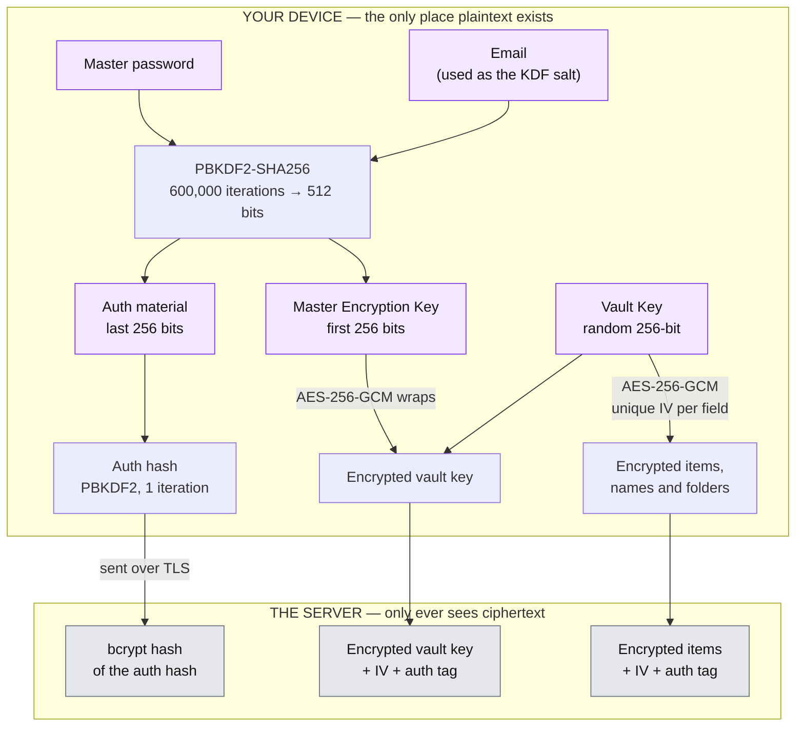
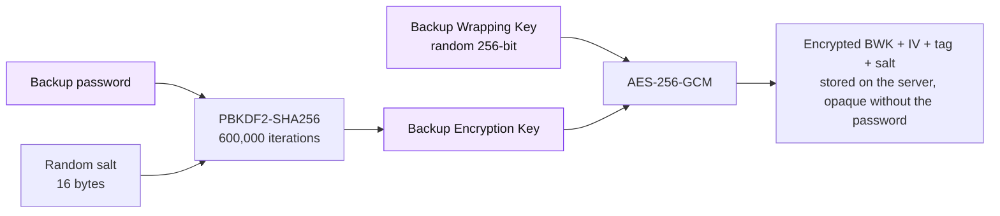
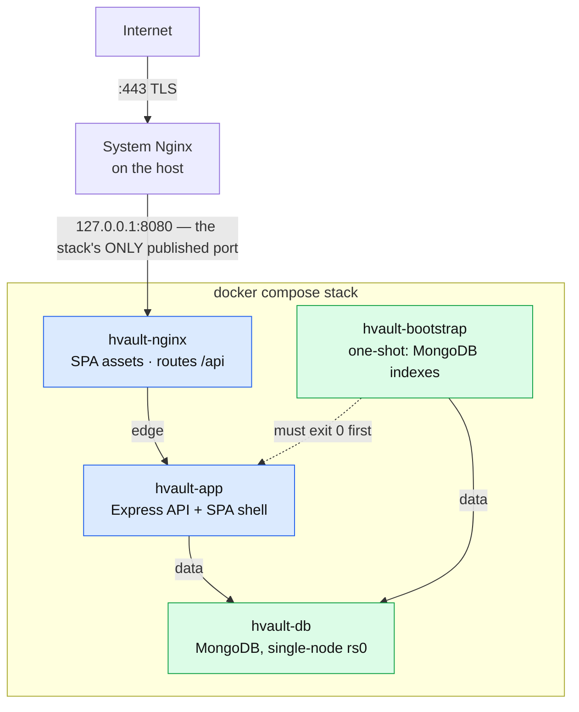

<div align="center">


# H-Vault

**A self-hostable, zero-knowledge password manager, secret store and encrypted notebook.**

Your master password never leaves your device. Neither does anything you encrypt with it.

[](https://github.com/Hiprax/h-vault/releases)
[](LICENSE)
[](https://nodejs.org)
[](tsconfig.base.json)
[](#testing)
[](#security-architecture)

[Quick start](#quick-start) · [Security architecture](#security-architecture) · [API](#api-reference) · [Deploy](#docker-deployment-recommended) · [Threat model](SECURITY.md#threat-model) · [Contributing](CONTRIBUTING.md)

</div>

---

H-Vault is a production-grade password manager you run yourself. Every vault item — its
contents **and its name** — is encrypted in the browser with AES-256-GCM before it is sent
anywhere. The server stores ciphertext it has no key for, and is built on the assumption
that it will one day be breached.

It is not a toy. It ships with two-factor authentication, refresh-token rotation with reuse
detection, encrypted off-site backups, an audit log, breach detection, a hardened Docker
stack that publishes exactly one loopback port, and a test suite that gates every push.

> [!IMPORTANT]
> Zero-knowledge means the server never _needs_ your plaintext. It does not mean it
> _couldn't_ serve you malicious JavaScript that steals it. That, and every other limit of
> this design, is written down plainly in the [threat model](SECURITY.md#threat-model).
> Read it before you trust anything with your passwords — including this.

## Table of contents

- [Features](#features)
- [Security architecture](#security-architecture)
- [Tech stack](#tech-stack)
- [Quick start](#quick-start)
- [Docker deployment](#docker-deployment-recommended)
- [Deployment security checklist](#deployment-security-checklist)
- [Configuration](#configuration)
- [API reference](#api-reference)
- [Rate limiting](#rate-limiting)
- [Project structure](#project-structure)
- [Testing](#testing)
- [The pipeline runs locally](#the-pipeline-runs-locally)
- [Releases](#releases)
- [Contributing](#contributing)
- [License](#license)

---

## Features

### Vault

|                        |                                                                                                                                                                                                     |
| ---------------------- | --------------------------------------------------------------------------------------------------------------------------------------------------------------------------------------------------- |
| **Five item types**    | Logins, secrets, notes, cards (with Luhn validation and an optional billing address) and identities — with search, folders, tags, favorites and a trash.                                            |
| **Client-side crypto** | AES-256-GCM under a vault key the server never sees. Item and folder names are ciphertext too — so search runs entirely in the browser, over data only you can decrypt.                             |
| **Password generator** | Character-set and passphrase modes (2048-word EFF-based list, exactly 11 bits per word). Strength is reported as **exact entropy**, not a heuristic score — see [below](#honest-strength-metering). |
| **Vault health**       | Finds weak, reused, old (90+ days) and breached passwords, and logins with no TOTP configured.                                                                                                      |
| **Password history**   | The last 10 passwords per login, each individually encrypted, decrypted on demand.                                                                                                                  |
| **Built-in TOTP**      | Generate 2FA codes for your stored logins, with a clipboard that clears itself.                                                                                                                     |
| **Key rotation**       | Re-key the entire vault on demand. The server raises a write fence for the duration, so a second session can't write ciphertext under the old key and silently lose it.                             |

### Security

|                               |                                                                                                                                                                                                             |
| ----------------------------- | ----------------------------------------------------------------------------------------------------------------------------------------------------------------------------------------------------------- |
| **Two-factor authentication** | TOTP with bcrypt-hashed backup codes, regeneration, replay protection, and brute-force throttling on the 2FA step itself — a temp token can't be used for unlimited guessing.                               |
| **Session management**        | Refresh-token rotation with reuse detection and family revocation. Access tokens are invalidated the instant a password changes. A locked-out, unverified or pending-deletion account cannot mint new ones. |
| **No enumeration oracles**    | Registration, login, lockout, password reset and verification-resend are all built so that response body _and_ response time are identical whether or not the account exists.                               |
| **Account lockout**           | 30 minutes after 10 failed attempts, with progressive delays and an unlock email — and evaluated _after_ the password check, so it never reveals that an account exists.                                    |
| **CSRF + rate limiting**      | HMAC-SHA256 double-submit tokens with constant-time verification, and [thirteen rate-limit tiers](#rate-limiting) backed by MongoDB, keyed per IP, email, user or session, with IPv6 `/64` aggregation.     |
| **Breach detection**          | HaveIBeenPwned via k-anonymity — only a 5-character SHA-1 prefix ever leaves the server.                                                                                                                    |
| **Audit log**                 | A searchable security log covering **37 distinct operations**, with TTL-based retention.                                                                                                                    |
| **Account deletion**          | GDPR-complete, password-confirmed, and cascaded atomically across every collection.                                                                                                                         |

### Data

- **Encrypted backups.** Scheduled or on-demand backups, encrypted under a _separate_ backup
  password so they stay opaque even to a server that holds them. Downloads are signed with
  HMAC-SHA256 and the signature is verified on restore, so a tampered file is rejected.
  Restores are safe to repeat: a restore **never replaces your vault key** — the client
  re-encrypts incoming rows to the key you already have — and previously-restored content is
  matched by provenance, so re-running the same backup doesn't accumulate duplicates. Any
  folder cycle a malicious file plants is detected and broken.
- **Import / export.** Import from Bitwarden, LastPass, KeePass, Chrome/Edge, Firefox, 1Password
  and generic CSV, with skip / overwrite / keep-both conflict strategies and hash-based
  deduplication. Every source is parsed and encrypted **in the browser** before upload, so no
  credential, note or field value ever reaches the server in the clear. Source folders/groups are
  carried over as tags — and tags, as always, are stored in plaintext so the server can index
  them, so your source folder names are visible to it. Export is encrypted JSON and requires
  re-entering your master password. (CSV is import-only.)
- **File encryption tool.** A standalone, entirely client-side tool: pick any file, set a
  password, download a self-contained `.enc` container — Argon2id envelope encryption, the
  filename and MIME type sealed _inside_, and an integrity hash re-verified on decrypt. It is
  **account-agnostic**: it never touches your vault key or master password, so a file encrypted
  while signed in as one user decrypts with the same password on any machine, as anyone, or as
  nobody. Lose the password and the file is gone — the UI says so, plainly.
- **Soft delete.** A 30-day trash with restore, purged by a nightly job.

### Experience

- **Progressive Web App** — installable, with offline read access from an encrypted IndexedDB
  cache and automatic re-sync when connectivity returns.
- **Accessible by construction** — focus traps, `aria-activedescendant` roving focus in menus,
  live regions, and correct ARIA roles on virtualized lists (`react-window` above 50 items).
- **Keyboard-first** — `Ctrl`+`L` lock, `Ctrl`+`N` new item, `Ctrl`+`K` search, `Ctrl`+`↑`/`↓`
  reorder folders (`Cmd` on macOS).
- **Auto-lock and clipboard hygiene** — configurable idle lock, and a single shared timer that
  wipes copied secrets from the OS clipboard on a deadline, on tab-hide, and on lock.
- **Degrades honestly** — one corrupt item never breaks the list. It is flagged, a banner offers
  a re-sync, and the item stays deletable instead of crashing the page.

---

## Security architecture

### The key hierarchy

Everything below the dashed line is derived on your device and never crosses it.



The server can verify you know your password (it bcrypts the auth hash) and hand back your
encrypted vault key — but it cannot unwrap that key, because the MEK that wraps it is derived
from a password it never receives.

**Why the email is the salt.** The client must derive the _same_ MEK on every device before it
has spoken to the server, so the salt has to be something it already knows. A per-user random
salt would have to be fetched first — and an endpoint that returns a salt for an email is an
account-enumeration oracle. This is the standard trade-off for browser-based zero-knowledge
vaults; the iteration count is what carries the cost of an offline attack.

### Backup encryption

Backups are encrypted under a second, independent password, so an operator who holds your
backup file still holds nothing.



The backup file also carries an HMAC-SHA256 signature computed under a key separated from the
BWK by HKDF, so tampering is detected at restore time rather than discovered later.

### Cryptographic parameters

| Parameter                 | Value                                                                                        |
| ------------------------- | -------------------------------------------------------------------------------------------- |
| Key derivation            | PBKDF2-SHA256, **600,000 iterations** (a registration below 500,000 is rejected)             |
| Master-key salt           | The account email — see the note above                                                       |
| Backup-key salt           | 16 random bytes                                                                              |
| Encryption                | AES-256-GCM                                                                                  |
| Key size                  | 256 bits                                                                                     |
| IV                        | 12 bytes, freshly random for **every** field                                                 |
| Authentication tag        | 16 bytes                                                                                     |
| Name hash                 | HMAC-SHA256 over the item name, keyed by the vault key — for duplicate detection, not search |
| Server-side password hash | bcrypt, 12 rounds (configurable, 4–31)                                                       |
| File encryption tool      | Argon2id (32 MiB, t=3, p=1) wrapping a random per-file key                                   |

### Honest strength metering

The generator's output is uniform-random, so its strength is reported as **exact
information-theoretic entropy** — `length × log₂(charset)`, or `words × 11` for a passphrase —
against five bands anchored on NIST SP 800-131A's 112-bit minimum. Crack times are quoted as an
average case against a single high-end GPU and computed entirely in log space, so they never
overflow to "infinity" for a long password.

zxcvbn — which saturates its score at roughly 33 bits and assumes a human chose the password — is
used only where it is actually the right tool: for the **human-chosen** master password, and for
the stored passwords the vault-health check grades.

> A default 5-word passphrase honestly reads **55 bits — "Weak"** here. Most generators would
> paint it green.

---

## Tech stack

<table>
<tr><td valign="top" width="33%">

**Backend**

- Node.js 24 · TypeScript 6 (strict)
- Express 5
- MongoDB 7+ · Mongoose 9
- Passport JWT (access + refresh rotation)
- Zod 4 validation
- Helmet · CSRF · `express-rate-limit`<br/>(first-party MongoDB store) · hppx · bcryptjs
- Nodemailer · node-cron
- `@hiprax/crypto` · `@hiprax/logger` · `@hiprax/errors`

</td><td valign="top" width="33%">

**Frontend**

- React 19 · Vite 8 (Rolldown)
- TypeScript 6 (strict)
- Zustand 5 (auth · vault · ui)
- React Router 7, lazy-loaded
- Tailwind CSS 4 · shadcn/ui-inspired
- React Hook Form + Zod
- **Web Crypto API** — PBKDF2, AES-256-GCM, HMAC
- `@hiprax/crypto` + hash-wasm (Argon2id)
- vite-plugin-pwa · IndexedDB offline cache

</td><td valign="top" width="33%">

**Shared**

- Zod schemas for every request,<br/>response and decrypted payload
- TypeScript types for every model
- Crypto parameters and limits<br/>as single-source constants
- Built **first** — both other<br/>packages depend on it

</td></tr>
</table>

---

## Quick start

**Prerequisites:** Node.js **24+** (pinned in `.nvmrc`) and Docker (for MongoDB).

```bash
git clone https://github.com/Hiprax/h-vault.git
cd h-vault
npm install

cp .env.example .env
# Set JWT_ACCESS_SECRET, JWT_REFRESH_SECRET and SESSION_SECRET — 32+ chars each, all different:
#   node -e "console.log(require('crypto').randomBytes(32).toString('hex'))"

docker compose -f docker-compose.dev.yml up -d hvault-db   # MongoDB only
npm run build:shared                                        # shared must be built first
npm run dev
```

|                    |                                  |
| ------------------ | -------------------------------- |
| Frontend           | <http://localhost:3000>          |
| API                | <http://localhost:5000/api/v1>   |
| API docs (Swagger) | <http://localhost:5000/api/docs> |

> **Prefer not to run Node on the host?** Drop the service name — `docker compose -f
docker-compose.dev.yml up -d` — and the same file also starts a hot-reload **app** container
> serving those two ports, so you skip `npm run dev` entirely. Start only one of the two: the
> container publishes 3000 and 5000, so running both collides on the ports.

---

## Docker deployment (recommended)

The stack is **self-contained**: the API, the SPA, MongoDB and the Nginx that fronts them all
live inside it. It publishes exactly **one** host port, bound to loopback, and your machine's own
system Nginx terminates TLS and proxies to it.



`data` is an **internal** network: no published port, and no route to the internet. Nginx is not
on it at all.

### 0. Host prerequisites

Nothing on the host but Docker. MongoDB, Node and the routing Nginx all live **inside** the stack —
the only thing you install yourself is the system Nginx that terminates TLS in front of it (step 3).

- **Docker Engine** with the **Compose plugin ≥ 2.24** (`docker compose version`). The stack uses
  the `env_file` long syntax, which older Compose rejects with a parse error.
- `sudo systemctl enable --now docker`, or the stack does **not** come back after a reboot.
- The host's system Nginx (step 3) plus `sudo ufw allow 80,443/tcp`. Do **not** open the stack's
  port: it is bound to `127.0.0.1` and must stay that way. A Docker port published without a host
  IP is reachable from the whole internet **even behind an active `ufw deny`** — Docker's iptables
  rules are evaluated before `INPUT`.
- ~2 GB free RAM and ~3 GB disk **to build**, if you build on the production host.

### 1. Configure

One `.env` at the repo root configures every package. Compose hands it to the app container
wholesale, so there is no per-package env file to maintain.

```bash
cp .env.example .env
chmod 600 .env          # it holds every secret the deployment has
```

At minimum:

| Variable                                                    | Notes                                                                                                                                |
| ----------------------------------------------------------- | ------------------------------------------------------------------------------------------------------------------------------------ |
| `JWT_ACCESS_SECRET`, `JWT_REFRESH_SECRET`, `SESSION_SECRET` | 32+ chars, all different. `node -e "console.log(require('crypto').randomBytes(32).toString('hex'))"`                                 |
| `TWO_FACTOR_ENCRYPTION_KEY`                                 | Set it on day one. Unset, 2FA secrets are encrypted under `SESSION_SECRET` — which means rotating `SESSION_SECRET` later breaks 2FA. |
| `MONGO_ROOT_PASSWORD`                                       | Ships **empty**, and the stack refuses to start until you set it. Must be **URL-safe** (it goes into a URI): `openssl rand -hex 32`. |
| `APP_URL`, `CORS_ORIGIN`                                    | Your public HTTPS URL. The app **refuses to boot** in production with a non-HTTPS `CORS_ORIGIN`.                                     |
| `HVAULT_HTTP_PORT`                                          | The single loopback port to publish (default `8080`). One per stack if the host runs several.                                        |
| `TRUST_PROXY_HOPS`                                          | `2` with the system Nginx in front (the default); `1` if you expose the loopback port directly.                                      |
| `HVAULT_STACK_NAME`                                         | Namespaces the Compose project, containers, networks and volumes. Change it **only** for a second stack on the same host.            |
| `HVAULT_EDGE_SUBNET`, `HVAULT_DATA_SUBNET`                  | Only if `172.31.24x` is already taken here. An overlap is fatal: Docker refuses to create the network.                               |
| `HVAULT_VERSION`                                            | The tag the stack's images are built under. Keep it equal to `package.json`'s `version` (a test asserts the Compose default does).   |

> **Running two H-Vaults on one host?** Give the second its own `HVAULT_STACK_NAME`,
> `HVAULT_HTTP_PORT` and subnets. The stack name matters most: two stacks sharing it do not fail
> loudly — Compose treats them as the **same project**, so the second `up` recreates the first
> one's containers and adopts its volumes.

### 2. Start

```bash
docker compose up -d --build --wait
```

`--wait` blocks until every service reports **healthy** and **exits non-zero if any does not** —
that is the gate. A green `docker compose config` proves nothing. Afterwards `docker compose ps`
should show three services `healthy` and `hvault-bootstrap` `Exited (0)`.

On a first or clean deployment that is the whole story. The one case where `--wait` reports a
failure the stack does not have is **re-running it to recover from an app outage longer than about
75 seconds** — see the `hvault-nginx is unhealthy` row in [Troubleshooting](#troubleshooting).

That is the whole deployment. Indexes are created automatically by the one-shot bootstrap
container before the API is allowed to start, so there is no manual index step. (Production runs
Mongoose with `autoIndex` off, and the indexes are not merely a performance matter: the
`(userId, searchHash)` unique partial index on folders is what makes duplicate detection return
409, and the audit-log and refresh-token TTLs are what bound those collections.)

### 3. Put your system Nginx in front

```bash
sudo cp docker/nginx/system.docker.example.conf /etc/nginx/sites-available/hvault.conf
sudo ln -s /etc/nginx/sites-available/hvault.conf /etc/nginx/sites-enabled/
# edit server_name + the ssl_certificate paths, then:
sudo nginx -t && sudo systemctl reload nginx
```

Get certificates with `sudo certbot certonly --nginx -d vault.example.com`. Running under PM2
instead? Use `docker/nginx/system.pm2.example.conf`, which proxies straight to Express on
`127.0.0.1:5000` and sets `TRUST_PROXY=1`.

> **Get `TRUST_PROXY_HOPS` right.** Express trusts the last _N_ entries of `X-Forwarded-For`. Too
> high and any client can spoof its own IP by sending the header — defeating the IP-keyed rate
> limits and poisoning the audit log. Too low, and every request is attributed to the proxy. With
> the system Nginx **and** the stack's Nginx there are exactly two proxies, so `2` is correct.

### What the stack does for you

- **One exposed surface.** Only Nginx publishes a port, on `127.0.0.1`. MongoDB has no published
  port and sits on an internal network with no route to the internet.
- **Security headers stay intact.** Nginx serves the content-hashed `/assets/*` straight from disk
  (immutable caching, gzip, `nosniff`), but every **HTML document** is proxied to Express, so
  helmet remains the single owner of the CSP, its per-request nonce, `X-Frame-Options` and
  `Referrer-Policy`. HSTS belongs to the outer Nginx alone.
- **API responses are never compressed.** Gzipping a response that mixes a secret (a CSRF or
  bearer token) with attacker-influenced content is the precondition for a BREACH-style
  compression oracle. The payloads are base64 ciphertext, which barely compresses anyway.
- **Transactions work.** MongoDB runs as a single-node replica set (`rs0`), so vault-key rotation,
  account deletion and refresh-token rotation take their atomic paths.
- **Hardened by default.** `no-new-privileges` everywhere; all Linux capabilities dropped (MongoDB
  keeps only the five its entrypoint needs to drop to an unprivileged user); read-only root
  filesystems on the app, Nginx **and** the bootstrap; memory, CPU and `pids_limit` bounds; log
  rotation; and healthcheck probes that leak nothing into `docker inspect`.

<details>
<summary><b>Updating, rolling back, and backing up the database</b></summary>

#### Update

```bash
git pull
# bump HVAULT_VERSION in .env to match package.json, then:
docker compose up -d --build --wait
```

The bootstrap re-runs (creating any index a new release added), and Nginx re-resolves the app
through Docker's DNS, so it follows the new container even if its IP changes. There is a **brief
downtime window** while the containers are recreated.

#### Roll back

```bash
git checkout v0.1.0            # the release you want back
docker compose up -d --build --wait
```

Images are tagged with `HVAULT_VERSION`, so the previous release's images are still on the host
under their own tag, and `docker compose ps` names the version actually serving. A rollback does
**not** roll the database back.

#### Back up the database

The vault lives in the `hvault-db-data` volume. It is encrypted at rest by the client — but it is
still the only copy, and the server cannot decrypt it for you. A lost volume with no backup is a
lost vault.

```bash
set -a && . ./.env && set +a
docker compose exec -T hvault-db mongodump \
  --username "$MONGO_ROOT_USERNAME" --password "$MONGO_ROOT_PASSWORD" \
  --authenticationDatabase admin --db hvault --archive | gzip > hvault-$(date +%F).gz
```

Restore into an empty (or to-be-overwritten) stack:

```bash
set -a && . ./.env && set +a
gunzip -c hvault-2026-07-14.gz | docker compose exec -T hvault-db mongorestore \
  --username "$MONGO_ROOT_USERNAME" --password "$MONGO_ROOT_PASSWORD" \
  --authenticationDatabase admin --archive --drop
docker compose restart hvault-app        # drop any cached connections
```

Keep a backup of `.env` **with** the data: the vault is decryptable only with each user's master
password, but `TWO_FACTOR_ENCRYPTION_KEY` is what makes the stored 2FA secrets readable.

</details>

<details>
<summary><b>Rotating secrets</b></summary>

| Secret                                    | Effect of rotating it                                                                                                                                                                                                     | How                                                                                                                                                                                                                                                                                      |
| ----------------------------------------- | ------------------------------------------------------------------------------------------------------------------------------------------------------------------------------------------------------------------------- | ---------------------------------------------------------------------------------------------------------------------------------------------------------------------------------------------------------------------------------------------------------------------------------------- |
| `JWT_ACCESS_SECRET`, `JWT_REFRESH_SECRET` | Every session is invalidated; users log in again. Safe, and the right move after any suspected exposure.                                                                                                                  | Edit `.env`, `docker compose up -d`.                                                                                                                                                                                                                                                     |
| `SESSION_SECRET`                          | In-flight CSRF tokens are rejected once (the client re-fetches automatically). **Also the fallback 2FA key** — read the next row first.                                                                                   | Edit `.env`, `docker compose up -d`.                                                                                                                                                                                                                                                     |
| `TWO_FACTOR_ENCRYPTION_KEY`               | **Destructive.** It decrypts the stored TOTP secrets. Rotate it and every 2FA user is locked out of their authenticator and must use a one-time backup code.                                                              | Don't, unless you must. Set a dedicated key on day one so you never have to.                                                                                                                                                                                                             |
| `MONGO_ROOT_PASSWORD`                     | `MONGO_INITDB_ROOT_*` only creates the user on the **first** boot against an empty data dir; changing `.env` later just breaks authentication.                                                                            | Rotate it inside the database first (see troubleshooting), then update `.env`.                                                                                                                                                                                                           |
| `MONGO_APP_PASSWORD`                      | `hvault-db-init` reconciles the user's **roles** on every `up` but never rewrites an existing password, so changing `.env` alone breaks the app's authentication on the next deploy — the same trap as the root password. | Rotate inside the database first: `docker compose exec hvault-db mongosh -u "$MONGO_ROOT_USERNAME" -p "$MONGO_ROOT_PASSWORD" --authenticationDatabase admin --eval 'db.getSiblingDB("hvault").changeUserPassword("hvault_app","<new>")'`, then update `.env` and `docker compose up -d`. |

</details>

<details>
<summary><b>Troubleshooting</b></summary>

| Symptom                                                                                            | Cause and fix                                                                                                                                                                                                                                                                                                                                                                                                                                                                                                                                                                    |
| -------------------------------------------------------------------------------------------------- | -------------------------------------------------------------------------------------------------------------------------------------------------------------------------------------------------------------------------------------------------------------------------------------------------------------------------------------------------------------------------------------------------------------------------------------------------------------------------------------------------------------------------------------------------------------------------------- |
| MongoDB crash-loops on Ubuntu 26.04 / any Linux 6.19+ kernel                                       | SERVER-121912. MongoDB 8.0 moved TCMalloc to per-CPU caches that violate the rseq ABI as it changed in kernel 6.19, so mongod aborts at startup and `restart: unless-stopped` loops forever. The fix ships in the stack — `GLIBC_TUNABLES=glibc.pthread.rseq=1`, set at **every** mongod launch site (both compose files, the server test setup, the E2E harness). If you hit this, something removed it. **Never set it to `0`**: that is mongod's own default, and precisely the value that breaks.                                                                            |
| `docker compose up` fails: "Pool overlaps with other one on this address space"                    | Another Docker network already owns `172.31.240.0/24` or `172.31.241.0/24`. Set `HVAULT_EDGE_SUBNET` / `HVAULT_DATA_SUBNET` to free blocks, and give each stack its own `HVAULT_HTTP_PORT`. If free blocks keep getting taken, narrow Docker's own auto-allocation range instead — it carves bridges out of `172.17.0.0/12` from the bottom up — by setting `default-address-pools` in `/etc/docker/daemon.json`.                                                                                                                                                                |
| `up -d --wait` exits 1 saying `container hvault-nginx is unhealthy`, but the port answers `200`    | Only after an app outage longer than ~75 s. Nginx's health probe runs **through** the proxy to `/api/v1/health`, so while the app is down nginx fails its five retries and is marked unhealthy; Compose treats an already-unhealthy container as terminal instead of waiting for its next probe. The stack is fine — confirm with `curl -fsS http://127.0.0.1:${HVAULT_HTTP_PORT:-8080}/api/v1/health`, then re-run the command (nginx clears itself on its first good probe, ≤15 s). The deep probe is deliberate: it is what proves the whole single-port path at deploy time. |
| Upgrading an **existing** deployment from `mongo:7.0`                                              | mongod 8.0 starts on a 7.0 data directory as-is. Then raise the compatibility version once, or 8.0 keeps behaving like 7.0: `docker compose exec hvault-db mongosh -u "$MONGO_ROOT_USERNAME" -p "$MONGO_ROOT_PASSWORD" --authenticationDatabase admin --eval 'db.adminCommand({setFeatureCompatibilityVersion:"8.0", confirm:true})'`. Take a `mongodump` first — it is not reversible without a restore.                                                                                                                                                                        |
| App exits with code 0 and no log output                                                            | Almost always a config error thrown before the app installs its error handling. `docker compose logs hvault-app`, and check `.env` has every required secret.                                                                                                                                                                                                                                                                                                                                                                                                                    |
| `MongoParseError` / auth failures on boot                                                          | `MONGO_ROOT_PASSWORD` or `MONGO_APP_PASSWORD` contains a character that is URI syntax (`@ : / ? #`). Regenerate it with `openssl rand -hex 32`.                                                                                                                                                                                                                                                                                                                                                                                                                                  |
| Upgrading an existing deployment: `docker compose up` aborts with `MONGO_APP_PASSWORD is required` | Expected, and it fails **before** any container is created. The app no longer authenticates as database root — it uses a least-privilege `readWrite`-on-`hvault` user that the new one-shot `hvault-db-init` provisions. Add `MONGO_APP_USERNAME` / `MONGO_APP_PASSWORD` (URL-safe, `openssl rand -hex 32`) to `.env`, then `docker compose up -d --build`. The user is created on that first `up`; existing data is untouched.                                                                                                                                                  |
| `hvault-db` goes **unhealthy after you change `MONGO_ROOT_PASSWORD`**                              | `MONGO_INITDB_ROOT_*` only creates the user on the first boot against an empty data directory, so changing it later does not rotate the existing user. Rotate it inside the database: `docker compose exec hvault-db mongosh -u <old-user> -p <old-pass> --authenticationDatabase admin --eval 'db.getSiblingDB("admin").changeUserPassword("<user>","<new-pass>")'`, then update `.env`.                                                                                                                                                                                        |
| App boots in dev but the container exits complaining about `CORS_ORIGIN`                           | Compose forces `NODE_ENV=production`, where a non-HTTPS `CORS_ORIGIN` is a hard boot failure by design. Set `CORS_ORIGIN` and `APP_URL` to your real `https://` URL — that value is valid for local `npm run dev` too, since the Vite dev server proxies `/api` same-origin.                                                                                                                                                                                                                                                                                                     |

</details>

### PM2 (production clustering)

```bash
npm run build
npm run create-indexes -w packages/server   # nothing does this for you here
pm2 start ecosystem.config.cjs --env production
```

512 MB memory restart limit, structured logs in `logs/`, cluster mode. Background jobs take
distributed MongoDB locks, so they never double-run across instances. Express serves the SPA
itself in this mode (there is no internal Nginx), so front it with
`docker/nginx/system.pm2.example.conf` and set `TRUST_PROXY=1`.

---

## Deployment security checklist

**Secrets**

- [ ] `JWT_ACCESS_SECRET`, `JWT_REFRESH_SECRET`, `SESSION_SECRET` — unique, random, 32+ chars each
- [ ] `TWO_FACTOR_ENCRYPTION_KEY` — set explicitly, so 2FA does not depend on `SESSION_SECRET`
- [ ] `MONGO_ROOT_PASSWORD` — strong, and URL-safe
- [ ] `MONGO_APP_PASSWORD` — strong, and URL-safe (the app authenticates as this user, not as root)
- [ ] No secret starts with `dev-` (the app refuses to boot in production if one does)

**Network**

- [ ] TLS terminated by a reverse proxy; HTTPS enforced for all clients
- [ ] `CORS_ORIGIN` is your production `https://` origin
- [ ] `TRUST_PROXY_HOPS` equals the real number of proxies in front of the app
- [ ] The stack publishes exactly one port, bound to `127.0.0.1`; MongoDB publishes none
- [ ] Only 80/443 open to the internet; MongoDB's 27017 unreachable from outside

**Email** — required for verification, password reset, account unlock and backups

- [ ] `EMAIL_PROVIDER` set, and either all three SMTP fields or both Gmail fields configured
      (a partial configuration is a startup error in production)

**Database**

- [ ] Indexes exist — automatic in the Docker stack (the bootstrap container), manual under PM2
      via `npm run create-indexes -w packages/server`, because `autoIndex` is off in production
- [ ] A replica set, if you want the transactional paths (the Docker stack gives you one)
- [ ] Database backups scheduled independently of H-Vault's own backup feature

---

## Configuration

One `.env` at the repo root. Every value is validated by Zod at boot, and the app **fails to
start** rather than run misconfigured.

<details open>
<summary><b>Application variables</b></summary>

| Variable                      | Required | Default                            | Notes                                                                                                                           |
| ----------------------------- | -------- | ---------------------------------- | ------------------------------------------------------------------------------------------------------------------------------- |
| `JWT_ACCESS_SECRET`           | **Yes**  | —                                  | Min 32 chars                                                                                                                    |
| `JWT_REFRESH_SECRET`          | **Yes**  | —                                  | Min 32 chars. Use a different value from the access secret                                                                      |
| `SESSION_SECRET`              | **Yes**  | —                                  | Min 32 chars. Signs the CSRF token; also the 2FA key fallback                                                                   |
| `PORT`                        | No       | `5000`                             | 1–65535                                                                                                                         |
| `NODE_ENV`                    | No       | `development`                      | `development` · `production` · `test`                                                                                           |
| `APP_URL`                     | No       | `http://localhost:5000`            | Public base URL used in emailed links. Must be `http://` or `https://`                                                          |
| `APP_NAME`                    | No       | `H-Vault`                          | Used in email subjects and the TOTP issuer                                                                                      |
| `MONGODB_URI`                 | No       | `mongodb://localhost:27017/hvault` | Overridden inside the Docker stack                                                                                              |
| `JWT_ACCESS_EXPIRY`           | No       | `5m`                               | Access token lifetime                                                                                                           |
| `JWT_REFRESH_EXPIRY`          | No       | `7d`                               | Refresh token lifetime                                                                                                          |
| `CORS_ORIGIN`                 | No       | `http://localhost:3000`            | **Must be HTTPS in production** or the app will not boot                                                                        |
| `TWO_FACTOR_ENCRYPTION_KEY`   | No       | falls back to `SESSION_SECRET`     | Min 32 chars. An empty assignment is treated as unset                                                                           |
| `BCRYPT_ROUNDS`               | No       | `12`                               | 4–31                                                                                                                            |
| `EMAIL_PROVIDER`              | No       | `smtp`                             | `smtp` or `gmail`                                                                                                               |
| `SMTP_HOST` / `USER` / `PASS` | No       | —                                  | All three together, or none. Partial config is a startup error in production                                                    |
| `SMTP_PORT`                   | No       | `587`                              | —                                                                                                                               |
| `SMTP_SECURE`                 | No       | auto                               | Auto-detected from the port (`true` for 465)                                                                                    |
| `SMTP_FROM`                   | No       | —                                  | Unset, the From address is derived: `APP_NAME <noreply@SMTP_HOST>`, or `APP_NAME <noreply@hvault.local>`                        |
| `GMAIL_USERNAME` / `PASSWORD` | No       | —                                  | Both or neither. Use an [App Password](https://myaccount.google.com/apppasswords)                                               |
| `BACKUP_MAX_SIZE_MB`          | No       | `25`                               | 1–100                                                                                                                           |
| `BACKUP_RETENTION_DAYS`       | No       | `30`                               | 1–365                                                                                                                           |
| `EXPORT_MAX_SIZE_MB`          | No       | `25`                               | 1–100                                                                                                                           |
| `FILE_ENCRYPTION_MAX_SIZE_MB` | No       | `100`                              | 1–1024. A client-side guardrail advertised via `GET /config` — the file is never uploaded, so it cannot be enforced server-side |
| `AUDIT_LOG_RETENTION_DAYS`    | No       | `365`                              | 1–3650                                                                                                                          |
| `MONGO_MAX_POOL_SIZE`         | No       | `10`                               | 1–100, and must be ≥ the min pool size                                                                                          |
| `MONGO_MIN_POOL_SIZE`         | No       | `2`                                | 0–50                                                                                                                            |
| `TRUST_PROXY`                 | No       | `false`                            | `false` · `true` · `1` · a named range · a subnet list · a hop count (0–10)                                                     |
| `ENABLE_SWAGGER`              | No       | `false`                            | Serves **unauthenticated** API docs in production when on. Always on in dev/test                                                |
| `METRICS_TOKEN`               | No       | —                                  | Min 16 chars. Enables `GET /api/v1/metrics`; unset, that endpoint 404s                                                          |
| `RATE_LIMIT_WINDOW_MS`        | No       | `900000`                           | Reserved — the limiters below carry their own windows                                                                           |
| `RATE_LIMIT_MAX`              | No       | `100`                              | Reserved — as above                                                                                                             |

</details>

<details>
<summary><b>Docker Compose variables</b> — read by Compose, not by the app</summary>

| Variable              | Default           | Notes                                                                                    |
| --------------------- | ----------------- | ---------------------------------------------------------------------------------------- |
| `HVAULT_HTTP_PORT`    | `8080`            | The one host port published, always bound to `127.0.0.1`                                 |
| `HVAULT_STACK_NAME`   | `hvault`          | Namespaces the project, containers, networks and volumes                                 |
| `HVAULT_VERSION`      | `0.2.0`           | Image tag for the three first-party images. Keep it equal to `package.json`              |
| `HVAULT_EDGE_SUBNET`  | `172.31.240.0/24` | Nginx ↔ app, plus the app's egress                                                       |
| `HVAULT_DATA_SUBNET`  | `172.31.241.0/24` | App ↔ MongoDB. Internal: no published port, no route out                                 |
| `TRUST_PROXY_HOPS`    | `2`               | Becomes the app's `TRUST_PROXY`. Must match reality exactly                              |
| `MONGO_ROOT_USERNAME` | `hvault`          | Created on the database's first boot only. Held by `hvault-db` and `hvault-db-init` only |
| `MONGO_ROOT_PASSWORD` | — (**required**)  | Ships empty; the stack refuses to start without it. Must be URL-safe                     |
| `MONGO_APP_USERNAME`  | `hvault_app`      | The least-privilege account the app and index bootstrap authenticate as                  |
| `MONGO_APP_PASSWORD`  | — (**required**)  | Ships empty; the stack refuses to start without it. Must be URL-safe                     |

</details>

---

## API reference

Every endpoint is under `/api/v1` (except the Swagger UI at `/api/docs`). The vault, folder, user,
tools and backup routes all require a Bearer JWT, as do four `/auth` routes — `lock`, `logout`,
`logout-all` and `verify-unlock`. The rest of `/auth`, plus health, config and the CSRF token, are
public; metrics is gated by a header token rather than a JWT. The **Auth** column below is
authoritative.

<details open>
<summary><b>Authentication</b> — <code>/api/v1/auth</code></summary>

| Method | Endpoint                    | Auth | Description                                         |
| ------ | --------------------------- | ---- | --------------------------------------------------- |
| POST   | `/auth/register`            | No   | Create an account with an encrypted vault key       |
| POST   | `/auth/login`               | No   | Authenticate; may return a 2FA temp token           |
| POST   | `/auth/login/2fa`           | No   | Complete 2FA with a TOTP or backup code             |
| POST   | `/auth/refresh`             | No   | Rotate the access token (httpOnly refresh cookie)   |
| POST   | `/auth/lock`                | Yes  | Lock the vault (records a `vault_lock` audit event) |
| POST   | `/auth/logout`              | Yes  | Revoke this session                                 |
| POST   | `/auth/logout-all`          | Yes  | Revoke every other session                          |
| POST   | `/auth/verify-unlock`       | Yes  | Server-side verification of an unlock attempt       |
| POST   | `/auth/verify-email`        | No   | Verify an email with a token                        |
| POST   | `/auth/forgot-password`     | No   | Request a password-reset email                      |
| POST   | `/auth/reset-password`      | No   | Reset the password with a token                     |
| POST   | `/auth/unlock-account`      | No   | Unlock a locked-out account with a token            |
| POST   | `/auth/resend-verification` | No   | Resend the verification email                       |

</details>

<details>
<summary><b>Vault items</b> — <code>/api/v1/vault</code></summary>

| Method | Endpoint                      | Description                                                   |
| ------ | ----------------------------- | ------------------------------------------------------------- |
| GET    | `/vault/items`                | List (paginated; filter by type, folder, favorite; max 200)   |
| GET    | `/vault/items/trash`          | List soft-deleted items                                       |
| GET    | `/vault/items/:id`            | Fetch one item                                                |
| POST   | `/vault/items`                | Create                                                        |
| PUT    | `/vault/items/:id`            | Update (encrypted payload, or metadata only)                  |
| DELETE | `/vault/items/:id`            | Soft delete                                                   |
| DELETE | `/vault/items/:id/permanent`  | Delete permanently from the trash                             |
| POST   | `/vault/items/restore/:id`    | Restore from the trash                                        |
| POST   | `/vault/items/bulk-delete`    | Bulk soft delete (max 100)                                    |
| POST   | `/vault/items/bulk-move`      | Bulk move to a folder (max 100)                               |
| POST   | `/vault/items/bulk-reencrypt` | **Vault key rotation** — re-key every item and folder at once |
| DELETE | `/vault/items/trash/empty`    | Empty the trash                                               |

</details>

<details>
<summary><b>Folders</b> — <code>/api/v1/folders</code></summary>

| Method | Endpoint            | Description                                                    |
| ------ | ------------------- | -------------------------------------------------------------- |
| GET    | `/folders`          | List every folder                                              |
| POST   | `/folders`          | Create (409 on a duplicate name)                               |
| PUT    | `/folders/:id`      | Update, re-parent — with cycle and depth checks on the subtree |
| DELETE | `/folders/:id`      | Delete, moving or deleting the contents                        |
| PUT    | `/folders/:id/sort` | Reorder                                                        |

</details>

<details>
<summary><b>User</b> — <code>/api/v1/user</code></summary>

| Method | Endpoint                            | Description                                         |
| ------ | ----------------------------------- | --------------------------------------------------- |
| GET    | `/user/profile`                     | Profile and settings                                |
| PUT    | `/user/settings`                    | Update settings                                     |
| PUT    | `/user/change-password`             | Change the master password (re-wraps the vault key) |
| POST   | `/user/2fa/setup`                   | Begin 2FA setup (returns a QR code)                 |
| POST   | `/user/2fa/verify`                  | Finish 2FA setup (returns backup codes)             |
| DELETE | `/user/2fa`                         | Disable 2FA (password + TOTP)                       |
| POST   | `/user/2fa/regenerate-backup-codes` | Replace every backup code (password required)       |
| GET    | `/user/sessions`                    | List active sessions                                |
| DELETE | `/user/sessions/:id`                | Revoke a session                                    |
| GET    | `/user/audit-log`                   | Audit log (paginated, filterable)                   |
| DELETE | `/user`                             | Delete the account and all its data                 |

</details>

<details>
<summary><b>Tools and backup</b> — <code>/api/v1/tools</code>, <code>/api/v1/backup</code></summary>

| Method | Endpoint                       | Description                                                                                                                                    |
| ------ | ------------------------------ | ---------------------------------------------------------------------------------------------------------------------------------------------- |
| POST   | `/tools/check-password-breach` | HaveIBeenPwned k-anonymity check (5-char hash prefix)                                                                                          |
| POST   | `/tools/export`                | Encrypted JSON export (master password required)                                                                                               |
| POST   | `/tools/import`                | Import already-encrypted items (client parses/encrypts Bitwarden, LastPass, KeePass, Chrome, Firefox, 1Password, CSV) with conflict strategies |
| POST   | `/backup/setup`                | Configure backup encryption (master password required)                                                                                         |
| PUT    | `/backup/settings`             | Schedule and recipients                                                                                                                        |
| POST   | `/backup/trigger`              | Create a backup and email it                                                                                                                   |
| GET    | `/backup/download`             | Download an encrypted backup file                                                                                                              |
| GET    | `/backup/history`              | Backup history (paginated)                                                                                                                     |
| PUT    | `/backup/change-password`      | Change the backup password                                                                                                                     |
| POST   | `/backup/restore`              | Restore from an encrypted backup                                                                                                               |

</details>

<details>
<summary><b>Public and operational</b></summary>

| Method | Endpoint             | Auth  | Description                                                                   |
| ------ | -------------------- | ----- | ----------------------------------------------------------------------------- |
| GET    | `/api/v1/csrf-token` | No    | Fetch a CSRF token for state-changing requests                                |
| GET    | `/api/v1/config`     | No    | Public config (the File Encryption size guardrail)                            |
| GET    | `/api/v1/health`     | No    | Health check. Uptime and version are included **outside** production          |
| GET    | `/api/v1/metrics`    | Token | Server metrics — `x-metrics-token` header; 404s unless `METRICS_TOKEN` is set |
| GET    | `/api/docs`          | No    | Swagger UI (dev/test, or `ENABLE_SWAGGER=true`)                               |
| GET    | `/api/v1/docs.json`  | No    | The OpenAPI 3.0.3 document                                                    |

</details>

### Response format

```jsonc
// Success
{ "success": true, "data": { }, "message": "..." }

// Success, paginated
{ "success": true, "data": [], "pagination": { "page": 1, "limit": 50, "total": 120, "totalPages": 3 } }

// Error — every 4xx and 5xx, from one error middleware
{ "success": false, "message": "Vault item not found", "statusCode": 404, "statusText": "Not Found" }
```

Error responses carry an additional `stack` field outside production. In production, 5xx messages
are replaced with the generic status text, so an internal failure cannot leak its details.

---

## Rate limiting

Thirteen tiers, all backed by MongoDB so they hold across a PM2 cluster. IP-keyed limiters collapse
an IPv6 address to its `/64` prefix, so rotating the source address inside one allocation does not
buy an attacker a fresh bucket.

| Tier            | Limit       | Window | Applied to                                                                                                                                               |
| --------------- | ----------- | ------ | -------------------------------------------------------------------------------------------------------------------------------------------------------- |
| Auth            | 10 / IP     | 15 min | register, login, 2FA login, refresh, verify-unlock, forgot-password, resend-verification                                                                 |
| Account         | 20 / email  | 15 min | login (stacked on top of the auth tier)                                                                                                                  |
| Token verify    | 20 / IP     | 15 min | verify-email, reset-password, unlock-account, 2FA login, 2FA setup verification                                                                          |
| Refresh         | 5 / session | 5 min  | token refresh — keyed by IP + user-agent + a hash of the refresh cookie                                                                                  |
| Unlock          | 5 / user    | 5 min  | vault unlock verification                                                                                                                                |
| Password verify | 5 / user    | 15 min | every re-authentication: change password, 2FA setup/disable/regenerate, delete account, export, vault key rotation, backup setup/restore/change-password |
| Breach check    | 30 / user   | 15 min | HaveIBeenPwned lookups                                                                                                                                   |
| General auth    | 60 / user   | 1 min  | profile, sessions, audit log, folder list, lock, logout, logout-all                                                                                      |
| Heavy Ops       | 10 / IP     | 15 min | empty trash, bulk delete, bulk move, export, backup trigger, backup download                                                                             |
| Import          | 60 / user   | 15 min | vault import — a dedicated, larger budget because a big migration is sent as several encrypted batches                                                   |
| CSRF            | 30 / IP     | 15 min | the CSRF token endpoint                                                                                                                                  |
| Health          | 60 / IP     | 1 min  | health and public config — counted **in memory**, per process (see below)                                                                                |
| Metrics         | 60 / IP     | 1 min  | the metrics endpoint — counted **in memory**, per process (see below)                                                                                    |

Exceeding a limit returns **429** with a JSON body. Responses carry the IETF standard headers —
`RateLimit-Policy`, `RateLimit-Limit`, `RateLimit-Remaining`, `RateLimit-Reset`, and `Retry-After`
on a 429.

> Rate limiters are **pass-through no-ops outside production**, so development and the test suite
> are never throttled. They are exercised against a real MongoDB by a dedicated test suite that
> forces them on.

> The Health and Metrics limiters are the two exceptions to the MongoDB-backed store: they count in
> process memory instead. They guard the endpoints whose whole job is to report on the database, so
> a shared store made them fail on the very outage they exist to describe — the request stalled for
> the driver's full server-selection timeout and then failed closed, turning the intended
> `503 {"database":"disconnected"}` into a generic 500 that both container health probes timed out
> on. In exchange their counters are per process rather than cluster-wide, which is immaterial for
> three endpoints that perform no I/O.

---

## Project structure

```text
h-vault/
├── packages/
│   ├── shared/                  # @hvault/shared — built FIRST, both others depend on it
│   │   └── src/
│   │       ├── constants/       #   Crypto parameters, limits, enums, audit actions
│   │       ├── schemas/         #   Zod: auth, vault, folder, user, config, common
│   │       ├── types/           #   TypeScript interfaces for every model
│   │       ├── utils/           #   maskEmail, formatBytes, generateId
│   │       └── generated/       #   APP_VERSION, injected from package.json at build time
│   │
│   ├── server/                  # @hvault/server
│   │   ├── src/
│   │   │   ├── config/          #   Zod-validated env, Mongo connection, OpenAPI spec
│   │   │   ├── controllers/     #   auth, vault, folder, user, backup, tools, health, config, metrics
│   │   │   ├── middleware/      #   JWT auth, validation, CSRF, rate limiting (+ its Mongo store)
│   │   │   ├── models/          #   User, VaultItem, Folder, RefreshToken,
│   │   │   │                    #   AuditLog, BackupLog, JobLock, Migration
│   │   │   ├── routes/          #   Express routers
│   │   │   ├── services/        #   auditService
│   │   │   ├── jobs/            #   backup scheduler, token cleanup, trash purge
│   │   │   └── utils/           #   tokens, email, job locks, folder graph, graceful shutdown
│   │   └── tests/               #   Vitest + Supertest + mongodb-memory-server
│   │
│   └── client/                  # @hvault/client
│       ├── src/
│       │   ├── components/
│       │   │   ├── auth/        #   Login, Register, ForgotPassword, UnlockScreen
│       │   │   ├── layout/      #   AppLayout, ProtectedRoute, PublicOnlyRoute,
│       │   │   │                #   ErrorBoundary, OnboardingGuide, ReloadPrompt
│       │   │   ├── vault/       #   VaultList, VaultItemForm, VaultItemDetail,
│       │   │   │                #   SearchBar, FolderSidebar, PasswordGenerator
│       │   │   ├── tools/       #   FileEncryptPanel, FileDecryptPanel
│       │   │   └── ui/          #   Button, Card, Input, Dialog, Toast, Tabs, Badge…
│       │   ├── pages/           #   16 route pages, all lazy-loaded
│       │   ├── hooks/           #   useAutoLock, useClipboardGuard, useClipboardCountdown,
│       │   │                    #   useKeyboardShortcuts, useUserSettings,
│       │   │                    #   useConnectionStatus, useFavicon
│       │   ├── stores/          #   Zustand: auth, vault, ui + the encrypted storage adapter
│       │   ├── services/
│       │   │   ├── api/         #   Axios client (CSRF, refresh, retry interceptors)
│       │   │   └── crypto/      #   cryptoService (vault) + fileCryptoService (isolated by design)
│       │   ├── utils/           #   passwordEntropy, deviceFingerprint, favicon
│       │   ├── constants/       #   the 2048-word passphrase list
│       │   └── lib/             #   logger, lazyZxcvbn, vaultSearch, cn
│       ├── public/              #   PWA icons and favicons
│       └── tests/               #   Vitest + jsdom
│
├── e2e/                         # Playwright specs + helpers + in-memory Mongo harness
├── scripts/ci/                  # THE PIPELINE — local-ci, docker-gate, sast-gate, secret-scan
├── docker/
│   ├── Dockerfile               # One file, four targets: app | web | bootstrap | development
│   ├── mongo.Dockerfile         # MongoDB + the replica-set key file its entrypoint generates
│   └── nginx/                   # internal.conf (in-container) + system.*.example.conf (the host's)
├── .github/workflows/release.yml  # The ONLY workflow: tag + publish a Release
├── .husky/                      # pre-commit: secret scan + lint-staged │ pre-push: the full pipeline
├── docker-compose.yml           # Production stack, one loopback port
├── docker-compose.dev.yml       # Development MongoDB + hot-reload app
└── ecosystem.config.cjs         # PM2 cluster config
```

**Build order:** `shared → server` and `shared → client`. The shared package must be built first.

---

## Testing

```bash
npm run test                    # every workspace
npm run test -w packages/server # one workspace
npm run test:e2e                # Playwright
```

| Suite      | Files | What it covers                                                                                                                                                                                                                                                                                                                         |
| ---------- | ----- | -------------------------------------------------------------------------------------------------------------------------------------------------------------------------------------------------------------------------------------------------------------------------------------------------------------------------------------- |
| **Server** | 93    | Supertest against an in-memory MongoDB: auth, refresh reuse detection, vault and folder CRUD, cycle and depth guards, 2FA, backup/restore atomicity and cross-account restore, import/export, cross-user isolation, concurrent operations, rate limiters, background jobs, CSRF, config validation, and the Docker/pipeline invariants |
| **Client** | 76    | jsdom: crypto round-trips (IV uniqueness, tamper detection), stores, hooks, Axios interceptors, offline cache, accessibility, entropy metering, the import parsers + client-side import encryption, and the file-encryption tool against the **real** crypto library                                                                   |
| **Shared** | 6     | Schemas, constants, utilities, barrel exports                                                                                                                                                                                                                                                                                          |
| **E2E**    | 10    | Playwright (Chromium): 186 tests — full auth, vault, folder, 2FA, import/export, backup/restore, lock/unlock and file-encryption journeys                                                                                                                                                                                              |

**Coverage** is measured with `@vitest/coverage-v8` and enforced as a build gate — a regression
fails the push rather than being quietly absorbed. `server` and `client` must clear **90%** on all
four metrics; `shared` is held to **95%** on statements, functions and lines (90% on branches).

Exclusions are limited to true process entry points (`server.ts`, `main.tsx`) and code with no
runtime behavior of its own (shared's type-only `src/types/**` and its generated `src/generated/**`).
Everything else is measured — the Passport JWT strategy, the rate
limiters, the env config, the Mongo retry logic, the migration runner and the client's whole API
layer. An exclusion list is the easiest way to inflate a coverage number, so it is kept
deliberately small.

---

## The pipeline runs locally

There is **no CI workflow that tests this repository.** Everything a hosted runner would check
runs on your machine, in the `pre-push` hook, before the commits leave it — so a red X can no
longer appear on a push that was already broken when it left your laptop, and no repository
minutes are spent discovering it.

```bash
npm run ci                      # every gate — exactly what pre-push runs
npm run ci -- --list            # what each gate is, and which CI job it replaces
npm run ci -- --only=lint,test  # a subset, while iterating
npm run ci -- --continue        # don't stop at the first failure
```

| Gate         | What it runs                                                              | Replaces                   |
| ------------ | ------------------------------------------------------------------------- | -------------------------- |
| `engines`    | Node satisfies `engines.node`; warns if it is not the `.nvmrc` version    | the CI Node matrix's floor |
| `secrets`    | Every **tracked** file scanned for credential patterns                    | _new_                      |
| `build`      | `npm run build` (shared → server → client)                                | `ci` job                   |
| `lint`       | ESLint + `eslint-plugin-security`, `--max-warnings=0`                     | `ci` job                   |
| `format`     | `prettier --check .`                                                      | _new_                      |
| `type-check` | `tsc --noEmit` across all three packages                                  | `ci` job                   |
| `test`       | The full Vitest suite + the coverage thresholds                           | `ci` job                   |
| `audit`      | `npm audit --audit-level=moderate --omit=dev`                             | `ci` job                   |
| `e2e`        | Playwright (Chromium) against an auto-started stack                       | `e2e` job                  |
| `docker`     | Builds all 4 images, `nginx -t`, `docker compose config`, 3 × Trivy scans | `docker-build` job         |
| `sast`       | CodeQL `security-and-quality` suite                                       | `sast` job                 |

**A full run takes 15–30 minutes.** That is the deliberate trade: time spent before the push
instead of minutes billed after it. Two escape hatches exist:

```bash
HVAULT_SKIP_GATES=docker,e2e git push   # skip named gates for one push
git push --no-verify                    # skip the hook entirely
```

**Two gates need tools the repository cannot ship, and they behave differently on purpose:**

- **Docker** must be running for the `docker` gate. If it is not, the gate **fails** — with the
  command to skip it — rather than pretending it passed. Container hardening is not optional here.
- **CodeQL** is optional: without the CLI the `sast` gate reports **SKIPPED** (never "passed"), and
  ESLint's security rules remain the static-analysis baseline. To enable the real thing, unpack the
  bundle into `.cache/codeql` (gitignored):

  ```bash
  gh release download -R github/codeql-action <latest-tag> \
    -p 'codeql-bundle-<platform>.tar.gz' -D .cache/codeql
  tar -xzf .cache/codeql/codeql-bundle-<platform>.tar.gz -C .cache/codeql
  ```

  CodeQL currently reports 18 pre-existing `js/sql-injection` findings — request values reaching a
  Mongoose query, which it flags because it cannot see the Zod schema, the `$`-stripping middleware
  or the field allowlist standing in front of them. They are recorded in
  `scripts/ci/codeql-baseline.json`, keyed by content hash, so the gate fails only on **new**
  findings. Refresh it with `npm run ci:sast -- --update-baseline`.

**Known gap, stated plainly:** the old CI ran the unit tests on a Node 22 + 24 matrix. The local
pipeline runs them on your Node only. The project pins Node 24 everywhere that matters (`.nvmrc`,
`node:24-alpine` in every production image), so the 22 leg was testing a runtime nothing here ships
on, and `engines.node` was tightened to `>=24` to say so honestly.

### Scripts

| Command                        | Description                                   |
| ------------------------------ | --------------------------------------------- |
| `npm run dev`                  | Server + client together, hot-reloading       |
| `npm run build`                | Build all packages (shared → server → client) |
| `npm run start`                | Start the production server                   |
| `npm run test`                 | Every workspace's tests                       |
| `npm run test:e2e`             | Playwright E2E tests                          |
| `npm run lint`                 | ESLint, warnings are errors                   |
| `npm run type-check`           | Type-check all three packages                 |
| `npm run format`               | Prettier — write                              |
| `npm run format:check`         | Prettier — verify only                        |
| `npm run ci`                   | The whole pipeline (what `pre-push` runs)     |
| `npm run ci:list`              | List the pipeline's gates                     |
| `npm run ci:docker`            | The container gate on its own                 |
| `npm run ci:sast`              | The CodeQL gate on its own                    |
| `npm run secret-scan`          | Scan every tracked file for committed secrets |
| `npm run audit:prod`           | Dependency audit, production deps only        |
| `npm run release:next-version` | Compute the next release tag                  |
| `npm run clean`                | Remove `dist/`, `node_modules/` and `logs/`   |

---

## Releases

`.github/workflows/release.yml` is the only workflow in the repository. On every push to `main` it
tags the commit and publishes a GitHub Release with generated notes. It is **gated on nothing** —
the pipeline already ran, locally, before the push.

The tag is chosen by `scripts/ci/next-version.mjs`: the highest existing `vX.Y.Z` with its patch
bumped, unless `package.json`'s version is higher, which is how a minor or major release is cut.

```text
v0.1.0 → v0.1.1 → v0.1.2          # ordinary pushes
                                  # set package.json to 0.2.0, then:
             → v0.2.0 → v0.2.1
```

Tags are ordered numerically, not lexically (`v1.10.0` is above `v1.9.0`). If HEAD is already
tagged, nothing new is minted, so a re-run is idempotent. The workflow never commits back to the
repository, and it cannot trigger itself.

Every user-visible change is recorded in the **[changelog](CHANGELOG.md)**
([Keep a Changelog](https://keepachangelog.com/en/1.1.0/), [SemVer](https://semver.org/)).

---

## Contributing

Contributions are welcome — start with **[CONTRIBUTING.md](CONTRIBUTING.md)**.

The short version: fork, branch, write the change **with tests**, run `npm run ci` until it is
green, and open a pull request. The `pre-push` hook will run the full pipeline for you whether you
remember to or not.

**Found a vulnerability?** Do not open an issue. Follow **[SECURITY.md](SECURITY.md)** and report
it privately.

---

## License

[MIT](LICENSE) © Hiprax

<div align="center">
<br/>

**H-Vault** — because the server should never be able to read your passwords, even if it wanted to.

</div>
