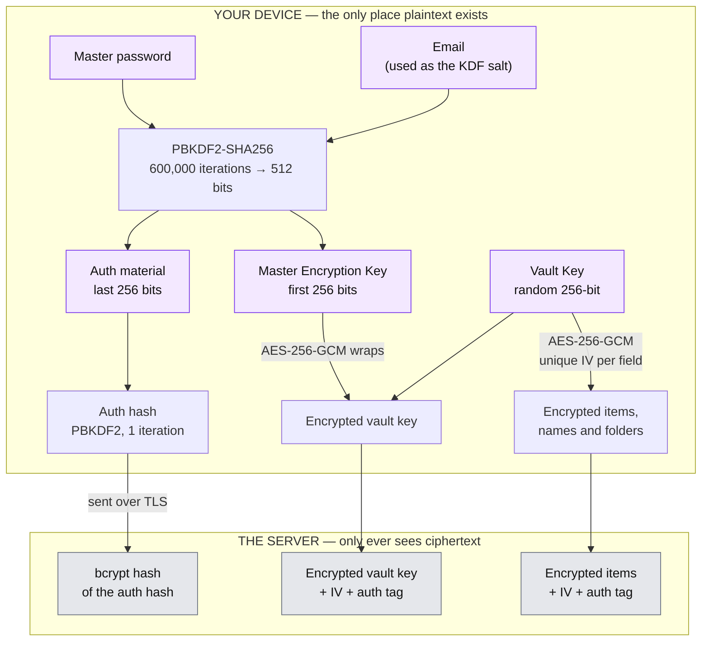
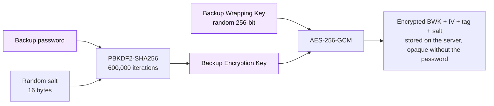
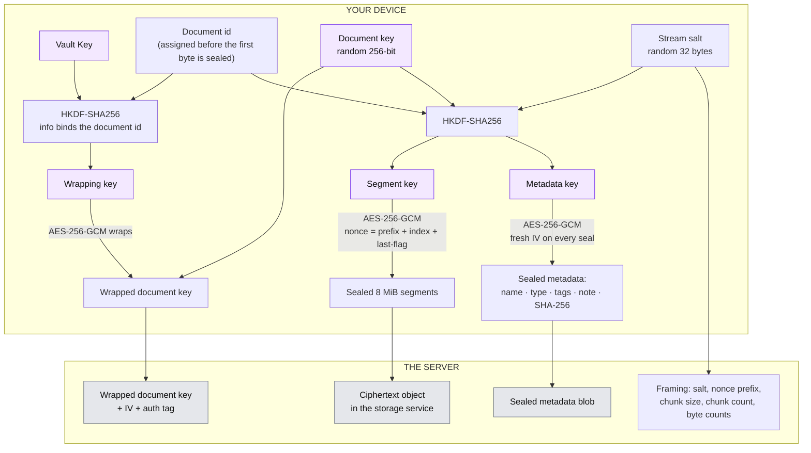
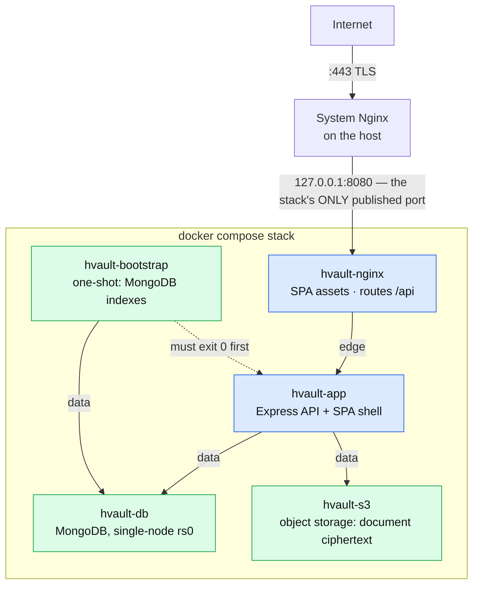

<div align="center">


# H-Vault

**A self-hostable, zero-knowledge password manager, secret store and encrypted notebook.**

Your master password never leaves your device. Neither does anything you encrypt with it.

[](https://github.com/Hiprax/h-vault/releases)
[](LICENSE)
[](https://nodejs.org)
[](tsconfig.base.json)
[](#testing)
[](#security-architecture)

[Quick start](#quick-start) · [Security architecture](#security-architecture) · [API](#api-reference) · [Deploy](#docker-deployment-recommended) · [Threat model](SECURITY.md#threat-model) · [Contributing](CONTRIBUTING.md)

</div>

---

H-Vault is a production-grade password manager you run yourself. Every vault item — its
contents **and its name** — is encrypted in the browser with AES-256-GCM before it is sent
anywhere. The server stores ciphertext it has no key for, and is built on the assumption
that it will one day be breached.

It is not a toy. It ships with two-factor authentication, refresh-token rotation with reuse
detection, encrypted off-site backups, an audit log, breach detection, a hardened Docker
stack that publishes exactly one loopback port, and a test suite that gates every push.

> [!IMPORTANT]
> Zero-knowledge means the server never _needs_ your plaintext. It does not mean it
> _couldn't_ serve you malicious JavaScript that steals it. That, and every other limit of
> this design, is written down plainly in the [threat model](SECURITY.md#threat-model).
> Read it before you trust anything with your passwords — including this.

## Table of contents

- [Features](#features)
- [Security architecture](#security-architecture)
- [Tech stack](#tech-stack)
- [Quick start](#quick-start)
- [Docker deployment](#docker-deployment-recommended)
- [Deployment security checklist](#deployment-security-checklist)
- [Configuration](#configuration)
- [API reference](#api-reference)
- [Rate limiting](#rate-limiting)
- [Project structure](#project-structure)
- [Testing](#testing)
- [The pipeline runs locally](#the-pipeline-runs-locally)
- [Running the whole gauntlet on a remote machine](#running-the-whole-gauntlet-on-a-remote-machine)
- [Releases](#releases)
- [Contributing](#contributing)
- [License](#license)

---

## Features

### Vault

|                        |                                                                                                                                                                                                                                                                                                                                                          |
| ---------------------- | -------------------------------------------------------------------------------------------------------------------------------------------------------------------------------------------------------------------------------------------------------------------------------------------------------------------------------------------------------- |
| **Five item types**    | Logins (with optional 2FA recovery codes), secrets, notes, cards (with Luhn validation, notes and an optional two-line billing address) and identities (a two-line address with courier delivery notes, plus company, Social Security and passport numbers — both masked — notes and custom fields) — with search, folders, tags, favorites and a trash. |
| **Reuse an address**   | A card's billing address can be filled from any identity that has one, chosen from a searchable list with an undo. Delivery notes stay on the identity — a card cannot hold them. Runs entirely on already-decrypted items in the browser; nothing is sent anywhere.                                                                                     |
| **Client-side crypto** | AES-256-GCM under a vault key the server never sees. Item and folder names are ciphertext too — so search runs entirely in the browser, over data only you can decrypt.                                                                                                                                                                                  |
| **Password generator** | Character-set and passphrase modes (2048-word EFF-based list, exactly 11 bits per word). Strength is reported as **exact entropy**, not a heuristic score — see [below](#honest-strength-metering).                                                                                                                                                      |
| **Vault health**       | Finds weak, reused, old (90+ days) and breached passwords, and logins with no TOTP configured.                                                                                                                                                                                                                                                           |
| **Password history**   | The last 10 passwords per login, each individually encrypted, decrypted on demand.                                                                                                                                                                                                                                                                       |
| **Built-in TOTP**      | Generate 2FA codes for your stored logins, with a clipboard that clears itself.                                                                                                                                                                                                                                                                          |
| **Key rotation**       | Re-key the entire vault on demand. The server raises a write fence for the duration, so a second session can't write ciphertext under the old key and silently lose it.                                                                                                                                                                                  |

### Security

|                                   |                                                                                                                                                                                                                                                                                                                                                                                                                                                                                                                                                                                                                                                                                                                                                                                                                                             |
| --------------------------------- | ------------------------------------------------------------------------------------------------------------------------------------------------------------------------------------------------------------------------------------------------------------------------------------------------------------------------------------------------------------------------------------------------------------------------------------------------------------------------------------------------------------------------------------------------------------------------------------------------------------------------------------------------------------------------------------------------------------------------------------------------------------------------------------------------------------------------------------------- |
| **Two-factor authentication**     | TOTP with bcrypt-hashed backup codes, regeneration, replay protection, and brute-force throttling on the 2FA step itself — a temp token can't be used for unlimited guessing.                                                                                                                                                                                                                                                                                                                                                                                                                                                                                                                                                                                                                                                               |
| **Session management**            | Refresh-token rotation with reuse detection and family revocation. Access tokens are invalidated the instant a password changes. A locked-out, unverified or pending-deletion account cannot mint new ones. `MAX_SESSIONS` (50) is an enforced per-device cap: a new sign-in evicts your oldest _live_ session, never a reuse-detection record.                                                                                                                                                                                                                                                                                                                                                                                                                                                                                             |
| **Remember me / trusted devices** | Opt-in per login. A remembered session lasts 30 days across a browser restart, and on a 2FA account the device may skip the _2FA step_ — never the master password, which is still typed on every unlock. Trust is granted only against a TOTP code: completing the 2FA step with a single-use _backup code_ signs you in and still gives you the 30-day session, but registers no device, because a recovery credential is kept where the authenticator app is not. Trust is a server-side record (only a SHA-256 of an opaque token, revocable centrally), checked strictly _after_ the password succeeds, rotated on use, and dropped on password change/reset, 2FA enable/disable, backup-code regeneration, "log out everywhere", stolen-token reuse detection, and account deletion. Manage or revoke devices from the Sessions page. |
| **No enumeration oracles**        | Registration, login, lockout, password reset and verification-resend are all built so that response body _and_ response time are identical whether or not the account exists.                                                                                                                                                                                                                                                                                                                                                                                                                                                                                                                                                                                                                                                               |
| **Account lockout**               | 30 minutes after 10 failed attempts, with progressive delays and an unlock email — and evaluated _after_ the password check, so it never reveals that an account exists.                                                                                                                                                                                                                                                                                                                                                                                                                                                                                                                                                                                                                                                                    |
| **CSRF + rate limiting**          | HMAC-SHA256 double-submit tokens with constant-time verification, and [seventeen rate-limit tiers](#rate-limiting) backed by MongoDB, keyed per IP, email, user or session, with IPv6 `/64` aggregation.                                                                                                                                                                                                                                                                                                                                                                                                                                                                                                                                                                                                                                    |
| **Breach detection**              | HaveIBeenPwned via k-anonymity — only a 5-character SHA-1 prefix ever leaves the server.                                                                                                                                                                                                                                                                                                                                                                                                                                                                                                                                                                                                                                                                                                                                                    |
| **Audit log**                     | A searchable security log covering **47 distinct operations**, with TTL-based retention.                                                                                                                                                                                                                                                                                                                                                                                                                                                                                                                                                                                                                                                                                                                                                    |
| **Account deletion**              | GDPR-complete, password-confirmed, and cascaded atomically across every collection.                                                                                                                                                                                                                                                                                                                                                                                                                                                                                                                                                                                                                                                                                                                                                         |

### Data

- **Encrypted backups.** Scheduled or on-demand backups, encrypted under a _separate_ backup
  password so they stay opaque even to a server that holds them. Downloads are signed with
  HMAC-SHA256 and the signature is verified on restore, so a tampered file is rejected.
  Restores are safe to repeat: a restore **never replaces your vault key** — the client
  re-encrypts incoming rows to the key you already have — and previously-restored content is
  matched by provenance, so re-running the same backup doesn't accumulate duplicates. Any
  folder cycle a malicious file plants is detected and broken.
- **Import / export.** Import from Bitwarden, LastPass, KeePass, Chrome/Edge, Firefox, 1Password
  and generic CSV (whose column mapping includes a 2FA recovery-codes target), with
  skip / overwrite / keep-both conflict strategies. Duplicates are decided
  by an item's **content**, not its name: a login is identified by its site and username, so ten
  accounts on one site stay ten items and re-importing the same file changes nothing. `skip` (the
  default) never modifies anything; `overwrite` updates a matched item in place — replacing its
  name and content, keeping the previous password in that item's history — and always asks for
  confirmation first; `keep both` never matches, so it always adds. Matching runs once over the
  whole file before anything is sent, so how a large import is split into requests cannot change
  the result, and under `skip` or `overwrite` re-running an import that failed part-way through
  is safe: it simply performs whatever is left. (Under `keep both` a re-run adds the rows that
  already landed a second time — that is what "keep both" means.) Every source is
  parsed and encrypted **in the browser** before upload, so no credential, note or field value
  ever reaches the server in the clear. Source folders/groups are
  carried over as tags — and tags, as always, are stored in plaintext so the server can index
  them, so your source folder names are visible to it. Export is encrypted JSON and requires
  re-entering your master password.
- **Portable plaintext export ("Leave H-Vault").** A separate `/settings/export-data` page exports
  your whole vault to another password manager as an **unencrypted plaintext file** — Bitwarden JSON,
  Bitwarden CSV, or Chrome/Edge CSV. It is deliberately kept apart from the encrypted `.enc` export
  and the backup system — its own route, entry-point card and confirmation dialog — so "leave the
  app" can never be mistaken for "back up my vault". You re-enter your master password (verified
  server-side before any plaintext is produced), accept an explicit unencrypted-data warning, and the
  file is generated **entirely in the browser** and never uploaded. Anything that cannot be decoded,
  or that the chosen format cannot represent, is reported as skipped/omitted rather than silently
  dropped. Each format carries what it can: **Bitwarden JSON** is the most complete (logins, secure
  notes, cards, identities, folders, TOTP, custom fields and password history, with a login's 2FA
  recovery codes carried as a hidden custom field, an address's second street line in Bitwarden's own
  `address2` field, and an identity's delivery notes as a plain custom field); **Bitwarden CSV** keeps only logins and notes
  (cards, identities and secrets are omitted, and recovery codes arrive as text in the notes); and
  **Chrome/Edge CSV** is logins-only, dropping even a login's TOTP, recovery codes, custom fields
  and folder. Folder paths re-import as tags,
  as they do for import. CSV values are quoted per RFC 4180 but **never altered** — see
  [SECURITY.md](SECURITY.md).
- **File encryption tool.** A standalone, entirely client-side tool: pick any file, set a
  password, download a self-contained `.enc` container — Argon2id envelope encryption, the
  filename and MIME type sealed _inside_, and an integrity hash re-verified on decrypt. It is
  **account-agnostic**: it never touches your vault key or master password, so a file encrypted
  while signed in as one user decrypts with the same password on any machine, as anyone, or as
  nobody. Lose the password and the file is gone — the UI says so, plainly.
- **Soft delete.** A 30-day trash with restore, purged by a nightly job.

### Documents

An encrypted document store, **optional and off unless the operator configured object
storage** — a deployment without it looks exactly as it did before, with no Documents entry in
the sidebar and nothing to switch off.

- **Any file, sealed in your browser.** Each document gets its own random 256-bit key, wrapped
  under a key derived from your vault key and bound to that document's id, and the file is
  encrypted in segments that each seal to exactly 8 MiB — every segment carrying its own position
  and an end-of-file marker inside its nonce, so a hostile server cannot reorder, truncate, or
  splice one document into another without the decryption failing. What the server stores is ciphertext, a wrapped key and
  sizes: **no filename, no MIME type, no tag, no note, no content**. The name, type, tags, note
  and a whole-file SHA-256 live in their own sealed blob, and a download is checked against that
  digest on the way out — so what comes back is byte-identical or it is discarded and you are
  told.
- **Any file type uploads.** `DOCUMENT_ALLOWED_EXTENSIONS` is a **browser-side convenience**, not
  a control: the server receives ciphertext and cannot see a filename, so it cannot enforce an
  extension and does not pretend to. Set it and the upload panel will steer your users; leave it
  empty — the default — and every type uploads. Either way, a determined client can upload
  anything, and the docs say so rather than implying a server-side check that does not exist.
- **Filed, favorited and findable.** Documents share the vault's folders, and the Documents page
  has the same rail the vault does: all documents, favorites, the trash, and the folder tree with
  a count per folder. A file uploaded while a folder is open is filed there. Search reaches a
  document's name, its type, its tags and its note — every one of which is decrypted in your
  browser, so what you searched for never leaves it.
- **A trash you can actually open.** Deleting a document keeps it for thirty days, where it can be
  restored or destroyed for good, and it still occupies storage until it is. Emptying the trash
  tells you how many were destroyed, and says so plainly when the storage engine could not remove
  every file. If the engine refuses several files in a row it stops there rather than spending hours
  on a service that is plainly down, reports what it actually attempted, and reloads the trash so
  what you see is what is really still in it. Nothing is destroyed on that path and nothing is lost.
- **Rotating your vault key does not re-upload anything.** A rotation rewraps **32 bytes per
  document** instead of rewriting every file, which is the only way rotation stays possible once
  an account holds gigabytes. The request must name every item, folder and document the account
  has, and is refused if it does not, so a row created while you were preparing the rotation
  cannot be left behind under the superseded key.
- **Format and repair before uploading, optionally.** Two checkboxes on the upload panel tidy a
  document before it is encrypted — **format** for `json`, `jsonc`, `json5`, `jsonl`, `ndjson`,
  `md`, `markdown`, `yaml` and `yml`, and **repair** for the JSON family only (a heuristic that
  guessed at YAML indentation would change meaning silently, and Markdown has no parse failure to
  repair — both still get a parse check through the formatter). Nothing is rewritten silently: you
  see the byte delta, the lines added and removed, and a unified diff, and confirm before the
  upload starts. A file that cannot be repaired **stops** the upload and names the line, the
  column and the offending text, and offers to upload the original untouched. Both run on files up
  to 5 MB, and both run inside the isolated frame described below rather than in the page.
- **A viewer that cannot reach your vault.** Documents are displayed inside an isolated frame
  with an **opaque origin**: it holds no key, no token, no cookie and no storage, it cannot read
  the page that embeds it, and its own content-security policy leaves it unable to reach any host
  but this one or to read a single response. Your browser decrypts
  and verifies the file, and only then hands the frame the bytes — never the document key, the
  vault key, an access token, the document's id or even its name. The title, the toolbar and the
  download button are drawn outside the frame, so nothing a document renders can forge them, and
  a link inside a document asks for confirmation and shows you the destination's origin before it
  opens. **Full screen expands the whole panel, never the frame alone** — the name and the
  Download button stay outside it in both states, and the browser keeps its own address bar, which
  is the one piece of chrome a document can never draw.

#### What renders, and what is download-only

Every renderer below emits DOM nodes directly and never assigns HTML to the page, and before any
of them runs the file's **leading bytes are compared with what its name claims** — a PDF renamed
`.md` is refused, and the refusal says what the file actually looks like.

| Mode       | Extensions                                                                                                                                                                                                                                                                                                | How it is shown                                                                                                                                                             |
| ---------- | --------------------------------------------------------------------------------------------------------------------------------------------------------------------------------------------------------------------------------------------------------------------------------------------------------- | --------------------------------------------------------------------------------------------------------------------------------------------------------------------------- |
| `image`    | `png` `jpg` `jpeg` `gif` `webp` `avif` `bmp` `ico` `svg`                                                                                                                                                                                                                                                  | Through ``. **SVG is never inlined**, because an `` cannot run the script an inline SVG can                                                                       |
| `markdown` | `md` `markdown` `mdown` `mkd`                                                                                                                                                                                                                                                                             | The way GitHub renders a README — headings, tables, task lists, strikethrough, autolinks, footnotes, fenced code with highlighting — sanitized with a GitHub-derived schema |
| `html`     | `html` `htm` `xhtml`                                                                                                                                                                                                                                                                                      | The same sanitizing pipeline. Script, `on*` handlers and `javascript:` URLs do not survive it                                                                               |
| `text`     | `txt` `text` `log` `csv` `tsv`                                                                                                                                                                                                                                                                            | Text nodes, never HTML; `csv` and `tsv` as a table whose cells are text, so a formula-shaped cell is shown verbatim rather than interpreted                                 |
| `code`     | `sh` `bash` `zsh` `fish` `ps1` `bat` `cmd` `py` `rb` `pl` `lua` `sql` `r` `js` `mjs` `cjs` `ts` `tsx` `jsx` `c` `h` `cpp` `hpp` `cs` `java` `kt` `go` `rs` `php` `swift` `diff` `patch` `conf` `cfg` `properties` `env` `service` `json` `jsonc` `json5` `jsonl` `ndjson` `yaml` `yml` `toml` `xml` `ini` | Text nodes with syntax highlighting. An extension with no matching grammar simply reads as plain text                                                                       |
| `media`    | `mp4` `m4v` `webm` `ogv` `mp3` `m4a` `aac` `wav` `flac` `opus` `ogg` `oga`                                                                                                                                                                                                                                | `<video controls>` / `<audio controls>`, from a blob URL the frame mints itself                                                                                             |

Everything else is **download-only, and each case is a decision rather than a gap**:

| Not rendered                                                              | Why                                                                                                                                                                                                                                                                                                                                                                                                                                                             |
| ------------------------------------------------------------------------- | --------------------------------------------------------------------------------------------------------------------------------------------------------------------------------------------------------------------------------------------------------------------------------------------------------------------------------------------------------------------------------------------------------------------------------------------------------------- |
| **`pdf`**                                                                 | Deliberate. A PDF viewer is a large third-party parser, and the best-known one had arbitrary JavaScript execution _in the hosting page_ (CVE-2024-4367 in pdf.js) — which here would be the page holding your unlocked vault key. It is also the only renderer that would have needed network access and a WebAssembly module, which would have had to be opened up for every other format too. Download it and open it in the viewer your computer already has |
| **Office formats** — `docx`, `xlsx`, `pptx`                               | The same reason, plus fidelity a preview could not honestly claim                                                                                                                                                                                                                                                                                                                                                                                               |
| **Files with no extension** — `Dockerfile`, `Makefile`, `.bashrc`, `.env` | The renderer is chosen from the lowercased segment after the **last dot**, so a name with no dot — or whose only dot is leading — has nothing to choose from. Recognising them would take a second lookup keyed by whole filename, which is a second source of truth for one question. (`prod.env` has the extension `env` and does render; the file `.env` does not)                                                                                           |
| **Anything over 25 MB**                                                   | A memory budget before a UI one: the page holds the whole decrypted file, hands the same buffer to the frame, and the renderer builds its own representation on top, so the peak is a multiple of the file                                                                                                                                                                                                                                                      |
| **Anything else**                                                         | Unrecognised rather than refused. Adding an extension to the table above is cheap and safe, so the list grows when someone asks                                                                                                                                                                                                                                                                                                                                 |

Two consequences worth stating plainly. A preview is **not redacted in any way** — which is right
for a store whose whole content is sensitive by definition, but it does mean a previewed
`prod.env` shows its secrets on screen exactly as a revealed password field would. And a document
whose key will not unwrap cannot be renamed or downloaded at all: its name, type, tags and note
live in a sealed blob that will not open, so there is nothing to rewrite and no key to rewrite it
with, and the file's own bytes are sealed under a key derived from the same document key, so there
is nothing to hand back either. It stays movable, favoritable, trashable,
restorable and deletable, and the app says so instead of failing quietly.

#### Documents are not in your backups

This is the one thing to know before you rely on either. H-Vault's encrypted backup — scheduled,
emailed, downloadable — carries your vault. It does **not** carry your documents, and it never
will: a backup is a single JSON file of about 25 MiB and uploaded files do not fit in one. What it
carries instead is a count, so a restored account says "this account had 43 documents" rather than
looking complete when it is not.

For a self-hosted deployment that means the **object storage volume is the only copy of every
uploaded file**, and it has to be captured together with the database and the deployment's `.env`
— the wrapped keys are in the database, the ciphertext is in the storage service, and neither half
is usable without the other. The procedure, the volume names and why a file-level copy of a
running storage engine is not a backup are in
[Back up the database AND the document storage](#back-up-the-database-and-the-document-storage).

### Experience

- **Progressive Web App** — installable, with offline read access from an encrypted IndexedDB
  cache and automatic re-sync when connectivity returns.
- **Accessible by construction** — focus traps, `aria-activedescendant` roving focus in menus,
  live regions, and correct ARIA roles on virtualized lists (`react-window` above 50 items).
- **Keyboard-first** — `Ctrl`+`L` lock, `Ctrl`+`N` new item, `Ctrl`+`K` search, `Ctrl`+`↑`/`↓`
  reorder folders (`Cmd` on macOS).
- **Auto-lock on a wall-clock deadline** — the vault locks when your configured idle timeout has
  actually elapsed, measured against the clock rather than against a timer. Browsers throttle timers
  in background tabs and stop them entirely while a machine sleeps, so a timer alone can only fire
  late: come back from an hour's sleep and the vault re-checks the deadline immediately instead of
  waiting out the remainder. Locking as soon as the tab is hidden is available as a separate,
  opt-in setting with its own delay — off by default, because the timeout you configured should be
  the one that governs.
- **Clipboard hygiene** — a single shared deadline erases copied secrets from the OS clipboard, on
  that deadline and on lock. Switching tabs or minimising deliberately does **not** erase it: that is
  how you go somewhere to paste. If the browser refuses the erase while the window is in the
  background, it is retried the moment the window can write again rather than being abandoned.
- **Degrades honestly** — one corrupt item never breaks the list. It is flagged, a banner offers
  a re-sync, and the item stays deletable instead of crashing the page.

---

## Security architecture

### The key hierarchy

Everything below the dashed line is derived on your device and never crosses it.


```mermaid
flowchart TD
    subgraph client["YOUR DEVICE — the only place plaintext exists"]
        MP["Master password"]
        EM["Email<br/>(used as the KDF salt)"]
        MP --> KDF["PBKDF2-SHA256<br/>600,000 iterations → 512 bits"]
        EM --> KDF
        KDF --> MEK["Master Encryption Key<br/>first 256 bits"]
        KDF --> AM["Auth material<br/>last 256 bits"]
        AM --> AH["Auth hash<br/>PBKDF2, 1 iteration"]
        VK["Vault Key<br/>random 256-bit"]
        MEK -->|"AES-256-GCM wraps"| EVK["Encrypted vault key"]
        VK --> EVK
        VK -->|"AES-256-GCM<br/>unique IV per field"| CT["Encrypted items,<br/>names and folders"]
    end

    subgraph server["THE SERVER — only ever sees ciphertext"]
        BH["bcrypt hash<br/>of the auth hash"]
        SEVK["Encrypted vault key<br/>+ IV + auth tag"]
        SCT["Encrypted items<br/>+ IV + auth tag"]
    end

    AH -->|"sent over TLS"| BH
    EVK --> SEVK
    CT --> SCT

    classDef secret fill:#f3e8ff,stroke:#7c3aed,color:#111
    classDef opaque fill:#e5e7eb,stroke:#6b7280,color:#111
    class MP,EM,MEK,AM,VK secret
    class BH,SEVK,SCT opaque
```

The server can verify you know your password (it bcrypts the auth hash) and hand back your
encrypted vault key — but it cannot unwrap that key, because the MEK that wraps it is derived
from a password it never receives.

**Why the email is the salt.** The client must derive the _same_ MEK on every device before it
has spoken to the server, so the salt has to be something it already knows. A per-user random
salt would have to be fetched first — and an endpoint that returns a salt for an email is an
account-enumeration oracle. This is the standard trade-off for browser-based zero-knowledge
vaults; the iteration count is what carries the cost of an offline attack.

### Backup encryption

Backups are encrypted under a second, independent password, so an operator who holds your
backup file still holds nothing.


```mermaid
flowchart LR
    BP["Backup password"] --> BEK["PBKDF2-SHA256<br/>600,000 iterations"]
    SALT["Random salt<br/>16 bytes"] --> BEK
    BEK --> BEKK["Backup Encryption Key"]
    BWK["Backup Wrapping Key<br/>random 256-bit"] --> WRAP["AES-256-GCM"]
    BEKK --> WRAP
    WRAP --> OUT["Encrypted BWK + IV + tag + salt<br/>stored on the server, opaque without the password"]

    classDef secret fill:#f3e8ff,stroke:#7c3aed,color:#111
    class BP,BEKK,BWK secret
```

The backup file also carries an HMAC-SHA256 signature computed under a key separated from the
BWK by HKDF, so tampering is detected at restore time rather than discovered later.

### Document encryption

A document is not encrypted under the vault key directly. Each one gets its own key, and the
vault key only ever **wraps** it — which is what makes a rotation 32 bytes per document instead of
a re-upload of every file.


```mermaid
flowchart TD
    subgraph client["YOUR DEVICE"]
        VK["Vault Key"]
        ID["Document id<br/>(assigned before the first byte is sealed)"]
        DEK["Document key<br/>random 256-bit"]
        VK --> HK["HKDF-SHA256<br/>info binds the document id"]
        ID --> HK
        HK --> WK["Wrapping key"]
        WK -->|"AES-256-GCM wraps"| WDEK["Wrapped document key"]
        DEK --> WDEK
        SALT["Stream salt<br/>random 32 bytes"] --> HK2["HKDF-SHA256"]
        DEK --> HK2
        ID --> HK2
        HK2 --> SK["Segment key"]
        HK2 --> MK["Metadata key"]
        SK -->|"AES-256-GCM<br/>nonce = prefix + index + last-flag"| SEG["Sealed 8 MiB segments"]
        MK -->|"AES-256-GCM<br/>fresh IV on every seal"| META["Sealed metadata:<br/>name · type · tags · note · SHA-256"]
    end

    subgraph server["THE SERVER"]
        SW["Wrapped document key<br/>+ IV + auth tag"]
        SM["Sealed metadata blob"]
        SF["Framing: salt, nonce prefix,<br/>chunk size, chunk count, byte counts"]
        SO["Ciphertext object<br/>in the storage service"]
    end

    WDEK --> SW
    META --> SM
    SEG --> SO
    SALT --> SF

    classDef secret fill:#f3e8ff,stroke:#7c3aed,color:#111
    classDef opaque fill:#e5e7eb,stroke:#6b7280,color:#111
    class VK,DEK,WK,SK,MK secret
    class SW,SM,SO opaque
```

Four properties follow from putting the segment's **position** and an **end-of-file flag** inside
its nonce, and the document id inside every key derivation. A hostile server cannot reorder
segments, cannot truncate the file, cannot substitute a segment from another document, and cannot
swap the framing parameters it stores in plaintext — every one of those makes the decryption fail
rather than producing plausible bytes. The framing is stored twice on purpose: once in the columns
the server needs for range arithmetic, and once inside the authenticated metadata blob. **A client
must compare the two and refuse on a mismatch**, which is what turns a plaintext copy the server
could edit into one it cannot.

Content is immutable after upload — a segment is never rewritten, so a nonce is never reused under
a segment key — and replacing bytes means a new document. Renaming or retagging re-seals only the
metadata blob, under a freshly generated IV each time.

### Cryptographic parameters

| Parameter                 | Value                                                                                                                                          |
| ------------------------- | ---------------------------------------------------------------------------------------------------------------------------------------------- |
| Key derivation            | PBKDF2-SHA256, **600,000 iterations** (a registration below 500,000 is rejected)                                                               |
| Master-key salt           | The account email — see the note above                                                                                                         |
| Backup-key salt           | 16 random bytes                                                                                                                                |
| Encryption                | AES-256-GCM                                                                                                                                    |
| Key size                  | 256 bits                                                                                                                                       |
| IV                        | 12 bytes, freshly random for **every** field                                                                                                   |
| Authentication tag        | 16 bytes                                                                                                                                       |
| Name hash                 | HMAC-SHA256 over the name, keyed by the vault key — folder-name uniqueness, not search                                                         |
| Server-side password hash | bcrypt, 12 rounds (configurable, 4–31)                                                                                                         |
| File encryption tool      | Argon2id (32 MiB, t=3, p=1) wrapping a random per-file key                                                                                     |
| Document key              | Random 256-bit per document, wrapped under HKDF-SHA256(vault key, info bound to the document id)                                               |
| Document segment          | AES-256-GCM over 8,388,592 bytes of plaintext, sealing to exactly 8 MiB; nonce = 7 random bytes ‖ big-endian segment index ‖ last-segment flag |

### Honest strength metering

The generator's output is uniform-random, so its strength is reported as **exact
information-theoretic entropy** — `length × log₂(charset)`, or `words × 11` for a passphrase —
against five bands anchored on NIST SP 800-131A's 112-bit minimum. Crack times are quoted as an
average case against a single high-end GPU and computed entirely in log space, so they never
overflow to "infinity" for a long password.

zxcvbn — which saturates its score at roughly 33 bits and assumes a human chose the password — is
used only where it is actually the right tool: for the **human-chosen** master password, and for
the stored passwords the vault-health check grades.

> A default 5-word passphrase honestly reads **55 bits — "Weak"** here. Most generators would
> paint it green.

---

## Tech stack

<table>
<tr><td valign="top" width="33%">

**Backend**

- Node.js 24 · TypeScript 6 (strict)
- Express 5
- MongoDB 7+ · Mongoose 9
- Passport JWT (access + refresh rotation)
- Zod 4 validation
- Helmet · CSRF · `express-rate-limit`<br/>(first-party MongoDB store) · hppx · bcryptjs
- Nodemailer · node-cron
- `@hiprax/crypto` · `@hiprax/logger` · `@hiprax/errors`

</td><td valign="top" width="33%">

**Frontend**

- React 19 · Vite 8 (Rolldown)
- TypeScript 6 (strict)
- Zustand 5 (auth · vault · ui)
- React Router 8, lazy-loaded
- Tailwind CSS 4 · shadcn/ui-inspired
- React Hook Form + Zod
- **Web Crypto API** — PBKDF2, AES-256-GCM, HMAC
- `@hiprax/crypto` + hash-wasm (Argon2id)
- vite-plugin-pwa · IndexedDB offline cache

</td><td valign="top" width="33%">

**Shared**

- Zod schemas for every request,<br/>response and decrypted payload
- TypeScript types for every model
- Crypto parameters and limits<br/>as single-source constants
- Built **first** — both other<br/>packages depend on it

</td></tr>
</table>

---

## Quick start

**Prerequisites:** Node.js **24+** (pinned in `.nvmrc`) and Docker (for MongoDB).

```bash
git clone https://github.com/Hiprax/h-vault.git
cd h-vault
npm install

cp .env.example .env
# Set JWT_ACCESS_SECRET, JWT_REFRESH_SECRET and SESSION_SECRET — 32+ chars each, all different:
#   node -e "console.log(require('crypto').randomBytes(32).toString('hex'))"

docker compose -f docker-compose.dev.yml up -d hvault-db   # MongoDB only
npm run build:shared                                        # shared must be built first
npm run dev
```

|                    |                                  |
| ------------------ | -------------------------------- |
| Frontend           | <http://localhost:5173>          |
| API                | <http://localhost:5000/api/v1>   |
| API docs (Swagger) | <http://localhost:5000/api/docs> |

> **Prefer not to run Node on the host?** Drop the service name — `docker compose -f
docker-compose.dev.yml up -d` — and the same file also starts a hot-reload **app** container
> serving those two ports, so you skip `npm run dev` entirely. Start only one of the two: the
> container publishes 5173 and 5000, so running both collides on the ports.

---

## Docker deployment (recommended)

The stack is **self-contained**: the API, the SPA, MongoDB, the S3-compatible object storage the
document store writes ciphertext to, and the Nginx that fronts them all live inside it. It
publishes exactly **one** host port, bound to loopback, and your machine's own system Nginx
terminates TLS and proxies to it.


```mermaid
flowchart TD
    NET["Internet"] -->|":443 TLS"| SYS["System Nginx<br/>on the host"]
    SYS -->|"127.0.0.1:8080 — the stack's ONLY published port"| NGX

    subgraph stack["docker compose stack"]
        direction TB
        NGX["hvault-nginx<br/>SPA assets · routes /api"]
        APP["hvault-app<br/>Express API + SPA shell"]
        BOOT["hvault-bootstrap<br/>one-shot: MongoDB indexes"]
        DB["hvault-db<br/>MongoDB, single-node rs0"]
        S3["hvault-s3<br/>object storage: document ciphertext"]

        NGX -->|"edge"| APP
        APP -->|"data"| DB
        APP -->|"data"| S3
        BOOT -->|"data"| DB
        BOOT -.->|"must exit 0 first"| APP
    end

    classDef edge fill:#dbeafe,stroke:#2563eb,color:#111
    classDef data fill:#dcfce7,stroke:#16a34a,color:#111
    class NGX,APP edge
    class DB,BOOT,S3 data
```

`data` is an **internal** network: no published port, and no route to the internet. Nginx is not
on it at all, and neither the database nor the object storage can be reached from outside the
stack or reach out of it.

The storage engine is [Garage](https://garagehq.deuxfleurs.fr) (AGPL-3.0), pinned by digest and
running as a separate container — one static binary, about 6 MiB idle. `docker compose up` brings
it up **already provisioned**: the bucket and the access key are created on first boot from the
values you put in `.env`, so there is no storage step in this guide. Everything it holds is
ciphertext sealed in the browser, so it never sees a filename, a MIME type, a tag, a note or any
content. Its volume is also the **only** place your users' document bytes exist — read
[the backup boundary](#back-up-the-database-and-the-document-storage) before you rely on backups.

### 0. Host prerequisites

Nothing on the host but Docker. MongoDB, the object storage, Node and the routing Nginx all live
**inside** the stack — the only thing you install yourself is the system Nginx that terminates TLS
in front of it (step 3).

- **Docker Engine** with the **Compose plugin ≥ 2.24** (`docker compose version`). The stack uses
  the `env_file` long syntax, which older Compose rejects with a parse error.
- `sudo systemctl enable --now docker`, or the stack does **not** come back after a reboot.
- The host's system Nginx (step 3) plus `sudo ufw allow 80,443/tcp`. Do **not** open the stack's
  port: it is bound to `127.0.0.1` and must stay that way. A Docker port published without a host
  IP is reachable from the whole internet **even behind an active `ufw deny`** — Docker's iptables
  rules are evaluated before `INPUT`.
- ~2 GB free RAM and ~3 GB disk **to build**, if you build on the production host.

> **Building images on WSL2.** The Node image base is pinned to `node:24-alpine3.23` on purpose: the
> floating `node:24-alpine` tag moved onto Alpine 3.24, whose musl userspace crashes `npm` at launch
> (SIGSEGV) under recent WSL2 kernels, so `npm ci` dies with exit 139 during the build. The pin uses
> the identical Node runtime and builds everywhere. If you build on WSL2 and still see Node crash on
> launch, the WSL2 6.18 kernel series has separate known Node instability; pin the WSL2 kernel to the
> 6.6 LTS series via `%UserProfile%\.wslconfig` (`[wsl2]` `kernel=<path to a 6.6 microsoft-standard
bzImage>`), then `wsl --shutdown`. Do not chase a 6.19+ kernel — it regresses MongoDB instead.

### 1. Configure

One `.env` at the repo root configures every package. Compose hands it to the app container
wholesale, so there is no per-package env file to maintain.

```bash
cp .env.example .env
chmod 600 .env          # it holds every secret the deployment has
```

At minimum:

| Variable                                                                 | Notes                                                                                                                                                                                                                                                                                                                                                                                                                                                                                                                                                                                                              |
| ------------------------------------------------------------------------ | ------------------------------------------------------------------------------------------------------------------------------------------------------------------------------------------------------------------------------------------------------------------------------------------------------------------------------------------------------------------------------------------------------------------------------------------------------------------------------------------------------------------------------------------------------------------------------------------------------------------ |
| `JWT_ACCESS_SECRET`, `JWT_REFRESH_SECRET`, `SESSION_SECRET`              | 32+ chars, all different. `node -e "console.log(require('crypto').randomBytes(32).toString('hex'))"`                                                                                                                                                                                                                                                                                                                                                                                                                                                                                                               |
| `TWO_FACTOR_ENCRYPTION_KEY`                                              | Set it on day one. Unset, 2FA secrets are encrypted under `SESSION_SECRET` — which means rotating `SESSION_SECRET` later breaks 2FA.                                                                                                                                                                                                                                                                                                                                                                                                                                                                               |
| `MONGO_ROOT_PASSWORD`                                                    | Ships **empty**, and the stack refuses to start until you set it. Must be **URL-safe** (it goes into a URI): `openssl rand -hex 32`.                                                                                                                                                                                                                                                                                                                                                                                                                                                                               |
| `S3_BUCKET`, `S3_ACCESS_KEY_ID`, `S3_SECRET_ACCESS_KEY`, `S3_RPC_SECRET` | The document store's object storage. All four ship **empty** and the stack refuses to start until you set them, exactly like the database passwords — a placeholder would be a working bucket credential published in this repository. The bucket and the key are created for you on first boot, so the bucket name must be a **valid S3 bucket name** (3–63 characters, lower case; the engine refuses to start otherwise) and the access key id must be **at least 8 characters**. `openssl rand -hex 32` for the two secrets. Leave `S3_ENDPOINT` empty: the stack points the app at its own storage container. |
| `APP_URL`, `CORS_ORIGIN`                                                 | Your public HTTPS URL. The app **refuses to boot** in production with a non-HTTPS `CORS_ORIGIN`.                                                                                                                                                                                                                                                                                                                                                                                                                                                                                                                   |
| `HVAULT_HTTP_PORT`                                                       | The single loopback port to publish (default `8080`). One per stack if the host runs several.                                                                                                                                                                                                                                                                                                                                                                                                                                                                                                                      |
| `TRUST_PROXY_HOPS`                                                       | `2` with the system Nginx in front (the default); `1` if you expose the loopback port directly.                                                                                                                                                                                                                                                                                                                                                                                                                                                                                                                    |
| `HVAULT_STACK_NAME`                                                      | Namespaces the Compose project, containers, networks and volumes. Change it **only** for a second stack on the same host.                                                                                                                                                                                                                                                                                                                                                                                                                                                                                          |
| `HVAULT_EDGE_SUBNET`, `HVAULT_DATA_SUBNET`                               | Only if `172.31.24x` is already taken here. An overlap is fatal: Docker refuses to create the network.                                                                                                                                                                                                                                                                                                                                                                                                                                                                                                             |
| `HVAULT_VERSION`                                                         | The tag the stack's images are built under. Keep it equal to `package.json`'s `version` (a test asserts the Compose default does).                                                                                                                                                                                                                                                                                                                                                                                                                                                                                 |

> **Running two H-Vaults on one host?** Give the second its own `HVAULT_STACK_NAME`,
> `HVAULT_HTTP_PORT` and subnets. The stack name matters most: two stacks sharing it do not fail
> loudly — Compose treats them as the **same project**, so the second `up` recreates the first
> one's containers and adopts its volumes.

### 2. Start

```bash
docker compose up -d --build --wait
```

`--wait` blocks until every service reports **healthy** and **exits non-zero if any does not** —
that is the gate. A green `docker compose config` proves nothing. Afterwards `docker compose ps`
should show four services `healthy` — `hvault-nginx`, `hvault-app`, `hvault-db` and `hvault-s3` —
and the two one-shots, `hvault-bootstrap` and `hvault-db-init`, `Exited (0)`.

On a first or clean deployment that is the whole story. The one case where `--wait` reports a
failure the stack does not have is **re-running it to recover from an app outage longer than about
75 seconds** — see the `hvault-nginx is unhealthy` row in [Troubleshooting](#troubleshooting).

That is the whole deployment. Indexes are created automatically by the one-shot bootstrap
container before the API is allowed to start, so there is no manual index step. (Production runs
Mongoose with `autoIndex` off, and the indexes are not merely a performance matter: the
`(userId, searchHash)` unique partial index on folders is what makes duplicate detection return
409, and the audit-log and refresh-token TTLs are what bound those collections.)

### 3. Put your system Nginx in front

```bash
sudo cp docker/nginx/system.docker.example.conf /etc/nginx/sites-available/hvault.conf
sudo ln -s /etc/nginx/sites-available/hvault.conf /etc/nginx/sites-enabled/
# edit server_name + the ssl_certificate paths, then:
sudo nginx -t && sudo systemctl reload nginx
```

Get certificates with `sudo certbot certonly --nginx -d vault.example.com`. Running under PM2
instead? Use `docker/nginx/system.pm2.example.conf`, which proxies straight to Express on
`127.0.0.1:5000` and sets `TRUST_PROXY=1`.

> **Get `TRUST_PROXY_HOPS` right.** Express trusts the last _N_ entries of `X-Forwarded-For`. Too
> high and any client can spoof its own IP by sending the header — defeating the IP-keyed rate
> limits and poisoning the audit log. Too low, and every request is attributed to the proxy. With
> the system Nginx **and** the stack's Nginx there are exactly two proxies, so `2` is correct.

### What the stack does for you

- **One exposed surface.** Only Nginx publishes a port, on `127.0.0.1`. Neither MongoDB nor the
  object storage has a published port; both sit on an internal network with no route to the
  internet, so the storage engine's S3 API — which authenticates with a static key pair and has
  none of the app's rate limiting, CSRF or session handling in front of it — is unreachable from
  anywhere but the app container.
- **Security headers stay intact.** Nginx serves the content-hashed `/assets/*` straight from disk
  (immutable caching, gzip, `nosniff`), but every **HTML document** is proxied to Express, so
  helmet remains the single owner of the CSP, its per-request nonce, `X-Frame-Options` and
  `Referrer-Policy`. HSTS belongs to the outer Nginx alone.
- **API responses are never compressed.** Gzipping a response that mixes a secret (a CSRF or
  bearer token) with attacker-influenced content is the precondition for a BREACH-style
  compression oracle. The payloads are base64 ciphertext, which barely compresses anyway.
- **Transactions work.** MongoDB runs as a single-node replica set (`rs0`), so vault-key rotation,
  account deletion and refresh-token rotation take their atomic paths.
- **Hardened by default.** `no-new-privileges` everywhere; all Linux capabilities dropped (MongoDB
  keeps only the five its entrypoint needs to drop to an unprivileged user); read-only root
  filesystems on the app, Nginx, the bootstrap **and** the storage engine; memory, CPU and
  `pids_limit` bounds; log rotation; and healthcheck probes that leak nothing into
  `docker inspect`. The one image the stack does not build — the storage engine — is pinned by
  **digest** as well as by tag, so a moved tag cannot change what runs.
- **Documents cost the vault nothing when storage is unwell.** The app waits for the storage
  container to _start_, never for it to be _healthy_: documents are an optional feature, and a
  storage problem must not be able to hold a password manager's login down. A storage outage
  degrades documents alone, through the boot preflight and per-request errors.

<details>
<summary><b>Updating, rolling back, and backing up your data</b></summary>

#### Update

```bash
git pull
# bump HVAULT_VERSION in .env to match package.json, then:
docker compose up -d --build --wait
```

The bootstrap re-runs (creating any index a new release added), and Nginx re-resolves the app
through Docker's DNS, so it follows the new container even if its IP changes. There is a **brief
downtime window** while the containers are recreated.

#### Roll back

```bash
git checkout v0.1.0            # the release you want back
docker compose up -d --build --wait
```

Images are tagged with `HVAULT_VERSION`, so the previous release's images are still on the host
under their own tag, and `docker compose ps` names the version actually serving. A rollback does
**not** roll the database back.

#### Back up the database AND the document storage

> **Read this before you trust a backup.** H-Vault's own backup feature — the encrypted archive it
> emails and lets a user download — **does not contain documents**. It never has and it is not
> meant to: a backup is a single JSON document capped at about 25 MiB, and uploaded files do not
> fit in one. What a backup carries instead is a `documentSummary` breadcrumb saying how many
> documents and how many bytes the account held when it was taken, precisely so that a restore can
> say "this account had 43 documents; documents are not part of a backup" rather than looking
> complete. An operator who takes H-Vault's backups faithfully and never captures the storage
> volume still has **nothing** after losing it. The volume is the only copy.

Your data lives in **three** places, and a backup that captures fewer than all three is not a
backup:

| What                | Where                                       | Holds                                                                               |
| ------------------- | ------------------------------------------- | ----------------------------------------------------------------------------------- |
| The vault           | volume `hvault-db-data`                     | Every item, folder, user and — for documents — the **wrapped keys** and the framing |
| Document ciphertext | volumes `hvault-s3-data` + `hvault-s3-meta` | The sealed bytes of every uploaded file, and the storage engine's index of them     |
| The configuration   | the root `.env`                             | `TWO_FACTOR_ENCRYPTION_KEY`, the database and bucket credentials                    |

**Capture them together, or not at all.** A document's key is wrapped and stored in MongoDB while
its bytes sit in the storage engine, so neither half is usable alone: Mongo without the storage
volumes is a list of documents whose files are gone, and the storage volumes without Mongo are
opaque bytes nobody holds a key for. Snapshots taken minutes apart are fine — an uploaded document
is immutable, so a row that arrived after the storage snapshot is the only thing that can be
missing, and that is the failure mode the client already renders as a document whose object is
missing. Snapshots taken **days** apart are not.

The database half is a `mongodump`, which is consistent while the stack runs:

```bash
set -a && . ./.env && set +a
docker compose exec -T hvault-db mongodump \
  --username "$MONGO_ROOT_USERNAME" --password "$MONGO_ROOT_PASSWORD" \
  --authenticationDatabase admin --db hvault --archive | gzip > hvault-$(date +%F).gz
```

The storage half is the two volumes, and here the method matters more than the destination:

> **A file-level copy of a running storage engine is not a backup.** `docker cp`, `rsync` or `tar`
> over a live `hvault-s3-meta` reads a database that is being written to, and what comes back can
> be a metadata store that will not open — with nothing to tell you until the day you restore it.
> Either **stop the stack first**, or take a filesystem/block-level **snapshot** (LVM, ZFS, btrfs,
> your hypervisor or your cloud provider's volume snapshot), which is atomic.

Stopped, it is an ordinary archive of both volumes:

```bash
set -a && . ./.env && set +a
STACK="${HVAULT_STACK_NAME:-hvault}"      # Compose prefixes every volume with the project name
docker compose stop
docker run --rm \
  -v "${STACK}_hvault-s3-meta":/meta:ro \
  -v "${STACK}_hvault-s3-data":/data:ro \
  -v "$PWD":/out alpine \
  tar czf "/out/hvault-storage-$(date +%F).tgz" -C / meta data
docker compose up -d --wait
```

(`docker volume ls` confirms the names on your host. `docker compose down` does **not** remove
them; only `down -v` does, and that is the command that destroys every uploaded document.)

#### Restore

Restore the database:

```bash
set -a && . ./.env && set +a
gunzip -c hvault-2026-07-14.gz | docker compose exec -T hvault-db mongorestore \
  --username "$MONGO_ROOT_USERNAME" --password "$MONGO_ROOT_PASSWORD" \
  --authenticationDatabase admin --archive --drop
docker compose restart hvault-app        # drop any cached connections
```

Restore the storage volumes the same way you captured them — un-tar into the two named volumes
with the stack stopped, or roll the snapshot back.

> **Put both halves in place before the stack comes up, and never bring it up on a storage volume
> that is NEWER than the database.** An hourly clean-up sweeps the bucket for objects that no
> database row names and, once an object is more than a day old, deletes them — that is what
> reclaims the debris of an abandoned upload. It cannot tell that debris from a file whose row is
> simply missing because you restored an older dump. So a stack started with storage ahead of the
> database permanently destroys every document the database does not know about, within the hour,
> and restoring the dump you actually meant to use afterwards finds the bytes already gone. Keep
> the stack down until both halves are in place.

**The direction matters.** Restoring MongoDB **without** the storage volumes is not corruption and
does not fail loudly: every item and folder comes back, and every document row comes back too,
pointing at objects that no longer exist. The app renders those as documents whose file is missing;
the metadata, the name and the tags are still there, and only the bytes are gone. Restoring the
storage volumes **without** MongoDB leaves objects nobody holds a key for, which is unrecoverable —
the wrapped key is the only way in, and it lives in the database.

Keep a backup of `.env` **with** the data. The vault is decryptable only with each user's master
password, but `TWO_FACTOR_ENCRYPTION_KEY` is what makes the stored 2FA secrets readable, and
`S3_ACCESS_KEY_ID` / `S3_SECRET_ACCESS_KEY` are what let the restored stack open its own bucket.

</details>

<details>
<summary><b>Rotating secrets</b></summary>

| Secret                                     | Effect of rotating it                                                                                                                                                                                                                                                                                                                                                                                                                                                                                                                                                                | How                                                                                                                                                                                                                                                                                      |
| ------------------------------------------ | ------------------------------------------------------------------------------------------------------------------------------------------------------------------------------------------------------------------------------------------------------------------------------------------------------------------------------------------------------------------------------------------------------------------------------------------------------------------------------------------------------------------------------------------------------------------------------------ | ---------------------------------------------------------------------------------------------------------------------------------------------------------------------------------------------------------------------------------------------------------------------------------------- |
| `JWT_ACCESS_SECRET`, `JWT_REFRESH_SECRET`  | Every session is invalidated; users log in again. Safe, and the right move after any suspected exposure.                                                                                                                                                                                                                                                                                                                                                                                                                                                                             | Edit `.env`, `docker compose up -d`.                                                                                                                                                                                                                                                     |
| `SESSION_SECRET`                           | In-flight CSRF tokens are rejected once (the client re-fetches automatically). **Also the fallback 2FA key** — read the next row first.                                                                                                                                                                                                                                                                                                                                                                                                                                              | Edit `.env`, `docker compose up -d`.                                                                                                                                                                                                                                                     |
| `TWO_FACTOR_ENCRYPTION_KEY`                | **Destructive.** It decrypts the stored TOTP secrets. Rotate it and every 2FA user is locked out of their authenticator and must use a one-time backup code.                                                                                                                                                                                                                                                                                                                                                                                                                         | Don't, unless you must. Set a dedicated key on day one so you never have to.                                                                                                                                                                                                             |
| `MONGO_ROOT_PASSWORD`                      | `MONGO_INITDB_ROOT_*` only creates the user on the **first** boot against an empty data dir; changing `.env` later just breaks authentication.                                                                                                                                                                                                                                                                                                                                                                                                                                       | Rotate it inside the database first (see troubleshooting), then update `.env`.                                                                                                                                                                                                           |
| `MONGO_APP_PASSWORD`                       | `hvault-db-init` reconciles the user's **roles** on every `up` but never rewrites an existing password, so changing `.env` alone breaks the app's authentication on the next deploy — the same trap as the root password.                                                                                                                                                                                                                                                                                                                                                            | Rotate inside the database first: `docker compose exec hvault-db mongosh -u "$MONGO_ROOT_USERNAME" -p "$MONGO_ROOT_PASSWORD" --authenticationDatabase admin --eval 'db.getSiblingDB("hvault").changeUserPassword("hvault_app","<new>")'`, then update `.env` and `docker compose up -d`. |
| `S3_ACCESS_KEY_ID`, `S3_SECRET_ACCESS_KEY` | Rotate the two **together**, always. Measured against the pinned engine: changing the **secret alone** makes it exit 1 on the next `up` with `Access key <id> is associated with a secret key different than the one given in GARAGE_DEFAULT_SECRET_KEY` — it refuses to adopt the new secret rather than rewriting the key, and `restart: unless-stopped` turns that into a crash loop. Changing **both** mints a new key that reads and writes the pre-existing bucket. Documents themselves are unaffected either way: they are sealed with keys the storage service never holds. | Edit **both** values in `.env`, `docker compose up -d`, confirm `docker compose ps` shows `hvault-s3` healthy, then remove the superseded key: `docker compose exec hvault-s3 /garage key delete <old-id>`.                                                                              |
| `S3_RPC_SECRET`                            | The storage engine's cluster RPC secret. Single-node, so nothing else holds it and rotating it is safe.                                                                                                                                                                                                                                                                                                                                                                                                                                                                              | Edit `.env`, `docker compose up -d`.                                                                                                                                                                                                                                                     |

</details>

<details>
<summary><b>Troubleshooting</b></summary>

| Symptom                                                                                                                      | Cause and fix                                                                                                                                                                                                                                                                                                                                                                                                                                                                                                                                                                               |
| ---------------------------------------------------------------------------------------------------------------------------- | ------------------------------------------------------------------------------------------------------------------------------------------------------------------------------------------------------------------------------------------------------------------------------------------------------------------------------------------------------------------------------------------------------------------------------------------------------------------------------------------------------------------------------------------------------------------------------------------- |
| MongoDB crash-loops on Ubuntu 26.04 / any Linux 6.19+ kernel                                                                 | SERVER-121912. MongoDB 8.0 moved TCMalloc to per-CPU caches that violate the rseq ABI as it changed in kernel 6.19, so mongod aborts at startup and `restart: unless-stopped` loops forever. The fix ships in the stack — `GLIBC_TUNABLES=glibc.pthread.rseq=1`, set at **every** mongod launch site (both compose files, the server test setup, the E2E harness). If you hit this, something removed it. **Never set it to `0`**: that is mongod's own default, and precisely the value that breaks.                                                                                       |
| `docker compose up` fails: "Pool overlaps with other one on this address space"                                              | Another Docker network already owns `172.31.240.0/24` or `172.31.241.0/24`. Set `HVAULT_EDGE_SUBNET` / `HVAULT_DATA_SUBNET` to free blocks, and give each stack its own `HVAULT_HTTP_PORT`. If free blocks keep getting taken, narrow Docker's own auto-allocation range instead — it carves bridges out of `172.17.0.0/12` from the bottom up — by setting `default-address-pools` in `/etc/docker/daemon.json`.                                                                                                                                                                           |
| `up -d --wait` exits 1 saying `container hvault-nginx is unhealthy`, but the port answers `200`                              | Only after an app outage longer than ~75 s. Nginx's health probe runs **through** the proxy to `/api/v1/health`, so while the app is down nginx fails its five retries and is marked unhealthy; Compose treats an already-unhealthy container as terminal instead of waiting for its next probe. The stack is fine — confirm with `curl -fsS http://127.0.0.1:${HVAULT_HTTP_PORT:-8080}/api/v1/health`, then re-run the command (nginx clears itself on its first good probe, ≤15 s). The deep probe is deliberate: it is what proves the whole single-port path at deploy time.            |
| Upgrading an **existing** deployment from `mongo:7.0`                                                                        | mongod 8.0 starts on a 7.0 data directory as-is. Then raise the compatibility version once, or 8.0 keeps behaving like 7.0: `docker compose exec hvault-db mongosh -u "$MONGO_ROOT_USERNAME" -p "$MONGO_ROOT_PASSWORD" --authenticationDatabase admin --eval 'db.adminCommand({setFeatureCompatibilityVersion:"8.0", confirm:true})'`. Take a `mongodump` first — it is not reversible without a restore.                                                                                                                                                                                   |
| App exits with code 0 and no log output                                                                                      | Almost always a config error thrown before the app installs its error handling. `docker compose logs hvault-app`, and check `.env` has every required secret.                                                                                                                                                                                                                                                                                                                                                                                                                               |
| `MongoParseError` / auth failures on boot                                                                                    | `MONGO_ROOT_PASSWORD` or `MONGO_APP_PASSWORD` contains a character that is URI syntax (`@ : / ? #`). Regenerate it with `openssl rand -hex 32`.                                                                                                                                                                                                                                                                                                                                                                                                                                             |
| Upgrading an existing deployment: `docker compose up` aborts with `S3_BUCKET is required` (or one of the other three `S3_*`) | Expected, and it fails **before** any container is created. The stack now runs an object storage service (`hvault-s3`) for the document store, and it guards its four values the same way it guards the database passwords — a placeholder would be a working bucket credential published in this repository. Add `S3_BUCKET`, `S3_ACCESS_KEY_ID` (8+ characters), `S3_SECRET_ACCESS_KEY` and `S3_RPC_SECRET` to `.env`, leave `S3_ENDPOINT` empty, then `docker compose up -d --build`. The bucket and key are created on that first `up`; existing data is untouched.                     |
| `hvault-s3` crash-loops after you change `S3_SECRET_ACCESS_KEY`                                                              | You changed the secret without changing the id. Measured: the engine exits 1 with `Access key <id> is associated with a secret key different than the one given in GARAGE_DEFAULT_SECRET_KEY` rather than adopting the new secret, and `restart: unless-stopped` retries forever. Set a **new `S3_ACCESS_KEY_ID` as well**, `docker compose up -d`, then drop the old one with `docker compose exec hvault-s3 /garage key delete <old-id>`. Reverting to the previous secret also works. Documents are unharmed either way — the bytes are sealed with keys the storage engine never holds. |
| Uploads fail, or the Documents page reports storage unavailable, while the vault works fine                                  | By design the app depends on the storage container having **started**, never on it being **healthy**, so the stack comes up and serves the vault even when storage does not. Check `docker compose ps hvault-s3` and `docker compose logs hvault-s3`. If the deployment is not meant to have documents at all, that is not this stack: leave the feature to a PM2 deployment, which has no storage engine.                                                                                                                                                                                  |
| Upgrading an existing deployment: `docker compose up` aborts with `MONGO_APP_PASSWORD is required`                           | Expected, and it fails **before** any container is created. The app no longer authenticates as database root — it uses a least-privilege `readWrite`-on-`hvault` user that the new one-shot `hvault-db-init` provisions. Add `MONGO_APP_USERNAME` / `MONGO_APP_PASSWORD` (URL-safe, `openssl rand -hex 32`) to `.env`, then `docker compose up -d --build`. The user is created on that first `up`; existing data is untouched.                                                                                                                                                             |
| `hvault-db` goes **unhealthy after you change `MONGO_ROOT_PASSWORD`**                                                        | `MONGO_INITDB_ROOT_*` only creates the user on the first boot against an empty data directory, so changing it later does not rotate the existing user. Rotate it inside the database: `docker compose exec hvault-db mongosh -u <old-user> -p <old-pass> --authenticationDatabase admin --eval 'db.getSiblingDB("admin").changeUserPassword("<user>","<new-pass>")'`, then update `.env`.                                                                                                                                                                                                   |
| App boots in dev but the container exits complaining about `CORS_ORIGIN`                                                     | Compose forces `NODE_ENV=production`, where a non-HTTPS `CORS_ORIGIN` is a hard boot failure by design. Set `CORS_ORIGIN` and `APP_URL` to your real `https://` URL — that value is valid for local `npm run dev` too, since the Vite dev server proxies `/api` same-origin.                                                                                                                                                                                                                                                                                                                |

</details>

### PM2 (production clustering)

```bash
npm run build
npm run create-indexes -w packages/server   # nothing does this for you here
pm2 start ecosystem.config.cjs --env production
```

512 MB memory restart limit, structured logs in `logs/`, cluster mode. Background jobs take
distributed MongoDB locks, so they never double-run across instances. Express serves the SPA
itself in this mode (there is no internal Nginx), so front it with
`docker/nginx/system.pm2.example.conf` and set `TRUST_PROXY=1`.

**There is no storage engine here**, so the document store is simply **off** unless you point
`S3_ENDPOINT`, `S3_BUCKET`, `S3_ACCESS_KEY_ID` and `S3_SECRET_ACCESS_KEY` at storage of your own —
any S3-compatible service, self-hosted or hosted. All four or none: a partial set is a startup
error in production. Nothing else changes if you leave them empty; the API reports the feature as
unavailable and the app hides it. (`S3_RPC_SECRET` belongs to the Docker stack's storage container
and is not read here at all.) If you do configure storage under PM2, its data is yours to back up,
and the boundary above still holds: documents are not in H-Vault's own backups.

---

## Deployment security checklist

**Secrets**

- [ ] `JWT_ACCESS_SECRET`, `JWT_REFRESH_SECRET`, `SESSION_SECRET` — unique, random, 32+ chars each
- [ ] `TWO_FACTOR_ENCRYPTION_KEY` — set explicitly, so 2FA does not depend on `SESSION_SECRET`
- [ ] `MONGO_ROOT_PASSWORD` — strong, and URL-safe
- [ ] `MONGO_APP_PASSWORD` — strong, and URL-safe (the app authenticates as this user, not as root)
- [ ] `S3_ACCESS_KEY_ID` (8+ chars) and `S3_SECRET_ACCESS_KEY` — strong, and rotated only as a pair
- [ ] `S3_RPC_SECRET` — strong; it is the storage engine's cluster secret, not its bucket key
- [ ] No secret starts with `dev-` (the app refuses to boot in production if one does)

**Network**

- [ ] TLS terminated by a reverse proxy; HTTPS enforced for all clients
- [ ] `CORS_ORIGIN` is your production `https://` origin
- [ ] `TRUST_PROXY_HOPS` equals the real number of proxies in front of the app
- [ ] The stack publishes exactly one port, bound to `127.0.0.1`; MongoDB and the object storage publish none
- [ ] Only 80/443 open to the internet; MongoDB's 27017 and the storage API's 3900 unreachable from outside

**Email** — required for verification, password reset, account unlock and backups

- [ ] `EMAIL_PROVIDER` set, and either all three SMTP fields or both Gmail fields configured
      (a partial configuration is a startup error in production)

**Database**

- [ ] Indexes exist — automatic in the Docker stack (the bootstrap container), manual under PM2
      via `npm run create-indexes -w packages/server`, because `autoIndex` is off in production
- [ ] A replica set, if you want the transactional paths (the Docker stack gives you one)
- [ ] Database backups scheduled independently of H-Vault's own backup feature
- [ ] **The document storage volumes are backed up too, alongside the database and `.env`.**
      Documents are not in H-Vault's own backups: `hvault-s3-data` is the only copy of every
      uploaded file, and its wrapped keys live in MongoDB, so the two are only useful together.
      Snapshot or stop-then-copy — a file-level copy of a running storage engine is not a backup

---

## Configuration

One `.env` at the repo root. Every value is validated by Zod at boot, and the app **fails to
start** rather than run misconfigured.

<details open>
<summary><b>Application variables</b></summary>

| Variable                             | Required | Default                            | Notes                                                                                                                                                                                                                                                  |
| ------------------------------------ | -------- | ---------------------------------- | ------------------------------------------------------------------------------------------------------------------------------------------------------------------------------------------------------------------------------------------------------ |
| `JWT_ACCESS_SECRET`                  | **Yes**  | —                                  | Min 32 chars                                                                                                                                                                                                                                           |
| `JWT_REFRESH_SECRET`                 | **Yes**  | —                                  | Min 32 chars. Use a different value from the access secret                                                                                                                                                                                             |
| `SESSION_SECRET`                     | **Yes**  | —                                  | Min 32 chars. Signs the CSRF token; also the 2FA key fallback                                                                                                                                                                                          |
| `PORT`                               | No       | `5000`                             | 1–65535                                                                                                                                                                                                                                                |
| `NODE_ENV`                           | No       | `development`                      | `development` · `production` · `test`                                                                                                                                                                                                                  |
| `APP_URL`                            | No       | `http://localhost:5000`            | Public base URL used in emailed links. Must be `http://` or `https://`                                                                                                                                                                                 |
| `APP_NAME`                           | No       | `H-Vault`                          | Used in email subjects and the TOTP issuer                                                                                                                                                                                                             |
| `MONGODB_URI`                        | No       | `mongodb://localhost:27017/hvault` | Overridden inside the Docker stack                                                                                                                                                                                                                     |
| `JWT_ACCESS_EXPIRY`                  | No       | `5m`                               | Access token lifetime                                                                                                                                                                                                                                  |
| `REFRESH_TOKEN_DAYS`                 | No       | `7`                                | Standard refresh-token (session) lifetime, in whole days. 1–90                                                                                                                                                                                         |
| `REFRESH_TOKEN_REMEMBER_DAYS`        | No       | `30`                               | "Remember me" session lifetime, in whole days. 1–365, and must be ≥ `REFRESH_TOKEN_DAYS`                                                                                                                                                               |
| `TRUSTED_DEVICE_DAYS`                | No       | `30`                               | How long a device may skip the 2FA step, in whole days. 1–365, and must be ≥ `REFRESH_TOKEN_REMEMBER_DAYS`                                                                                                                                             |
| `CORS_ORIGIN`                        | No       | `http://localhost:5173`            | **Must be HTTPS in production** or the app will not boot                                                                                                                                                                                               |
| `TWO_FACTOR_ENCRYPTION_KEY`          | No       | falls back to `SESSION_SECRET`     | Min 32 chars. An empty assignment is treated as unset                                                                                                                                                                                                  |
| `BCRYPT_ROUNDS`                      | No       | `12`                               | 4–31                                                                                                                                                                                                                                                   |
| `EMAIL_PROVIDER`                     | No       | `smtp`                             | `smtp` or `gmail`                                                                                                                                                                                                                                      |
| `SMTP_HOST` / `USER` / `PASS`        | No       | —                                  | All three together, or none. Partial config is a startup error in production                                                                                                                                                                           |
| `SMTP_PORT`                          | No       | `587`                              | —                                                                                                                                                                                                                                                      |
| `SMTP_SECURE`                        | No       | auto                               | Auto-detected from the port (`true` for 465)                                                                                                                                                                                                           |
| `SMTP_FROM`                          | No       | —                                  | Unset, the From address is derived: `APP_NAME <noreply@SMTP_HOST>`, or `APP_NAME <noreply@hvault.local>`                                                                                                                                               |
| `GMAIL_USERNAME` / `PASSWORD`        | No       | —                                  | Both or neither. Use an [App Password](https://myaccount.google.com/apppasswords)                                                                                                                                                                      |
| `BACKUP_MAX_SIZE_MB`                 | No       | `25`                               | 1–100                                                                                                                                                                                                                                                  |
| `BACKUP_RETENTION_DAYS`              | No       | `30`                               | 1–365                                                                                                                                                                                                                                                  |
| `EXPORT_MAX_SIZE_MB`                 | No       | `25`                               | 1–100                                                                                                                                                                                                                                                  |
| `FILE_ENCRYPTION_MAX_SIZE_MB`        | No       | `100`                              | 1–1024. A client-side guardrail advertised via `GET /config` — the file is never uploaded, so it cannot be enforced server-side                                                                                                                        |
| `S3_ENDPOINT`                        | No       | —                                  | S3-compatible endpoint URL, `http://` or `https://`. In production a plain `http://` endpoint is accepted only for a loopback address, an RFC 1918 private address or a single-label host (an in-stack service name); anything else must be `https://` |
| `S3_REGION`                          | No       | `us-east-1`                        | Matches the bundled storage configuration, so the default works untouched                                                                                                                                                                              |
| `S3_BUCKET`                          | No       | —                                  | The bucket that holds the encrypted documents                                                                                                                                                                                                          |
| `S3_ACCESS_KEY_ID`                   | No       | —                                  | Min 8 chars (a shorter id is refused by the storage engine itself). All four `S3_*` connection variables together, or none: a partial set is a startup error in production, and a warning that disables the document store in development              |
| `S3_SECRET_ACCESS_KEY`               | No       | —                                  | Min 16 chars                                                                                                                                                                                                                                           |
| `S3_FORCE_PATH_STYLE`                | No       | `true`                             | Path-style addressing (bucket in the URL path). Only the exact value `false` turns it off                                                                                                                                                              |
| `MAX_DOCUMENT_SIZE_MB`               | No       | `100`                              | 1–1024. Largest single document a client may upload                                                                                                                                                                                                    |
| `DOCUMENT_STORAGE_QUOTA_MB_PER_USER` | No       | `2048`                             | 1–1048576, and must be ≥ `MAX_DOCUMENT_SIZE_MB` or the app will not boot. Counts stored documents plus the declared size of uploads in flight                                                                                                          |
| `DOCUMENT_UPLOAD_TTL_HOURS`          | No       | `24`                               | 1–168. How long an unfinished upload is kept before it is abandoned                                                                                                                                                                                    |
| `DOCUMENT_ALLOWED_EXTENSIONS`        | No       | — (all allowed)                    | Comma-separated extension allowlist, e.g. `pdf,md,png`. Advisory and enforced in the browser only: the server receives ciphertext and cannot see a filename                                                                                            |
| `AUDIT_LOG_RETENTION_DAYS`           | No       | `365`                              | 1–3650                                                                                                                                                                                                                                                 |
| `LOG_DIRECTORY`                      | No       | `<cwd>/logs`                       | Where the rotating log files go. Relative values resolve against the process's working directory; a blank value is treated as unset. No file transports under `NODE_ENV=test`                                                                          |
| `BREACH_CACHE_TTL_DAYS`              | No       | `30`                               | 1–365. Freshness window for on-demand HIBP breach-range cache entries; seed-imported entries are TTL-exempt                                                                                                                                            |
| `BREACH_SEED_AUTO`                   | No       | `false`                            | When `true`, the refresh cron may fetch missing/stale ranges from HIBP (tens of GB over a full corpus). Off by default                                                                                                                                 |
| `BREACH_SEED_REFRESH_CRON`           | No       | —                                  | Cron expression (UTC) for the breach-range refresh job. Unset disables it. Requires `BREACH_SEED_AUTO=true` to fetch                                                                                                                                   |
| `HIBP_CACHE_MAX_BYTES`               | No       | `67108864`                         | ≥ 1048576 (1 MiB). Byte ceiling for the in-memory HIBP range cache, per worker process (a real range is ~36 KB); the binding memory bound, alongside the 10,000-entry cap                                                                              |
| `MONGO_MAX_POOL_SIZE`                | No       | `10`                               | 1–100, and must be ≥ the min pool size                                                                                                                                                                                                                 |
| `MONGO_MIN_POOL_SIZE`                | No       | `2`                                | 0–50                                                                                                                                                                                                                                                   |
| `TRUST_PROXY`                        | No       | `false`                            | `false` · `true` · `1` · a named range · a subnet list · a hop count (0–10)                                                                                                                                                                            |
| `ENABLE_SWAGGER`                     | No       | `false`                            | Serves **unauthenticated** API docs in production when on. Always on in dev/test                                                                                                                                                                       |
| `METRICS_TOKEN`                      | No       | —                                  | Min 16 chars. Enables `GET /api/v1/metrics`; unset, that endpoint 404s                                                                                                                                                                                 |

</details>

> **Seeding the breach corpus (optional, for offline breach checks).** Password-breach
> lookups fall back to on-demand Have I Been Pwned queries until you pre-seed the full
> Pwned Passwords corpus into the local `pwned_range_cache`. The seed is heavy (tens of GB
> transferred, ~15–25 GB on disk after compression), idempotent and resumable. Run it
> locally with `npm run seed-breaches -w packages/server` (add `-- --concurrency=24`,
> `-- --from=00000 --to=00FFF` for a slice, `-- --force`, or `-- --stale-days=30`). Inside
> the production Docker stack the app image ships **no `npm` and no `tsx`**, so run the
> compiled entry point instead:
>
> ```bash
> docker compose exec hvault-app node packages/server/dist/cli/seedBreaches.js
> ```
>
> A scheduled refresh of missing/stale ranges is available through `BREACH_SEED_REFRESH_CRON`
> and `BREACH_SEED_AUTO` (see the table above).

<details>
<summary><b>Docker Compose variables</b> — read by Compose, not by the app</summary>

| Variable               | Default           | Notes                                                                                                                                              |
| ---------------------- | ----------------- | -------------------------------------------------------------------------------------------------------------------------------------------------- |
| `HVAULT_HTTP_PORT`     | `8080`            | The one host port published, always bound to `127.0.0.1`                                                                                           |
| `HVAULT_STACK_NAME`    | `hvault`          | Namespaces the project, containers, networks and volumes                                                                                           |
| `HVAULT_VERSION`       | `0.11.0`          | Image tag for the three first-party images. Keep it equal to `package.json`                                                                        |
| `HVAULT_EDGE_SUBNET`   | `172.31.240.0/24` | Nginx ↔ app, plus the app's egress                                                                                                                 |
| `HVAULT_DATA_SUBNET`   | `172.31.241.0/24` | App ↔ MongoDB and the object storage. Internal: no published port, no route out                                                                    |
| `TRUST_PROXY_HOPS`     | `2`               | Becomes the app's `TRUST_PROXY`. Must match reality exactly                                                                                        |
| `MONGO_ROOT_USERNAME`  | `hvault`          | Created on the database's first boot only. Held by `hvault-db` and `hvault-db-init` only                                                           |
| `MONGO_ROOT_PASSWORD`  | — (**required**)  | Ships empty; the stack refuses to start without it. Must be URL-safe                                                                               |
| `MONGO_APP_USERNAME`   | `hvault_app`      | The least-privilege account the app and index bootstrap authenticate as                                                                            |
| `MONGO_APP_PASSWORD`   | — (**required**)  | Ships empty; the stack refuses to start without it. Must be URL-safe                                                                               |
| `S3_BUCKET`            | — (**required**)  | Read by Compose as well as by the app: the storage container CREATES this bucket on first boot. Ships empty; the stack refuses to start without it |
| `S3_ACCESS_KEY_ID`     | — (**required**)  | Likewise: Compose hands it to the storage container, which mints the key. Min 8 characters — the engine rejects a shorter id at boot               |
| `S3_SECRET_ACCESS_KEY` | — (**required**)  | Likewise. Rotate it only together with the id above, or the storage container crash-loops (see "Rotating secrets")                                 |
| `S3_RPC_SECRET`        | — (**required**)  | The storage engine's own cluster RPC secret, read by the storage container and never by the app — the app's `environment:` blanks it back out      |

</details>

---

## API reference

Every endpoint is under `/api/v1` (except the Swagger UI at `/api/docs`). The vault, folder, user,
tools and backup routes all require a Bearer JWT, as do four `/auth` routes — `lock`, `logout`,
`logout-all` and `verify-unlock`. The rest of `/auth`, plus health, config and the CSRF token, are
public; metrics is gated by a header token rather than a JWT. The **Auth** column below is
authoritative.

<details open>
<summary><b>Authentication</b> — <code>/api/v1/auth</code></summary>

| Method | Endpoint                    | Auth | Description                                                       |
| ------ | --------------------------- | ---- | ----------------------------------------------------------------- |
| POST   | `/auth/register`            | No   | Create an account with an encrypted vault key                     |
| POST   | `/auth/login`               | No   | Authenticate (optional `rememberMe`); may return a 2FA temp token |
| POST   | `/auth/login/2fa`           | No   | Complete 2FA with a TOTP or backup code                           |
| POST   | `/auth/refresh`             | No   | Rotate the access token (httpOnly refresh cookie)                 |
| POST   | `/auth/lock`                | Yes  | Lock the vault (records a `vault_lock` audit event)               |
| POST   | `/auth/logout`              | Yes  | Revoke this session                                               |
| POST   | `/auth/logout-all`          | Yes  | Revoke every other session                                        |
| POST   | `/auth/verify-unlock`       | Yes  | Server-side verification of an unlock attempt                     |
| POST   | `/auth/verify-email`        | No   | Verify an email with a token                                      |
| POST   | `/auth/forgot-password`     | No   | Request a password-reset email                                    |
| POST   | `/auth/reset-password`      | No   | Reset the password with a token                                   |
| POST   | `/auth/unlock-account`      | No   | Unlock a locked-out account with a token                          |
| POST   | `/auth/resend-verification` | No   | Resend the verification email                                     |

</details>

<details>
<summary><b>Vault items</b> — <code>/api/v1/vault</code></summary>

| Method | Endpoint                      | Description                                                                                                 |
| ------ | ----------------------------- | ----------------------------------------------------------------------------------------------------------- |
| GET    | `/vault/items`                | List (paginated; filter by type, folder, favorite; max 200)                                                 |
| GET    | `/vault/items/trash`          | List soft-deleted items                                                                                     |
| GET    | `/vault/items/:id`            | Fetch one item                                                                                              |
| POST   | `/vault/items`                | Create                                                                                                      |
| PUT    | `/vault/items/:id`            | Update (encrypted payload, or metadata only)                                                                |
| DELETE | `/vault/items/:id`            | Soft delete                                                                                                 |
| DELETE | `/vault/items/:id/permanent`  | Delete permanently from the trash                                                                           |
| POST   | `/vault/items/restore/:id`    | Restore from the trash                                                                                      |
| POST   | `/vault/items/bulk-delete`    | Bulk soft delete (max 100)                                                                                  |
| POST   | `/vault/items/bulk-move`      | Bulk move to a folder (max 100)                                                                             |
| POST   | `/vault/items/bulk-reencrypt` | **Vault key rotation** — re-key every item, folder and document at once, and the request must name them all |
| DELETE | `/vault/items/trash/empty`    | Empty the trash                                                                                             |

</details>

<details>
<summary><b>Folders</b> — <code>/api/v1/folders</code></summary>

| Method | Endpoint            | Description                                                    |
| ------ | ------------------- | -------------------------------------------------------------- |
| GET    | `/folders`          | List every folder                                              |
| POST   | `/folders`          | Create (409 on a duplicate name)                               |
| PUT    | `/folders/:id`      | Update, re-parent — with cycle and depth checks on the subtree |
| DELETE | `/folders/:id`      | Delete, moving or deleting the contents                        |
| PUT    | `/folders/:id/sort` | Reorder                                                        |

</details>

<details>
<summary><b>User</b> — <code>/api/v1/user</code></summary>

| Method | Endpoint                            | Description                                         |
| ------ | ----------------------------------- | --------------------------------------------------- |
| GET    | `/user/profile`                     | Profile and settings                                |
| PUT    | `/user/settings`                    | Update settings                                     |
| PUT    | `/user/change-password`             | Change the master password (re-wraps the vault key) |
| POST   | `/user/2fa/setup`                   | Begin 2FA setup (returns a QR code)                 |
| POST   | `/user/2fa/verify`                  | Finish 2FA setup (returns backup codes)             |
| DELETE | `/user/2fa`                         | Disable 2FA (password + TOTP)                       |
| POST   | `/user/2fa/regenerate-backup-codes` | Replace every backup code (password required)       |
| GET    | `/user/sessions`                    | List active sessions                                |
| DELETE | `/user/sessions/:id`                | Revoke a session                                    |
| GET    | `/user/trusted-devices`             | List devices allowed to skip the 2FA step           |
| DELETE | `/user/trusted-devices/:id`         | Revoke one trusted device (forces 2FA next login)   |
| DELETE | `/user/trusted-devices`             | Revoke every trusted device                         |
| GET    | `/user/audit-log`                   | Audit log (paginated, filterable)                   |
| DELETE | `/user`                             | Delete the account and all its data                 |

</details>

<details>
<summary><b>Documents</b> — <code>/api/v1/documents</code></summary>

Available only where object storage is configured; every route answers **503** otherwise, and
`GET /config` says which it is so the app can hide the feature rather than probe for it. A document
is encrypted in the browser before a byte leaves it: the server stores ciphertext, a wrapped key and
sizes, and never sees a filename, a type, a tag or a note.

Because it never sees a filename, the server cannot enforce a file-type restriction either:
`DOCUMENT_ALLOWED_EXTENSIONS` is applied by the browser and **any** type reaches these endpoints.
Treat it as a nudge for your own users, not as a control at the API boundary.

| Method | Endpoint                                   | Description                                                                                                    |
| ------ | ------------------------------------------ | -------------------------------------------------------------------------------------------------------------- |
| GET    | `/documents`                               | Active documents (paginated; filter by folder or favorite, sort by created/updated/favorite)                   |
| GET    | `/documents/trash`                         | Trashed documents (paginated); they still occupy storage until permanently deleted                             |
| GET    | `/documents/usage`                         | Document count and bytes stored, with the per-user quota and per-document size cap                             |
| GET    | `/documents/uploads`                       | Transfers in progress, with the parts already received                                                         |
| POST   | `/documents/uploads`                       | Open a transfer; returns the id the browser encrypts against                                                   |
| GET    | `/documents/uploads/:id`                   | One transfer and its part ledger, so an interrupted upload resumes                                             |
| DELETE | `/documents/uploads/:id`                   | Cancel a transfer and release what the storage engine holds                                                    |
| PUT    | `/documents/uploads/:id/parts/:partNumber` | Store one sealed segment (`application/octet-stream`, `Content-Length` required, `x-hv-part-sha256` verified)  |
| POST   | `/documents/uploads/:id/complete`          | Commit the document; sizes are derived from what the storage engine holds, never from the request              |
| GET    | `/documents/:id`                           | One document row: the wrapped key, the framing and the sealed metadata blob                                    |
| GET    | `/documents/:id/segments/:index`           | One sealed segment as raw bytes (`no-store`); the byte range is computed server-side, never sent by the client |
| PUT    | `/documents/:id`                           | Re-seal the metadata blob, set favorite, move between folders; content and framing are immutable               |
| DELETE | `/documents/:id`                           | Move to the trash; the object stays and the quota is unchanged until it is permanently deleted                 |
| POST   | `/documents/:id/restore`                   | Restore from the trash                                                                                         |
| DELETE | `/documents/:id/permanent`                 | Destroy a trashed document: mark, delete the object, then delete the row that holds its only wrapped key       |
| DELETE | `/documents/trash/empty`                   | Destroy every document that was in the trash when the request arrived                                          |

</details>

<details>
<summary><b>Tools and backup</b> — <code>/api/v1/tools</code>, <code>/api/v1/backup</code></summary>

| Method | Endpoint                             | Description                                            |
| ------ | ------------------------------------ | ------------------------------------------------------ |
| POST   | `/tools/check-password-breach`       | HaveIBeenPwned k-anonymity check (5-char hash prefix)  |
| POST   | `/tools/check-password-breach/batch` | Batched HaveIBeenPwned check (many 5-char prefixes)    |
| POST   | `/tools/export`                      | Encrypted JSON export (master password required)       |
| POST   | `/tools/import`                      | Execute already-resolved import operations (see below) |
| POST   | `/backup/setup`                      | Configure backup encryption (master password required) |
| PUT    | `/backup/settings`                   | Schedule and recipients                                |
| POST   | `/backup/trigger`                    | Create a backup and email it                           |
| GET    | `/backup/download`                   | Download an encrypted backup file                      |
| GET    | `/backup/history`                    | Backup history (paginated)                             |
| PUT    | `/backup/change-password`            | Change the backup password                             |
| POST   | `/backup/restore`                    | Restore from an encrypted backup                       |

`POST /tools/import` takes `{ format, conflictStrategy, operations: { inserts, updates } }` and
answers `{ insertedCount, updatedCount }`. The client parses the source (Bitwarden, LastPass,
KeePass, Chrome, Firefox, 1Password, generic CSV, or a native H-Vault export), decides what is a
duplicate against its own decrypted vault, and encrypts every item before the call — so each update
names the id of the item it replaces and **the server matches nothing**. `format` and
`conflictStrategy` are recorded for the audit log only. It answers `400` when the body fails schema
validation or when an update names an item that is unknown, trashed or someone else's, and `409`
while a vault-key rotation or another import for the same account is running, or when an item an
update targeted was changed or removed mid-request. Nothing is written on any `400`, nor on the
rotation or already-running `409` — those are all refused before the first write. The
changed-mid-request `409` is the one exception: on a replica set the whole request rolls back, but
on a standalone MongoDB (the default `MONGODB_URI`) earlier operations in that same request may
already have committed. Re-running is safe under `skip` and `overwrite`, which re-resolve against
the current vault and send only what is left.

</details>

<details>
<summary><b>Public and operational</b></summary>

| Method | Endpoint             | Auth  | Description                                                                                                              |
| ------ | -------------------- | ----- | ------------------------------------------------------------------------------------------------------------------------ |
| GET    | `/api/v1/csrf-token` | No    | Fetch a CSRF token for state-changing requests                                                                           |
| GET    | `/api/v1/config`     | No    | Public config (the File Encryption size guardrail and the document-store limits)                                         |
| GET    | `/api/v1/health`     | No    | Health check. Uptime and version are included **outside** production                                                     |
| GET    | `/api/v1/metrics`    | Token | Server metrics (uptime, memory, database, object storage) — `x-metrics-token` header; 404s unless `METRICS_TOKEN` is set |
| GET    | `/api/docs`          | No    | Swagger UI (dev/test, or `ENABLE_SWAGGER=true`)                                                                          |
| GET    | `/api/v1/docs.json`  | No    | The OpenAPI 3.0.3 document                                                                                               |

</details>

The `storage` block `/api/v1/metrics` reports is a **boot-time reading, not a live probe**:
one `HeadBucket` runs per worker process once the port is open, and the result is held for
the life of that process. `lastProbeOk: false` therefore keeps reading `false` after a bucket
is repaired until the process restarts, and `lastProbeAt: null` means the probe has not
answered yet rather than that it answered badly. `/api/v1/health` deliberately does not probe
storage at all, so it still answers while storage is down.

### Response format

```jsonc
// Success
{ "success": true, "data": { }, "message": "..." }

// Success, paginated
{ "success": true, "data": [], "pagination": { "page": 1, "limit": 50, "total": 120, "totalPages": 3 } }

// Error — every 4xx and 5xx, from one error middleware
{ "success": false, "message": "Vault item not found", "statusCode": 404, "statusText": "Not Found" }
```

Error responses carry an additional `stack` field outside production. In production, 5xx messages
are replaced with the generic status text, so an internal failure cannot leak its details.

---

## Rate limiting

Seventeen tiers, all backed by MongoDB so they hold across a PM2 cluster. IP-keyed limiters collapse
an IPv6 address to its `/64` prefix, so rotating the source address inside one allocation does not
buy an attacker a fresh bucket.

Two rules govern where a limiter goes, and both were learned the hard way:

- **A budget for credential attempts is never shared with session maintenance.** The auth tier counts
  what a person deliberately submits — a password, or a request for an email link. Token refresh and
  vault unlock are what the app does on its own, continuously, and they have their own tiers. Sharing
  one bucket meant a few ordinary lock-and-unlock cycles exhausted the login budget, and the next
  sign-in was refused before it was even tried.
- **A caller-supplied value may appear in a key only where an IP-keyed tier also bounds the same
  route.** A header, a cookie or a rotating token is chosen by the client, so keying on one lets that
  client mint a fresh bucket per request and never be counted. The per-account tier deliberately keys
  on the submitted email — the only way to bound one account across many addresses — and that is safe
  precisely because the auth tier bounds the IP on the same route regardless. The refresh tier has no
  such companion, so it keys on the address alone.

| Tier            | Limit      | Window | Applied to                                                                                                                                                                                                                                                                                               |
| --------------- | ---------- | ------ | -------------------------------------------------------------------------------------------------------------------------------------------------------------------------------------------------------------------------------------------------------------------------------------------------------- |
| Auth            | 20 / IP    | 15 min | register, login, 2FA login, forgot-password, resend-verification — credential attempts only                                                                                                                                                                                                              |
| Account         | 20 / email | 15 min | login (stacked on top of the auth tier)                                                                                                                                                                                                                                                                  |
| Token verify    | 20 / IP    | 15 min | verify-email, reset-password, unlock-account, 2FA login, 2FA setup verification                                                                                                                                                                                                                          |
| Refresh         | 200 / IP   | 15 min | token refresh — keyed by IP alone (the one identity an unauthenticated caller cannot forge), so it is shared by everyone behind one egress address; sized for ~60 open tabs                                                                                                                              |
| Unlock          | 5 / user   | 5 min  | vault unlock verification                                                                                                                                                                                                                                                                                |
| Password verify | 5 / user   | 15 min | every re-authentication: change password, 2FA setup/disable/regenerate, delete account, export, vault key rotation, backup setup/restore/change-password                                                                                                                                                 |
| Breach check    | 30 / user  | 15 min | HaveIBeenPwned lookups (single prefix)                                                                                                                                                                                                                                                                   |
| Breach batch    | 300 / user | 15 min | batched HaveIBeenPwned lookups — sized to cover a full-vault scan (many prefixes per request) without a partial result                                                                                                                                                                                   |
| General auth    | 60 / user  | 1 min  | profile, settings, sessions, trusted devices, audit log, folder list, document list, document trash, document usage, one document's metadata, backup settings and history, lock, logout, logout-all                                                                                                      |
| Heavy Ops       | 10 / IP    | 15 min | empty trash, bulk delete, bulk move, export, backup trigger, backup download                                                                                                                                                                                                                             |
| Import          | 60 / user  | 15 min | vault import — a dedicated, larger budget because a big migration is sent as several encrypted batches                                                                                                                                                                                                   |
| Document upload | 120 / user | 15 min | opening, completing and cancelling a document transfer — three requests per document whatever its size                                                                                                                                                                                                   |
| Document part   | derived    | 15 min | one sealed segment per request. Sized from the operator's own `MAX_DOCUMENT_SIZE_MB`: parts per document x 3 concurrent transfers x 4 attempts, floored at 120 (156 at the default 100 MB cap). A budget that ignored the concurrency or the retries would refuse a legitimate transfer part-way through |
| Document read   | derived    | 15 min | one segment per request on the way back, at twice the part budget because a document is read more often than it is written (floor 240; 312 at the default cap)                                                                                                                                           |
| CSRF            | 100 / IP   | 15 min | the CSRF token endpoint — every token refresh invalidates the token in every open tab, so re-fetches are routine                                                                                                                                                                                         |
| Health          | 60 / IP    | 1 min  | health and public config — counted **in memory**, per process (see below)                                                                                                                                                                                                                                |
| Metrics         | 60 / IP    | 1 min  | the metrics endpoint — counted **in memory**, per process (see below)                                                                                                                                                                                                                                    |

Exceeding a limit returns **429** with a JSON body. Responses carry the IETF standard headers —
`RateLimit-Policy`, `RateLimit-Limit`, `RateLimit-Remaining`, `RateLimit-Reset`, and `Retry-After`
on a 429.

> Rate limiters are **pass-through no-ops outside production**, so development and the test suite
> are never throttled. They are exercised against a real MongoDB by a dedicated test suite that
> forces them on.

> The Health and Metrics limiters are the two exceptions to the MongoDB-backed store: they count in
> process memory instead. They guard the endpoints whose whole job is to report on the database, so
> a shared store made them fail on the very outage they exist to describe — the request stalled for
> the driver's full server-selection timeout and then failed closed, turning the intended
> `503 {"database":"disconnected"}` into a generic 500 that both container health probes timed out
> on. In exchange their counters are per process rather than cluster-wide, which is immaterial for
> three endpoints that perform no I/O.

---

## Project structure

```text
h-vault/
├── packages/
│   ├── shared/                  # @hvault/shared — built FIRST, both others depend on it
│   │   └── src/
│   │       ├── constants/       #   Crypto parameters, limits, enums, audit actions
│   │       ├── schemas/         #   Zod: auth, vault, folder, user, config, common
│   │       ├── types/           #   TypeScript interfaces for every model
│   │       ├── utils/           #   maskEmail, formatBytes, generateId
│   │       └── generated/       #   APP_VERSION, injected from package.json at build time
│   │
│   ├── server/                  # @hvault/server
│   │   ├── src/
│   │   │   ├── config/          #   Zod-validated env, Mongo connection, OpenAPI spec
│   │   │   ├── controllers/     #   auth, vault, folder, user, backup, tools, health, config, metrics
│   │   │   ├── middleware/      #   JWT auth, validation, CSRF, rate limiting (+ its Mongo store)
│   │   │   ├── models/          #   User, VaultItem, Folder, RefreshToken,
│   │   │   │                    #   AuditLog, BackupLog, JobLock, Migration
│   │   │   ├── routes/          #   Express routers
│   │   │   ├── services/        #   auditService
│   │   │   ├── jobs/            #   backup scheduler, token cleanup, trash purge, document GC
│   │   │   └── utils/           #   tokens, email, job locks, folder graph, graceful shutdown
│   │   └── tests/               #   Vitest + Supertest + mongodb-memory-server
│   │
│   └── client/                  # @hvault/client
│       ├── src/
│       │   ├── components/
│       │   │   ├── auth/        #   Login, Register, ForgotPassword, UnlockScreen
│       │   │   ├── documents/   #   DocumentList, DocumentDetail, DocumentSandbox,
│       │   │   │                #   DocumentUploadPanel, DocumentTransfers
│       │   │   ├── folders/     #   FolderRail, shared by /vault and /documents
│       │   │   ├── layout/      #   AppLayout, RailLayout, ProtectedRoute,
│       │   │   │                #   PublicOnlyRoute, ErrorBoundary, OnboardingGuide,
│       │   │   │                #   ReloadPrompt
│       │   │   ├── vault/       #   VaultList, VaultItemForm, VaultItemDetail,
│       │   │   │                #   SearchBar, SavedAddressPicker, PasswordGenerator
│       │   │   ├── tools/       #   FileEncryptPanel, FileDecryptPanel
│       │   │   └── ui/          #   Button, Card, Input, Dialog, Toast, Tabs, Badge…
│       │   ├── pages/           #   19 route pages, all lazy-loaded
│       │   ├── hooks/           #   useAutoLock, useClipboardGuard, useClipboardCountdown,
│       │   │                    #   useKeyboardShortcuts, useUserSettings,
│       │   │                    #   useConnectionStatus, useFavicon
│       │   ├── stores/          #   Zustand: auth, vault, ui + the encrypted storage adapter
│       │   ├── services/
│       │   │   ├── api/         #   Axios client (CSRF, refresh, retry interceptors)
│       │   │   ├── clipboard/   #   clipboardService (copy + erase-deadline state machine)
│       │   │   └── crypto/      #   cryptoService (vault) + fileCryptoService (isolated by design)
│       │   ├── utils/           #   passwordEntropy, deviceFingerprint, favicon
│       │   ├── constants/       #   the 2048-word passphrase list
│       │   └── lib/             #   logger, lazyZxcvbn, vaultSearch, cn
│       ├── public/              #   PWA icons and favicons
│       └── tests/               #   Vitest + jsdom
│
├── e2e/                         # Playwright specs + helpers + in-memory Mongo harness
├── scripts/ci/                  # THE PIPELINE — local-ci, docker-gate, sast-gate, secret-scan
├── docker/
│   ├── Dockerfile               # One file, four targets: app | web | bootstrap | development
│   ├── mongo.Dockerfile         # MongoDB + the replica-set key file its entrypoint generates
│   └── nginx/                   # internal.conf (in-container) + system.*.example.conf (the host's)
├── .github/workflows/release.yml  # The ONLY workflow: tag + publish a Release
├── .husky/                      # pre-commit: secret scan + lint-staged │ pre-push: the full pipeline
├── docker-compose.yml           # Production stack, one loopback port
├── docker-compose.dev.yml       # Development MongoDB + hot-reload app
└── ecosystem.config.cjs         # PM2 cluster config
```

**Build order:** `shared → server` and `shared → client`. The shared package must be built first.

---

## Testing

```bash
npm run test                    # every workspace
npm run test -w packages/server # one workspace
npm run test:e2e                # Playwright
```

| Suite      | Files | What it covers                                                                                                                                                                                                                                                                                                                         |
| ---------- | ----- | -------------------------------------------------------------------------------------------------------------------------------------------------------------------------------------------------------------------------------------------------------------------------------------------------------------------------------------- |
| **Server** | 168   | Supertest against an in-memory MongoDB: auth, refresh reuse detection, vault and folder CRUD, cycle and depth guards, 2FA, backup/restore atomicity and cross-account restore, import/export, cross-user isolation, concurrent operations, rate limiters, background jobs, CSRF, config validation, and the Docker/pipeline invariants |
| **Client** | 139   | jsdom: crypto round-trips (IV uniqueness, tamper detection), stores, hooks, Axios interceptors, offline cache, accessibility, entropy metering, the import parsers + identity/conflict resolution + client-side import encryption, and the file-encryption tool against the **real** crypto library                                    |
| **Shared** | 13    | Schemas, constants, utilities, barrel exports                                                                                                                                                                                                                                                                                          |
| **E2E**    | 21    | Playwright (Chromium): full auth, vault, folder, 2FA, import/export, backup/restore, lock/unlock, address-field and file-encryption journeys, plus the encrypted document store — upload, byte-exact download, the format-and-repair review, trash/restore/purge, a quota refusal — and the isolated preview frame                     |

**Files** counts every test file each suite owns on disk, which is not the same as the number the
command above runs: the server's default Vitest config excludes `tests/resource/**` and
`tests/storage/**`, so `npm run test -w packages/server` collects fewer than the 168 on disk and
those two directories run under their own gates (`test:resource`, `test:storage`). The number of
test _cases_ is a third figure again, and it is ratcheted rather than written down here —
`.testfortress/baseline.json`'s `tests.count` is a floor fed from the JUnit reports, and it only
ever moves up.

**Coverage** is measured with `@vitest/coverage-v8` and enforced as a build gate — a regression
fails the push rather than being quietly absorbed. `server` and `client` must clear **90%** on all
four metrics; `shared` is held to **95%** on statements, functions and lines (90% on branches).

Exclusions are limited to true process entry points (`server.ts`, `main.tsx`) and code with no
runtime behavior of its own (shared's type-only `src/types/**` and its generated `src/generated/**`).
Everything else is measured — the Passport JWT strategy, the rate
limiters, the env config, the Mongo retry logic, the migration runner and the client's whole API
layer. An exclusion list is the easiest way to inflate a coverage number, so it is kept
deliberately small.

---

## The pipeline runs locally

There is **no CI workflow that tests this repository.** Everything a hosted runner would check
runs on your machine, in the `pre-push` hook, before the commits leave it — so a red X can no
longer appear on a push that was already broken when it left your laptop, and no repository
minutes are spent discovering it.

There are three entry points, one per tier, and **tiers are cumulative**: `verify` is a superset of
`verify:fast`, and `verify:full` a superset of both. A gate therefore cannot be quietly demoted out
of the push gate by moving it down a tier.

```bash
npm run verify:fast             # the fast tier (T0) — cheap enough to run constantly
npm run ci                      # T0 + T1 — exactly what pre-push runs
npm run verify:full             # T0 + T1 + T2 — the above plus the release tier
npm run ci -- --list            # what each gate is, its tier, and which CI job it replaces
npm run ci -- --only=lint,test  # a subset, while iterating
npm run ci -- --bail            # stop at the first failure instead of running them all
npm run ci -- --json            # one JSON document describing the run
```

Each tier has a stated time budget on the reference machine:

| Tier   | Entry point           | Budget        | Why that number                                                                                                                                                                                                                                                                                                                                                                                                                                                                                                                                                                                                  |
| ------ | --------------------- | ------------- | ---------------------------------------------------------------------------------------------------------------------------------------------------------------------------------------------------------------------------------------------------------------------------------------------------------------------------------------------------------------------------------------------------------------------------------------------------------------------------------------------------------------------------------------------------------------------------------------------------------------- |
| **T0** | `npm run verify:fast` | **90 s**      | It is meant to be run without thinking about it, and it fits — on a machine doing nothing else. Measured with the type-check build info warm: on an idle four-core box, **1m 18s**, over five runs spanning a single second. On the same four cores running unrelated work, 1m 19s to 2m 44s over ten. The spread is contention, not the tree — `lint` and `format` are 61 s of the idle 78 s and 1m 42s to 2m 00s of a busy run, more than this whole budget between them, while a COLD `type-check` adds about a minute more. Twelve seconds of headroom is what is left to spend before a gate is added here. |
| **T1** | `npm run ci`          | **12 min**    | Playwright alone is ~7.5 minutes and the server suite 3 to 4.5, and the tier measures 22 to 24 across two clean runs. Twelve rather than a rounder ten, because a budget nobody meets is a budget nobody respects.                                                                                                                                                                                                                                                                                                                                                                                               |
| **T2** | `npm run verify:full` | **unbounded** | `mutation` re-runs the whole suite once per mutant. Any number written here would be fiction.                                                                                                                                                                                                                                                                                                                                                                                                                                                                                                                    |

The budgets are **design budgets, not gates**, and both halves of that are deliberate. They are not
gates because the wall clock of the machine you happen to be on is not a property of this
repository, and failing a push over it would only teach people to reach for `--no-verify`. They are
not decoration either: every run records `budgetSeconds` beside its own `durationMs` in
`summary.json` and prints the comparison, so "T0 is still cheap enough to run constantly" is a
measurement you can check rather than a claim from the day it was written. They live in
`scripts/ci/lib/tiers.mjs`, and `docs-sync.test.ts` fails if this table and that file disagree.

| Gate               | Tier | What it runs                                                                                                                                                                                                                                   | Replaces                   |
| ------------------ | ---- | ---------------------------------------------------------------------------------------------------------------------------------------------------------------------------------------------------------------------------------------------- | -------------------------- |
| `engines`          | T0   | Node satisfies `engines.node`; warns if it is not the `.nvmrc` version                                                                                                                                                                         | the CI Node matrix's floor |
| `secrets`          | T0   | Every tracked **and untracked-not-ignored** file scanned for credential patterns                                                                                                                                                               | _new_                      |
| `lint`             | T0   | ESLint + `eslint-plugin-security`, `--max-warnings=0`, emitting SARIF                                                                                                                                                                          | `ci` job                   |
| `format`           | T0   | `prettier --check .`                                                                                                                                                                                                                           | _new_                      |
| `type-check`       | T0   | `tsc --noEmit` across all three packages, **plus their tests and `e2e/`**                                                                                                                                                                      | `ci` job                   |
| `integrity`        | T0   | Every marker that weakens a check, against the suppression ledger                                                                                                                                                                              | _new_                      |
| `ratchet`          | T0   | The cheap numbers: suppression counts, the scan's own fingerprints, the registered task list                                                                                                                                                   | _new_                      |
| `build`            | T1   | `npm run build` (shared → server → client)                                                                                                                                                                                                     | `ci` job                   |
| `test`             | T1   | The shared and client Vitest suites + their coverage thresholds                                                                                                                                                                                | `ci` job                   |
| `test-integration` | T1   | The server Vitest suite against a real `mongod` + its coverage thresholds                                                                                                                                                                      | `ci` job                   |
| `storage`          | T1   | The storage port against the pinned engine in a container: the same contract the double passes, plus what only a real engine can answer                                                                                                        | _new_                      |
| `security`         | T1   | The cross-user authorization matrix over the whole route table                                                                                                                                                                                 | _new_                      |
| `observability`    | T1   | Log, audit-row and error-body redaction                                                                                                                                                                                                        | _new_                      |
| `property`         | T1   | The generated-input invariants, run in two timezones                                                                                                                                                                                           | _new_                      |
| `snapshot`         | T1   | The three export formats against their verified goldens, and the export/import round trip                                                                                                                                                      | _new_                      |
| `smoke`            | T1   | Boots the **built artifact** in production mode and completes one vault journey against it                                                                                                                                                     | _new_                      |
| `audit`            | T1   | `npm audit --audit-level=moderate --omit=dev`                                                                                                                                                                                                  | `ci` job                   |
| `licenses`         | T1   | Every production dependency against the committed licence allowlist; any copyleft fails                                                                                                                                                        | _new_                      |
| `secrets-full`     | T1   | The working tree **plus every blob in git history** scanned for credential patterns                                                                                                                                                            | _new_                      |
| `deadcode`         | T1   | `knip` (unused files, exports, types, dependencies) + `jscpd` duplication against a committed ceiling                                                                                                                                          | _new_                      |
| `config`           | T1   | `actionlint` on the workflow, `hadolint` on both Dockerfiles, `spectral` on the generated OpenAPI document                                                                                                                                     | _new_                      |
| `openapi`          | T1   | `oasdiff` against the committed contract snapshot: a breaking API change fails unless the version's MAJOR component was raised in the same commit                                                                                              | _new_                      |
| `e2e`              | T1   | Playwright (Chromium) against an auto-started stack: dev server, in-memory MongoDB and the pinned storage engine in a container                                                                                                                | `e2e` job                  |
| `a11y`             | T1   | axe-core over twenty primary views and modals in the real authenticated DOM, plus the focus behaviours a scanner cannot infer                                                                                                                  | _new_                      |
| `docker`           | T1   | Builds all 4 images, `nginx -t`, `docker compose config`, 3 × Trivy scans (fails on new fixable CRITICAL/HIGH; see the baseline below)                                                                                                         | `docker-build` job         |
| `bundle`           | T1   | The built client's initial payload and every chunk against a committed size budget, so a deliberately lazy library cannot become a static import                                                                                               | _new_                      |
| `fuzz`             | T2   | Arbitrary bytes, the committed hostile corpus and generated documents through all seven import parsers and the restore path, under a wall-clock deadline                                                                                       | _new_                      |
| `resource`         | T2   | Volume and memory budgets at the per-user ceilings: streaming backup collection, a full-vault key rotation, a 25 MiB restore, the cleanup sweeps' query plans, a max-size document sent part by part, a full document list walked page by page | _new_                      |
| `deploy`           | T2   | The Compose stack from nothing: every service healthy, one loopback port, a vault item and a document round-tripped through it, the render document served with its own policy, a restart, an idempotent redeploy, the storage credential trap | _new_                      |
| `upgrade`          | T2   | A vault and a `.env` written by the PREVIOUS release, read by this one: every item still decrypts and parses to what that release parsed it to                                                                                                 | _new_                      |
| `recovery`         | T2   | A backup restored into a second, empty database, and a real process SIGKILLed mid-rotation, mid-import, mid-upload, mid-completion and mid-purge                                                                                               | _new_                      |
| `dst`              | T2   | The whole suite again in a DST-observing zone, so an assertion that is right only because local time and UTC agree fails here rather than on a user's machine                                                                                  | _new_                      |
| `flake`            | T2   | Ten complete runs of every suite in ten different shuffled orders, plus the Playwright suite three times over with retries off                                                                                                                 | _new_                      |
| `mutation`         | T2   | The oracle: Stryker mutates every file in the declared scope and the suite must kill the recorded share of them, per package and per core module                                                                                               | _new_                      |
| `sast`             | T1   | CodeQL `security-and-quality` suite, or Semgrep CE / OpenGrep when the CodeQL CLI is absent — the gate names the engine that answered                                                                                                          | `sast` job                 |
| `coverage`         | T1   | Each package against its recorded line/branch/function coverage, and 100% of the production lines the change touched                                                                                                                           | _new_                      |
| `ratchet-full`     | T1   | Every measured number against `baseline.json`, including coverage denominators and the measured file set                                                                                                                                       | _new_                      |

Eight gates sit in **T2** — `fuzz`, `resource`, `upgrade`, `recovery`, `dst`, `deploy`, `flake` and
`mutation` — so they run in `npm run verify:full` and before a release rather than on every push. Each
parking is deliberate rather than a quiet retirement: the fuzz, upgrade, recovery and DST suites all
run inside the ordinary test gates on every push, so only the separately-reported, deadline-bounded
run waits; the deployment drill's fast sibling `smoke` covers the built artifact on every push; and
the volume budgets measure wall-clock time and peak memory while building accounts at the per-user
ceilings, which takes a minute and is only meaningful in a process running nothing else, so measuring
them beside three other workers would turn a budget into a coin toss. The last two are the long ones:
`flake` runs the whole suite ten times plus the Playwright suite three times over, measured at
84 minutes, and `mutation` re-runs it once per mutant, which is hours. One more command sits outside the tiers entirely:

```bash
npm run ci:local                # a temporary worktree at HEAD + `npm ci` + verify:full
```

`ci:local` is the clean room. It distrusts this machine: a `node_modules` carried over from another
platform, a tool cache that no longer matches the pinned version, a file mode inherited from the
checkout. Uncommitted work is not in it — the subject is the commit — and it says so before it starts.

Gates run in the order above and the runner **aggregates**: every selected gate runs and every
failure is reported, rather than the run stopping at the first one. Exit `0` is a pass, `1` means
a gate failed, and `2` means a gate **could not run** — a missing prerequisite, a misconfiguration,
or a gate that passed without writing the report it declares.

Each gate leaves a machine-readable report in `.testfortress/reports/`: JUnit XML from every suite
and from Playwright, Cobertura coverage beside the existing lcov, SARIF from ESLint, JSON from the
secret scan, `summary.json` for the run, and each gate's own transcript. `.testfortress/verify.json`
is the registry the pipeline validates itself against on every run. Nothing there is uploaded
anywhere, and nothing there is committed.

#### Keeping the gates honest

A green run only means something if the definition of green cannot be edited to reach it, so three
things guard the gates themselves.

**`.testfortress/suppressions.json` is the complete, honest list of everything exempt from a gate.**
The `integrity` gate scans every tracked and untracked file for the markers that weaken a check — a
skipped or focused test, a silenced type checker or linter, an inline coverage pragma, a swallowed
error, a retry that hides a race, a `sleep` used as synchronisation — and fails unless each one is
either gone or written down with an owner, a reason, an expiry and the exact rule it excuses. Some
patterns cannot be written down at all: a neutered exit code, a committed test filter, a strictness
downgrade, a tautological assertion or a hook bypass **inside a file that defines a gate** is a
defect, not a debt. Outside gate files the same pattern needs an entry pinned to the exact
occurrence. Documentation is exempt, so this README can describe the patterns it forbids.

**What an entry costs, before you reach for one.** A ledger entry is not a free pass; it is a debt
recorded against four separate limits, and the limits are the point:

- **It expires.** Every entry carries an `expires` date, at most **90 days** out (**30** for a
  type-checker or linter suppression). The day it lapses, `integrity` fails — so an entry buys time,
  never permission. Renewing one means re-arguing it, in writing.
- **It is pinned to one occurrence.** An entry names the exact rule id — never the looser `kind`,
  because several rules share a kind and kind-matching would let one entry excuse every other marker
  in the same file — plus the file and a `symbol` anchor, and covers at most **3** occurrences.
  Move the code and the anchor stops matching, which is a failure, not a silent renewal.
- **The totals only go down.** `suppressions.count` and `suppressions.totalHits` are ratcheted
  fields. Adding an entry today lowers the ceiling you may hold tomorrow: once the count falls it
  cannot rise again without an explicit, reasoned `--accept`. There is a ceiling of **26** on top of
  that, and the sanctioned escape valves (`DEFERRED-ROW`, `EQUIV-MUTANT`, `BASELINE-REDUCTION`,
  `COV-DIFF-EXEMPT`) are exempt from it only so the ceiling cannot block the mechanism that lowers it.
- **Five families cannot be written down at all**, inside a file that defines a gate: a neutered exit
  code, a narrowed gate, a strictness downgrade, a tautological assertion and a swallowed failure.
  Those are defects. Coverage and mutation **scope** is not ledgerable anywhere — it is policed by
  the ratchet's absolute denominators and measured file sets instead.

**`.testfortress/baseline.json` records the current high-water mark of every gated number**, and the
`ratchet` gates compare against it. Each field declares a direction — coverage and test counts may
only rise, warnings and suppressions may only fall — and an unlisted field is a hard error rather
than an unchecked one. A number can be moved only by
`node scripts/ci/ratchet-check.mjs --accept --reason "..."`, which moves each field in its improving
direction only and refuses while anything is failing or unmeasured; there is no flag that worsens a
number. The baseline records absolute denominators (`linesTotal`) and the **measured file set**
beside every percentage, because a percentage whose denominator can shrink is not a gate: dropping a
file from coverage raises the number while covering less code. A field that is absent from the
baseline has no gate at all — which is the quieter half of the same mistake, so the baseline's own
sorted field list is pinned too, and deleting a field is itself a regression.

**`npm run verify:selftest` proves every registered gate can still fail.** It copies the working
tree to a temporary directory, plants exactly one defect per registered gate — an explicit `any` for
lint, a false assertion for the test suites, a broken Nginx directive for the container gate, a
dependency with a known advisory for the audit — and requires each gate to return non-zero for a
reason its own report can be shown to attribute to that defect. A gate registered with no
defect-injection case is a hard error naming it. A gate whose prerequisite is missing on this
machine — an absent CodeQL CLI, a stopped Docker daemon — is reported **BLOCKED** and counted on its
own line, never folded into the proven total: the run says how many gates it actually proved, so a
missing tool cannot read as a clean sheet. It is the release tier, not the push gate, because it
runs the whole pipeline once per gate.

**A full run takes 15–30 minutes.** That is the deliberate trade: time spent before the push
instead of minutes billed after it. Two escape hatches exist:

```bash
HVAULT_SKIP_GATES=docker,e2e git push   # skip named gates for one push
git push --no-verify                    # skip the hook entirely
```

**Two gates need tools the repository cannot ship, and they behave differently on purpose:**

- **Docker** must be running for the `docker` gate. If it is not, the gate reports **COULD NOT RUN**
  (exit 2) — with the command to skip it — rather than pretending it passed. Container hardening is not
  optional here.
- **CodeQL** is optional, and the `sast` gate degrades in stated steps rather than silently. With a
  usable CLI it runs the `security-and-quality` suite. Without one it falls back to Semgrep CE or
  OpenGrep and **says so in its report** — a different engine and rule corpus, explicitly not a
  CodeQL equivalent — and it reports **SKIPPED** only when no analyser is available at all, naming
  each one it looked for. Read the gate's first lines to see which engine answered; a run that
  passed on the fallback has not exercised the CodeQL baseline below. To install the real thing,
  unpack the bundle into `.cache/codeql` (gitignored):

  ```bash
  gh release download -R github/codeql-action <latest-tag> \
    -p 'codeql-bundle-linux64.tar.gz' -D .cache/codeql
  tar -xzf .cache/codeql/codeql-bundle-linux64.tar.gz -C .cache/codeql
  .cache/codeql/codeql/codeql version --format=terse   # probe it before trusting it
  ```

  **Match the asset to the machine** — `linux64`, `osx64` or `win64`. A bundle for another platform
  extracts without complaint and only fails at first use, because the launcher resolves a JRE under
  `tools/<platform>/java` that the archive never contained. Separately, an extraction that dropped
  the execute bit leaves the launcher unrunnable; `chmod +x .cache/codeql/codeql/codeql` fixes that
  one. The gate distinguishes the two and prints the applicable fix rather than a bare exit code.

  CodeQL currently reports 24 accepted error-severity findings, every one of them reviewed:

  - 20 `js/sql-injection` — request values reaching a Mongoose query, which it flags because it
    cannot see the Zod schema, the `$`-stripping middleware or the field allowlist standing in
    front of them.
  - 1 `js/type-confusion-through-parameter-tampering` on `Number(req.headers['content-length'])`
    in the document part route, which the query flags because a header is typed as possibly an
    array. The number is never used as a length: it is only compared for strict equality against
    the length of the buffer already received, so whatever the coercion produces it can cause a
    refusal and never a mis-sized read, an allocation or an index. A missing header is refused
    twice over, by that comparison and by the 411 guard in front of the body parser.
  - 1 `js/user-controlled-bypass` on the trusted-device 2FA skip, where the real authorization is
    the server-side hashed-token lookup rather than the cookie's presence.
  - 2 `js/invalid-prototype-value` in `packages/client/tests/fuzz/parsers.fuzz.test.ts`, where the
    fixture writes `{ ['__proto__']: 'name' }`. The query does not distinguish the COMPUTED key
    from the literal one, and the distinction is the whole point of the fixture: a computed
    `['__proto__']` creates an ordinary own data property (`Reflect.ownKeys` returns
    `['__proto__']`) and never reaches the prototype setter, which is exactly the shape a user's
    CSV header can produce and the one `parseGenericCsv` has to survive. Nothing is used as a
    prototype, so there is no defect to fix — rewriting correct, commented test code to satisfy a
    query that mis-models the computed form would cost more than it buys.

  They are recorded in `scripts/ci/codeql-baseline.json`, keyed by content hash, so the gate fails
  only on **new** findings. Refresh it with `npm run ci:sast -- --update-baseline`, and review what
  it adds — the refresh accepts everything currently reported.

- **Trivy** scans the three application images and fails the gate only on findings that have a fix,
  so an unpatched upstream CRITICAL cannot wall off the repository — a gate nobody can satisfy gets
  bypassed, and then it protects nothing. `scripts/ci/trivy-baseline.json` extends that to the case
  where a fix exists for the _library_ but not in anything installable here. **Nothing is currently
  accepted under it**: its `findings` list is empty. It held one entry — a denial-of-service
  advisory against `brace-expansion` inside **npm's own bundled dependency tree** in the
  `hvault-bootstrap` image, which no lockfile or `overrides` entry of this project can reach — and
  that entry named its own removal condition, which has now been met: the bootstrap image stopped
  shipping npm. It runs one script, so it invokes that script directly instead of through a package
  manager, and four advisories in npm's vendored tree went with it. An entry accepts a finding only
  when the CVE, the image, the package **and** the path all match, so the same CVE appearing in this
  project's own dependencies still fails the gate; the file keeps a `history` of what was accepted,
  why, and what retired it.

**Known gap, stated plainly:** the old CI ran the unit tests on a Node 22 + 24 matrix. The local
pipeline runs them on your Node only. The project pins Node 24 everywhere that matters (`.nvmrc`,
`node:24-alpine3.23` in every production image), so the 22 leg was testing a runtime nothing here ships
on, and `engines.node` was tightened to `>=24` to say so honestly.

### Scripts

| Command                        | Description                                              |
| ------------------------------ | -------------------------------------------------------- |
| `npm run dev`                  | Server + client together, hot-reloading                  |
| `npm run build`                | Build all packages (shared → server → client)            |
| `npm run start`                | Start the production server                              |
| `npm run test`                 | Every workspace's tests                                  |
| `npm run test:unit`            | The hermetic suites (shared, client)                     |
| `npm run test:integration`     | The server suite, against a real `mongod`                |
| `npm run test:e2e`             | Playwright E2E tests                                     |
| `npm run lint`                 | ESLint, warnings are errors                              |
| `npm run type-check`           | Type-check all packages, tests and `e2e/`                |
| `npm run format`               | Prettier — write                                         |
| `npm run format:check`         | Prettier — verify only                                   |
| `npm run ci`                   | The whole pipeline (what `pre-push` runs)                |
| `npm run verify:fast`          | The fast tier only (1m 18s idle, 1m 19s-2m 44s busy)     |
| `npm run verify:full`          | The whole pipeline plus the release tier                 |
| `npm run ci:list`              | List the pipeline's gates and their tiers                |
| `npm run ci:docker`            | The container gate on its own                            |
| `npm run ci:sast`              | The static-analysis gate on its own                      |
| `npm run audit:bundle`         | The client bundle size budgets on their own              |
| `npm run test:resource`        | The volume and memory budgets on their own               |
| `npm run test:upgrade`         | The previous release's vault and `.env`, read            |
| `npm run test:recovery`        | The backup-restore and crash-consistency drills          |
| `npm run test:dst`             | The whole suite again, in a DST-observing zone           |
| `npm run test:flake`           | Ten shuffled runs, plus E2E three times over             |
| `npm run report`               | Collect the gates' warning counts                        |
| `npm run verify:selftest`      | Prove every registered gate can still fail               |
| `npm run audit:integrity`      | Markers that weaken a gate, against the ledger           |
| `npm run audit:ratchet`        | The cheap gated numbers, against the baseline            |
| `npm run audit:ratchet:full`   | Every gated number, against the baseline                 |
| `npm run secret-scan`          | Scan every tracked file for committed secrets            |
| `npm run audit:prod`           | Dependency audit, production deps only                   |
| `npm run release:next-version` | Compute the next release tag                             |
| `npm run clean`                | Remove `dist/`, `node_modules/`, `logs/`, tsc build info |

---

## Running the whole gauntlet on a remote machine

The push gate is a little over twenty minutes. The release tier is a working day, and most of
that day is one gate: `mutation` re-runs the entire test suite once per mutant. That
is not something to run on the machine you are working on, so the full gauntlet
usually belongs on a spare box you can start and walk away from.

Nothing about it is cloud-specific and nothing about it needs a runner. Every gate is
one local command against locally installed tooling, so "run it elsewhere" means
exactly what it sounds like: SSH in, start it detached, log out, come back.

This section assumes the machine already exists and you can SSH to it. Everything
below is what to install **on** it, how to start a run that outlives your connection,
how to tell from the other side of the world whether it is working or wedged, and what
to do with the answer.

### What you are signing up for

Measured on the reference machine, from the reports each run leaves behind:

| Command               | Gates | Measured                            | What dominates it                                                                                                                      |
| --------------------- | ----- | ----------------------------------- | -------------------------------------------------------------------------------------------------------------------------------------- |
| `npm run verify:fast` | 7     | **1m 18s idle, 1m 19s-2m 44s busy** | ESLint at 39.6 s idle and up to 1m 20s busy, Prettier at 21.8 s idle and up to 47 s busy; the type check is 13 to 32 s with build info |
| `npm run ci`          | 29    | **22-24 min**                       | Playwright at ~7.5 min, then CodeQL at ~4.5, the server suite at 3-4.5 and the client suite at 2.5-3.5                                 |
| `npm run verify:full` | 37    | **hours**                           | `flake`, then `mutation`, which has no honest estimate                                                                                 |

**The fast tier fits its own budget on a machine doing nothing else, and not
otherwise. The table is the honest number rather than the target.** T0's design
budget is 90 seconds. Across fifteen runs on the same tree and the same gates, the
answer splits cleanly by what else the four cores were doing:

- **idle: 1m 18s**, five runs spanning a single second — `lint` 39.4 to 39.7 s,
  `format` 21.7 to 21.8 s, `type-check` 12.9 to 13.3 s, everything else 3.8 s.
  Twelve seconds of headroom.
- **busy: 1m 19s to 2m 44s**, over the other ten — the same gates measuring `lint` at
  1m 05s to 1m 16s and `format` at 36.7 to 44.1 s, which is more than the whole budget
  between them.

The runner prints `OVER` or does not, accordingly, exiting 0 either way because the
budget is a design budget and not a gate. Twenty-five phases of new source is what took
the headroom down to twelve seconds; the machine you are on decides whether you have it.
All fifteen had the type check's build info warm; a cold one — a fresh clone, or the
clean room — adds about a minute to every figure here.

Making `lint` cheaper has been tried and rejected on measurement, which is worth knowing
before you try it again: ESLint's `concurrency: 'auto'` was measured over eight
interleaved pairs of whole-repository runs and finished 4-4 on wall clock while costing
+37.5 % CPU and +0.95 GB of peak memory in every single run, because `projectService: true`
makes each worker thread build its own TypeScript program. That trade is backwards for
this tier twice over: the extra CPU only converts into wall clock when cores are idle,
which is exactly when the tier already fits, and it costs the most when the machine is
busy, which is the only time the tier needs the help. The reasoning and the numbers are
recorded beside the constructor in `scripts/ci/lint-gate.mjs`. Take the twelve seconds
as what is left before a gate is added here, not as a licence to raise the number.

The push tier is a range for the same reason every figure here is a measurement rather
than a constant: two clean runs of it on the same commit came in at 22m 12s and 24m 16s,
and the whole 124-second difference sat in the datastore and analyser gates while a
browser was open on the same four cores. Quote the range, run the gauntlet on a machine
doing nothing else, and treat any single number as the floor.

`verify:full` is cumulative: it is `npm run ci` plus the eight release-tier gates, so
those twenty-odd minutes are inside the number rather than beside it. Six of the
release-tier gates are cheap and measured at ten and a half minutes between them
(`dst` 6m52s, `deploy` 1m25s, `resource` 1m06s, `fuzz` 41s, `recovery` 20s,
`upgrade` 13s); `flake` and then `mutation` are the rest. Budget a day, start it in the
morning, and do not plan around a finish time.

Two commands are **not registered gates**, so `verify:full` does not run them, and both are worth
knowing about before you plan the day. `npm run verify:selftest` proves every gate can still fail,
by planting one defect per gate into a temporary copy of the tree: one case per registered task,
thirty-seven of them, each running that gate's real command until it fails for the declared reason.
`npm run ci:local` is the clean room, and it is not a quick extra: its body **is** `verify:full`,
run inside a fresh worktree after its own `npm ci`, so it costs a whole second run plus an install.
Run either separately, and budget for it separately.

**`verify:selftest` cannot pass while `mutation` holds no floor**, and the coupling is worth stating
because it arrives looking like an unrelated failure. The `mutation` case plants an extra `!`
pattern in the declared scope and expects the gate's cheap pre-flight to refuse it, naming the
directory that left the scope. But that pre-flight compares the declared globs against the
baseline's `mutation.filesMutated`, and with no `mutation` block there is nothing to compare
against: the pre-flight passes, the case's failure comes from somewhere else, and the harness
correctly refuses to credit it. Measured: **36 proven, 1 unproven, 33m 56s**, the one being
`mutation`, reported as _"exit 1, but its report never mentions the planted defect, so the failure
is not attributable to it"_. Record the first floor (see below) and the case becomes the
millisecond pre-flight check it was designed to be. Until then, read a selftest sweep as
36-of-37 rather than as broken.

That is also the honest duration to plan against: the sweep is **34 minutes**, not the whole day
`verify:full` needs, because each case runs its gate only until it fails. Two cases carry a time
cap for the opposite reason, `flake` at five minutes and `mutation` at two, so that a defect which
failed to land cannot leave the harness waiting on an hours-long gate.

### Provision the machine, once

**Node 24 and a full clone.** `engines.node` is `>=24.0.0` and `.nvmrc` pins 24; the
`engines` gate fails the run on anything older. Clone with history — **not**
`--depth 1`. Two gates read history, and they fail in opposite directions. `coverage`
computes patch coverage against `main` or `origin/main`, detects a shallow clone
outright and stops with the fix in the message. `secrets-full` is the quiet one, and
therefore the worse one: `git rev-list --objects --all` succeeds in a shallow clone and
returns a single commit's objects, so the gate **passes** having scanned almost nothing.
If your trunk ref is neither `main` nor `origin/main` — a feature branch cut from a
fork, say — set `HVAULT_DIFF_BASE` to the ref this branch forked from.

```bash
git clone https://github.com/Hiprax/h-vault.git
cd h-vault
npm ci                     # all three workspaces
npm run build:shared       # T0 excludes `build`, so verify:fast consumes shared/dist
```

**Playwright's browser is the one prerequisite nothing checks**, and what makes it a trap
is the classification rather than the message. Every other external tool is declared per
gate and reports **could not run**, which is exit 2 and a verdict of "unknown". The
browser is declared by nothing, so `e2e`, `a11y` and the E2E leg of `flake` report a
**failure** instead, exit 1, the same verdict a real defect gets. Pointed at an empty
browser cache, Playwright itself is clear enough:

```text
browserType.launch: Executable doesn't exist at
  .../chromium_headless_shell-1228/chrome-headless-shell-linux64/chrome-headless-shell
╔════════════════════════════════════════════════════════════╗
║ Looks like Playwright was just installed or updated.       ║
║ Please run the following command to download new browsers: ║
║     npx playwright install                                 ║
╚════════════════════════════════════════════════════════════╝
```

So the cost is not that the transcript is unreadable; it is that the summary table says
`✖ e2e` and nothing there distinguishes a missing browser from broken code. Only the
`chromium` project is declared, so one browser is enough:

```bash
npx playwright install --with-deps chromium
```

> **Neither half of that takes `sudo`.** `--with-deps` elevates its own `apt-get` call
> and prompts you. Prefixing the whole command with `sudo` puts the browser in
> **root's** cache where the gate cannot see it, and on a machine whose Node comes from
> a version manager it usually does not get that far: `sudo` replaces `PATH` with
> `secure_path` from `/etc/sudoers`, the `#!/usr/bin/env node` shebang cannot find
> Node, and the error names neither Playwright nor the cause —
> `env: 'node': no such file or directory`. Do not "fix" that by symlinking Node into
> `/usr/local/bin`; a version manager's path is specific to the installed version and
> the symlink dangles the next time it changes.

**Four binaries on `PATH`, pinned to the versions the release workflow installs.**
Pin them rather than taking the newest: several gates ratchet counts that a different
scanner version reports differently, which reads as a regression no code caused.

| Tool         | Version | Gate it feeds | Install                                                         |
| ------------ | ------- | ------------- | --------------------------------------------------------------- |
| `actionlint` | 1.7.12  | `config`      | [release archive](https://github.com/rhysd/actionlint/releases) |
| `hadolint`   | 2.14.0  | `config`      | [release binary](https://github.com/hadolint/hadolint/releases) |
| `oasdiff`    | 1.28.0  | `openapi`     | [release archive](https://github.com/oasdiff/oasdiff/releases)  |
| `diff-cover` | current | `coverage`    | `uv tool install diff-cover`, or `pipx install diff-cover`      |

`~/.local/bin` is enough for all four; none of them needs root. If you append that
directory to `PATH` in a shell profile, **start the run from a fresh login shell**:
launched from the shell that appended the line without re-reading it, the tools are
invisible and the run collects four "could not run" verdicts several minutes in.

**Then check what you actually installed, because a drifted tool is invisible.** Those
versions are the ones `.github/workflows/release.yml` installs, and nothing in the
pipeline compares the binary on your `PATH` with the pin. A scanner one minor release
ahead reports a ratcheted count differently, and that arrives as a regression no code
caused, so ask:

```bash
actionlint -version                # 1.7.12
hadolint --version                 # Haskell Dockerfile Linter 2.14.0
oasdiff --version                  # oasdiff version 1.28.0
diff-cover --version               # any current release
```

For the record, the durations published in this section were measured on a machine
carrying hadolint **2.15.1**, one minor above the pin. Nothing in the run noticed, which
is the point of the paragraph.

**Docker, for six gates and no fallback.** `docker` (push tier) builds all four images
and Trivy-scans three of them — the database image is built and deliberately not scanned;
`storage` (push tier) runs the storage port against the pinned engine in a container;
`e2e` and `a11y` (push tier) drive a harness that starts that same engine, because the
document store is switched off without it and its journeys and four of its scanned views
would fail for a reason that is not about them; `flake` (release tier) runs the Playwright
suite three times over and so inherits the same need; and `deploy` (release tier) stands
the whole Compose stack up from nothing. All six declare the daemon as a prerequisite and
report **could not run** without it, which is exit 2 and not a pass. Trivy is optional: absent from `PATH`, the container
gate runs `aquasec/trivy:latest` against a named cache volume instead, which needs the
daemon socket: under rootless Docker that is `$XDG_RUNTIME_DIR/docker.sock`, not
`/var/run/docker.sock`.

**The first run pulls about 1.7 GB of images**, and it is worth doing before you walk
away rather than discovering it inside the first container gate. Four are needed for the
image builds and the harnesses, and a fifth only when `trivy` is not on `PATH`:

| Image                                     | Size    | Pulled for                                               |
| ----------------------------------------- | ------- | -------------------------------------------------------- |
| `mongo:8.0`                               | 1.29 GB | the `FROM` of `docker/mongo.Dockerfile`                  |
| `aquasec/trivy:latest`                    | 252 MB  | only when `trivy` is absent from `PATH`                  |
| `node:24-alpine3.23`                      | 235 MB  | the `base` stage every image built here is built through |
| `dxflrs/garage:v2.3.0` (digest-pinned)    | 100 MB  | `storage`, `e2e`, `a11y`, `flake`, `deploy`              |
| `nginxinc/nginx-unprivileged:1.29-alpine` | 82 MB   | the `web` stage                                          |

Trivy's vulnerability database is a further download on its first scan, into the named
cache volume the container gate keeps for it. Note what a warm cache does to one number
in the duration table below: `docker` measured 14.5 s here because all four images
already existed with identical layers. On a fresh machine that gate is four image builds
and three scans, which is minutes.

**And a warm cache does something worse than distort a duration: it can hide a finding.**
Both Alpine bases here are rebuilt on their own project's release schedule rather than on
Alpine's security releases, which is why the Dockerfile runs `apk upgrade --no-cache` in
the `base` and the `web` stage. That instruction is only as fresh as its layer. Measured
in one sitting: the container gate passed, Trivy then refreshed its database mid-run, and
the next gate failed on `libexpat 2.8.3-r0 -> 2.8.4-r0` in the web image, whose cached
upgrade layer had been built while the branch was still on Alpine 3.23.4 (the app image,
built from a stage whose cache had turned over, was already on 3.23.5 and clean). Nothing
in the source had changed. The remedy is to re-resolve those two stages rather than to
prune the whole builder:

```bash
docker build --no-cache-filter base,web -f docker/Dockerfile --target web -t hvault-web:local-ci .
```

So when the container gate reports a fixable OS-package finding, check the age of that
layer before you go looking for a change that caused it, and expect the same class of
finding on a box whose builder cache has been sitting for a while. Never answer it by
pinning a package revision in the Dockerfile: that breaks every build the day Alpine
drops the revision.

**CodeQL is optional and degrades in stated steps**, so an unequipped machine still
gets an answer, just a smaller one. Install the bundle into `.cache/codeql` per
[Keeping the gates honest](#keeping-the-gates-honest) above, or point at an existing
one with `HVAULT_CODEQL=/path/to/codeql`. Without it the `sast` gate falls back to
Semgrep CE or OpenGrep and says so in its report; with no analyser at all it reports
**SKIPPED**, the one gate allowed to.

**Budget about 20 GB on the filesystem holding the checkout.** Almost none of it is the
project. Measured on this checkout immediately before a full pass: `.cache/` holds
**3.7 GB** (the CodeQL bundle at 2.5 GB plus the database it builds at 1.1 GB, alongside
the type-checker's incremental build info in `.cache/tsbuildinfo/` at 1.3 MB),
`node_modules` is **759 MB**, the three `packages/*/dist` directories come to 8 MB, `.git`
is 5.6 MB, and the whole working directory is **6.0 GB** before `mutation` runs. The
mutation gate's Stryker sandboxes then land in `.stryker-tmp/` inside the repository and
measured **8.9 GB** after one complete run, which is where the rest of the twenty
gigabytes goes. A release-tier run's reports come to about 15 MB. All of it is gitignored
and all of it is disposable, but it has to fit while the run is happening.

**Then give the run a `TMPDIR` on a real disk, and check it rather than assuming.** Two
more large things go to `os.tmpdir()` instead: the clean room's worktree with its
~600 MB of `node_modules`, and the data path of every `mongod` the test harness spawns,
at roughly 200 MB each. On many hosts `/tmp` is a **tmpfs sized at half of RAM**, so
that is a RAM budget wearing a disk's clothes, and it fails late and in disguise: the
datastore suites die at their first index build, which the runner reports as ordinary
test failures rather than as a machine that ran out of room.

This is not hypothetical. The machine these numbers were measured on has `/tmp` as a
16 GB tmpfs on 31 GB of RAM, and it was carrying **ten stranded `mongo-mem-*` data paths
totalling 2.0 GB of resident memory** from earlier killed runs before the sweep further
down reclaimed them. With `TMPDIR` exported by the launcher below, `~/hvault-tmp` grew to
**422 MB** during the server integration gate while the tmpfs stayed flat, which is the
redirect doing its job.

```bash
df -h /tmp .              # a small tmpfs on /tmp means redirect it
free -m                   # `shared` counts anything already living in that tmpfs
mkdir -p ~/hvault-tmp     # on the real disk; the launch command below exports it
```

Scratch on a real disk is slower than on a tmpfs. That is the right trade: the
datastore gates take longer, and they run.

**Free ports 27017 and 5000.** The E2E harness binds an in-memory MongoDB to 27017 and
the API to 5000 — two of the three ports `docker-compose.dev.yml` publishes on loopback.
If something is already on 27017 the harness **adopts it** rather than failing —
`port 27017 is busy — assuming a real MongoDB is running` — and writes into that server's
`hvault` database, which on a box that also runs the dev stack is a live database rather
than a fixture. Stop the dev stack before starting a run. The client's 5173 is the
exception and is reusable on purpose: Playwright reuses a dev server that is already
listening, which is why the gate deliberately does not set `CI`. `VITE_PORT` moves that
port and Playwright's base URL together; the Mongo port is fixed, so free it.

**There is no third port to free, despite the object-storage engine.** The harness
publishes it as `-p 127.0.0.1:0:3900`, so the daemon picks the host port and has already
bound it by the time `docker run` returns. Nothing probes for a free one, so nothing
collides, and 3900 on the host is not involved.

**The first run needs outbound network.** The unit tier blocks egress on purpose, with
exactly one hole punched: `mongodb-memory-server` fetching the `mongod` binary on a
machine that has not cached it yet. Beyond that first fetch the run needs the network
for `npm ci`, the Playwright download, `npm audit`, Trivy's vulnerability database and
the Docker base images. After those are cached the gauntlet is offline apart from the
dependency audit.

### Confirm the machine before spending a day on it

A missing prerequisite is reported honestly, but it is reported **when the run reaches
the gate that declares it**, and for the container and coverage gates that is deep into
the run. Ask everything up front instead. Keep the check outside the repository: both
the secret scan and the integrity scan enumerate untracked-but-not-ignored files, so a
helper left in the working tree is itself a finding.

```bash
cat > ~/hvault-preflight.sh <<'EOF'
#!/bin/sh
for probe in "node --version" "npm --version" "docker version" \
             "actionlint -version" "hadolint --version" \
             "oasdiff --version" "diff-cover --version"; do
  if $probe >/dev/null 2>&1; then echo "  ok       $probe"
  else echo "  MISSING  $probe"; fi
done
loc=$(npx playwright install --dry-run chromium 2>/dev/null | awk '/Install location/ {print $3; exit}')
[ -d "$loc" ] && echo "  ok       playwright chromium" || echo "  MISSING  playwright chromium"
echo; df -h /tmp "$HOME"; echo; free -m
EOF
sh ~/hvault-preflight.sh
```

Then run the real thing once, because eighty-two seconds of truth beats any probe:

```bash
npm run verify:fast
```

If that is green, the machine can build, lint, type-check and read its own ledger. What
it has not yet proved is Docker, Playwright and the datastore, and the launch below
will.

### Start it so a lost connection cannot kill it

`nohup` is enough for the common case, and it has one real weakness worth naming
rather than hiding: it gives you no terminal back, so the log file is your only view.
Start with it anyway — the run is entirely non-interactive and every result is written
to disk — and reach for the alternatives further down when the machine calls for them.

Write the launcher into a run directory outside the repository, so each run keeps its
own log, PID and verdict, and so nothing you create is scanned by a gate:

```bash
RUN="$HOME/hvault-runs/$(date -u +%Y%m%dT%H%M%SZ)"
mkdir -p "$RUN" "$HOME/hvault-tmp"

cat > "$RUN/run.sh" <<EOF
#!/bin/sh
echo \$\$ > "$RUN/run.pid"
cd "$PWD" || { echo 2 > "$RUN/exit-code"; exit 2; }
export TMPDIR="$HOME/hvault-tmp"
export NO_COLOR=1
npm run verify:full
echo \$? > "$RUN/exit-code"
EOF
chmod +x "$RUN/run.sh"

setsid --fork nohup "$RUN/run.sh" > "$RUN/run.log" 2>&1 < /dev/null &
sleep 1 && echo "started: $RUN (pid $(cat "$RUN/run.pid"))"
```

Five details in there are load-bearing, and each one is a way runs get lost:

- **`echo $? > exit-code` is the only thing that records the verdict**, and the failing
  `cd` writes it too. A background job that ends while nobody is waiting on it discards
  its exit status, so without this file there is no way, afterwards, to tell a run that
  failed from a run that was killed. An early exit that skipped the file would be
  reported as a kill, which is the exact misdiagnosis the file exists to prevent.
- **`setsid --fork` gives the run its own session and process group**, so it is not a
  child of your login shell and you can later signal the whole tree rather than one
  process. `--fork` is not decoration: bare `setsid` forks only when it is _already_ a
  process-group leader, which is true under an interactive shell's job control and false
  inside a script, so the plain form behaves differently depending on how you launched it.
- **The wrapper records its own `$$`; the launching shell must not record `$!`.** With
  the fork, `$!` names the `setsid` parent, which exits immediately — probe it later and
  you learn nothing, or worse, you learn about whatever recycled that PID. Written from
  the inside, the pidfile names the session leader, which is what you signal and probe.
  It is written by the run rather than by the launcher, hence the one-second pause before
  reading it back.
- **`< /dev/null` detaches stdin.** Anything that decides to prompt gets EOF and fails
  fast instead of blocking forever against a terminal that no longer exists.
- **`TMPDIR` is exported for the whole run, not one gate**, because the gates that need
  the space are spread across it.

`NO_COLOR=1` is comfort rather than correctness, and it only reaches half the output.
The runner's own step and verdict lines come out plain, and the per-gate transcripts it
writes are stripped of ANSI, but the child tools inside a gate do not honour it: measured
on one run, `run.log` still carried 9,472 escape sequences, all of them from Vite's
carriage-return progress redraw and the application's own request logger inside the test
children.

**Then verify it is actually detached before you log out**, because discovering
otherwise costs a day:

```bash
ps -o pid,pgid,sid,tty,cmd -p "$(cat "$RUN/run.pid")"   # TTY should read `?`
tail -f "$RUN/run.log"                                  # Ctrl-C stops watching, not the run
```

**Two situations where `nohup` alone is the wrong tool:**

- **You want to watch it, scroll back, and re-attach later.** Use tmux. It costs one
  line and solves the thing `nohup` cannot: `tmux new -s verify`, run the command
  normally inside it, detach with `Ctrl-b d`, and `tmux attach -t verify` from any
  later connection. Keep the `exit-code` file anyway — a pane you scrolled past is not
  a record.
- **The host kills user processes at logout.** Some systems set
  `KillUserProcesses=yes` in `logind.conf`, and there `nohup`, `setsid` and tmux all
  die when your session ends. Either allow your user to keep processes after logout
  with `loginctl enable-linger "$USER"`, or start the run as a transient user unit,
  which is managed by systemd rather than by your session:

  ```bash
  systemd-run --user --unit=hvault-verify --same-dir --collect \
    --setenv=TMPDIR="$HOME/hvault-tmp" sh -c 'npm run verify:full; echo $? > ~/hvault-exit-code'
  journalctl --user -u hvault-verify -f
  ```

**If the "spare machine" is a laptop, stop it sleeping.** A closing lid suspends the host
rather than killing the run, and which deadlines that breaks is not obvious. The per-gate
leg deadlines in the table below are Node timers on a **monotonic** clock, which stops
while the machine is asleep, so none of them is charged for the nap. Three things are
measured with `Date.now()` and are: the deployment drill's 120-second health and restart
waits, the `smoke` gate's 45-second boot deadline, and every budget in `resource`. A
suspend inside one of those fails a healthy run, and it does not even fail as a hang — it
reports "no healthy response within 120000ms", or a blown volume budget, for a reason that
is nowhere in the code. Run it under
`systemd-inhibit --what=handle-lid-switch:sleep:idle`, or disable suspend for the
duration.

### Watch it from anywhere

The runner streams. It prints a `[n/37]` step line for each gate as it starts, the
gate's own output beneath it, and a pass or fail line with a duration when it ends. A
boxed summary table and the tier budget comparison come last.

```bash
tail -f "$RUN/run.log"                                       # live
grep -oE '^\[[0-9]+/[0-9]+\]' "$RUN/run.log" | tail -1       # which gate it is on
grep -cE 'passed in|failed after' "$RUN/run.log"             # how many have finished
ls -lt .testfortress/reports/ | head -20                     # what has been written
```

That last one is a progress bar by accident, and it is reliable for exactly one class of
file: a gate's **declared** reports and its own `<gate>.log` are deleted before that gate
runs, so their presence means it has at least begun. Nothing else in the directory is
cleared, because the runner is handed a gate's declared list and nothing more. The
per-leg JUnit documents several gates write as a side effect therefore survive from
earlier runs: `test:flake` declares `flake.json` alone, and on this machine
`junit-flake-server.xml` sat in that directory eighteen days old while `flake` had not
yet started. The same holds for `junit-fuzz-*.xml`, `junit-upgrade*.xml`,
`junit-storage.xml`, `junit-recovery.xml`, `junit-resource.xml`, `openapi.json`,
`a11y-scans.json` and `diff-cover.json`. Read the mtime, not the name.

**`summary.json` is the exception, and do not use its existence as a finish signal.** It
is declared by the tier entry points rather than by any gate, so nothing clears it, and on
a machine that has run before it is sitting there from the last run for the whole of this
one. Read its `startedAt` — or its mtime — before believing it. The `exit-code` file from
the launcher is the only unambiguous signal that this run is over.

**The step counter is not a clock either.** Gates run in the order `npm run ci -- --list`
prints, which interleaves the tiers rather than running T0, then T1, then T2 — and the two
longest gates in the repository sit at positions 33 and 34 of 37. A `verify:full` that has
been on `[34/37]` for four hours is not stuck; it is doing the thing you asked for. The
same run reaching `[31/37]` in half an hour is likewise normal, and tells you almost
nothing about how much is left.

**Distinguishing slow from stuck** needs one number: how long the gate named on the
last step line is expected to take. Only these exceed half a minute; everything else
in the run is seconds.

| Gate               | Measured | Its own deadline, if it has one              |
| ------------------ | -------- | -------------------------------------------- |
| `mutation`         | hours    | none, deliberately                           |
| `flake`            | 84m 26s  | 30 min per suite leg, 90 min for the E2E leg |
| `e2e`              | 8m 28s   | 180 s just to boot the stack                 |
| `dst`              | 6m 52s   | 15 min per leg                               |
| `test-integration` | 4m 53s   | none                                         |
| `sast`             | 4m 46s   | none                                         |
| `test`             | 3m 11s   | none                                         |
| `type-check`       | 1m 24s   | none                                         |
| `deploy`           | 1m 25s   | 120 s per health wait                        |
| `resource`         | 1m 06s   | 15 min                                       |
| `a11y`             | 57s      | none                                         |
| `lint`             | 48s      | none                                         |
| `fuzz`             | 41s      | 5 min per leg                                |
| `property`         | 31s      | none                                         |

`type-check` is the one row that depends on what the machine already knows: **1m 24s is a
COLD run**, which is what a fresh clone and the clean room always get. Every one of its
seven tsc invocations keeps incremental build information in `.cache/tsbuildinfo/`, so a
run over an unchanged tree measured **25s** when the gate was timed on its own, and 13s to
32s inside whole `verify:fast` runs — the spread being what else the machine was doing.

Everything else in the run measured under half a minute, and three of those are worth
a word. `docker` came in at 14.5 s only because its layer cache and Trivy's database
were warm, as the pull table above says. `build` (24 s), `recovery` (20 s), `upgrade`
(13 s) and `storage` (10 s) are genuinely that cheap. `format` at 25 s and the 48 s in
the `lint` row above it are cheap **on a quiet machine only**: like `type-check`, both
are single figures from one idle run, and on contended cores they measure 22 to 47 s and
40 s to 1m 20s respectively — which is the whole reason the fast tier overruns its budget
on a busy box while every row here still reads as cheap. Take the two figures in the tier
section, not these, as what they cost you in practice. The datastore gates are
the ones contention moves: `test-integration` measured 3m 16s on an idle box and 4m 53s
on the same commit while something else was reading the tree, which is the whole argument
for a machine doing nothing else.

A gate that owns a deadline enforces it itself: exceeding it is a **SIGKILL and a
failure**, reported as _a hang, not a slow machine_, never as a skip. A gate with no
deadline can only be judged by whether the log is still growing:

```bash
stat -c '%y  %n' "$RUN/run.log"      # last write; compare against `date`
```

If the log has not moved in materially longer than the figure above for the gate it is
on, it is wedged rather than slow. On a shared or heavily loaded box the two blur, so
run the gauntlet on a machine doing nothing else — the volume budgets in `resource`
measure wall-clock time and peak memory, and measuring those beside three other
workers turns a budget into a coin toss.

### Tell "finished" from "died"

The exit-code file is the authority. A PID is not: the pidfile outlives the run, and a
recycled PID will happily report a stranger's process as your job.

```bash
if [ -f "$RUN/exit-code" ]; then
  echo "finished, exit $(cat "$RUN/exit-code")"
elif pgrep -g "$(cat "$RUN/run.pid")" >/dev/null 2>&1; then
  echo "still running"
else
  echo "killed: no verdict was written"
fi
```

**If it was killed**, the run itself left no explanation, so look outside it. The two
answers that cover almost every case:

```bash
sudo dmesg -T | tail -40             # the OOM killer names the process it chose
journalctl -k --since '-1 day' | grep -i -e oom -e killed
journalctl --user --since '-1 day' | grep -i 'stopping user manager'
```

`dmesg` needs `sudo` wherever `kernel.dmesg_restrict` is on, which is most
distributions now; `journalctl -k` reads the same ring buffer and usually does not.

An OOM kill means the box needs more RAM or fewer concurrent workers; a user-manager
stop at the moment your session ended means `KillUserProcesses`, and the fix is the
transient unit or `enable-linger` above.

**If it finished, the exit code carries meaning and all three values matter:**

- **`0`** — every selected gate passed, or legitimately skipped.
- **`1`** — a gate **failed**. The code is broken, and that is definite.
- **`2`** — nothing failed, but a gate **could not run**: a missing prerequisite, a
  manifest that disagrees with the runner, or a gate that passed without writing the
  report it declares. The verdict is unknown, which is a different problem from a
  known-bad one. Never read a `2` as a soft pass.

Two codes you will see inside gate output rather than as the run's own: **78**, which
only `sast` may emit and which means SKIPPED, and **124**, a wall-clock deadline kill,
which is always a failure.

One more thing about a `1` on a first full run: read the failing gate names before
reading the code as a verdict on your change. On the reference run these numbers come
from, 34 of 37 gates passed and three did not. `mutation` was **stopped at a time limit**
after 114 seconds, so by the rule further down it is reported as **not run**, not as red,
and the 2h 3m the run took therefore excludes a real mutation leg. `ratchet-full` failed
because reports were invalidated by an edit made mid-run, which is the paragraph on a
frozen checkout further down. `flake` was the only genuine defect of the three: one
order-dependent client test, failing in one of ten shuffled orders, which is precisely
what that gate is for.

### Read the verdict

`.testfortress/reports/summary.json` is the machine-readable form of the whole run —
every task's status, duration, gate criterion, declared reports and a one-line summary.
The same document goes to stdout if you add `--json` to the command.

```bash
node -e '
const s = require("./.testfortress/reports/summary.json");
console.log("exit", s.exitCode, JSON.stringify(s.counts),
            "in", Math.round(s.durationMs / 60000) + " min");
for (const t of s.tasks.filter((t) => t.status !== "pass"))
  console.log(`${t.status.padEnd(6)} ${t.id.padEnd(18)} ${t.summary}\n       ${t.report.join(" ")}`);
'
```

Every gate also tees its own full transcript into `.testfortress/reports/<gate>.log`,
with two exceptions to that naming: `type-check` writes `tsc.log` and `audit` writes
`deps.log`. `npm run report` re-derives `warnings.json` from the artifacts already on
disk, without running anything again.

Read `ratchet-full` last and read it properly. It runs after every other gate because
it grades what they measured against `.testfortress/baseline.json`, and it is the gate
that turns "green" into "green and not by having measured less".

### The first full run will fail on `mutation`, and that is correct

`mutation`'s floor is `.testfortress/baseline.json`, not a threshold inside the tool.
When that file carries no `mutation` block — which is its state until someone records
one — the gate mutates the whole declared scope, writes `mutation.json`, and then
**fails**, because a gate that passes while holding no floor is not a gate. It fails
rather than refusing to start precisely so that the report you need in order to record
the first floor exists by the time you read the failure.

Record it from the machine that measured it, once the rest of the run is clean:

```bash
npm run audit:ratchet:full
node scripts/ci/ratchet-check.mjs --accept --reason "first mutation baseline, measured on <host> at <sha>"
```

`--accept` moves every field in its improving direction only, refuses without a
`--reason`, and refuses while anything is failing or unmeasured, so it can only ever be
run from a tree that has just gone green. It also **refuses a `--tier` argument**:
accepting demands the full comparison, because a partial one would write a floor from
numbers it never looked at. Read the baseline back afterwards and confirm the block is
there; if it is not, nothing was armed and the next run holds no floor either.

Two things about that first run are easy to plan around badly, and both were measured
the hard way.

**There is no incremental state until a leg finishes.** The Stryker configuration sets
`incremental: true`, and the incremental file is what makes every later run re-test only
the mutants whose code, or whose killing test, actually changed. It is written by a
**completed** leg. So look for
`.stryker-tmp/incremental-shared.json`, `-client.json` and `-server.json`, and not for
`.stryker-tmp/` itself: the directory proves nothing, because a killed run leaves its
sandbox copies behind and no incremental file. Measured on a run stopped after two
minutes, that is 3.6 GB of sandboxes and three lines in the log reading
`No incremental result file found`.

Without them the first run is the entire scope from nothing, and the scope is what to
budget against. Measured on that same run as each leg started: the shared leg is
**2,469 mutants across 11 files**, the client leg **19,192 across 139**, and the server
leg 79 files (its count was not reached before the leg was stopped). Stryker's own
estimate for the shared leg is worth quoting because it explains where the hours go:
_"Detected 1033 static mutants (42% of total) that are estimated to take 96% of the time
running the tests"_, which is the price of `ignoreStatic: false` and the reason that
setting is not negotiable. For calibration, the client leg last ran to completion at
12h35m over 15,322 mutants, so scale that up by a quarter.

**A partial run banks nothing, deliberately.** If any leg exits non-zero or writes no
report, including because you killed it, the gate writes **no** `mutation.json` at all,
on the stated grounds that a report missing a package would be read as a shrunken scope
rather than as a broken run. There is therefore no way to accumulate a floor leg by leg,
and equally no way for a killed run to leave behind a number `--accept` could bank. A
floor comes from one complete run or from no run. That is also why a `mutation` you
stopped at a time limit must be reported as **not run**, never as red and never as a
pass.

> **`.testfortress/baseline.json` is the one file a run produces that belongs in git.**
> Commit and push it from the machine that measured it, never after copying reports
> between hosts.

### Re-running only what failed

Three failures out of thirty-seven should not cost another day. The runner takes an
explicit gate list, and it **overrides the tier filter** rather than intersecting with
it, so a release-tier gate can be re-run on its own:

```bash
npm run ci -- --only=fuzz,recovery       # exactly these, whatever tier they live in
npm run ci -- --skip=docker,e2e          # everything else in the tier
HVAULT_SKIP_GATES=docker,e2e npm run ci  # the same thing, from the environment
```

Three things to know before leaning on it:

- **A subset run is triage, not verification.** The verdict of record is a full run.
  Re-run the failures until they are understood and fixed, then re-run everything.
- **`--only` brings no dependencies with it.** `--only=e2e` does not run `build`, and
  the gate declares a built `packages/shared/dist` as a prerequisite; without one it
  reports could not run. Run `npm run build` first, or name `build` in the list.
- **A subset run rewrites `summary.json` to describe the subset.** Copy the full run's
  summary somewhere first if you want to keep it.

`--bail` stops at the first failure. It is the wrong flag for an unattended run: the
runner aggregates by default precisely so that one overnight run tells you about every
broken gate rather than the first one.

### What to do when it goes wrong

**Your connection dropped.** Nothing happened to the run. Reconnect, and read
`"$RUN/run.log"`; the launch above deliberately gives the run its own session so your
terminal is not part of it.

**The gate says COULD NOT RUN.** A tool it declared is not on `PATH`, and the runner
prints which one and how to install it. Install it and re-run that gate alone with
`--only`. This is exit 2, and it is never a pass — the whole point of the distinction
is that "we did not check" and "we checked and it is fine" must not look the same.

**`e2e` fails with "Executable doesn't exist".** The browser was never installed, or
was installed as root. `npx playwright install --with-deps chromium`, without `sudo`,
as the user who will run the gauntlet.

**`e2e`, `a11y` or `storage` fail inside setup code** rather than on an assertion: a
rejected TOTP code, an empty CSRF response, or `the storage engine was not ready within
60000ms`. Suspect resource contention before suspecting a regression. Playwright runs
single-worker with **retries off**, so a starved server surfaces as a hard failure rather
than a flake, and the storage harness gives its engine a 60-second readiness deadline that
a busy machine can lose. Measured, in one sitting: `storage` passed four times at 6.2 s,
9.6 s, 6 s and 6.2 s, and failed once with its conformance file taking **63 s** instead of
3.7 s and the second file's engine never answering, while every one of the 23 conformance
assertions in the failing run still passed. Re-run it alone with nothing else competing,
and if it passes, what you saw was the machine. Do not answer it by raising the deadline:
a timeout lifted to win a race stops being a deadline.

**Scratch space is full, or the datastore gates die for no stated reason.** A killed run
strands its `mongod` data paths: `mongodb-memory-server` deliberately keeps them "for
investigation" when a start fails, and after a `SIGKILL` nothing is left that can reach
them. Each is roughly 200 MB, and on a tmpfs each is 200 MB of RAM. They live under
`os.tmpdir()`, so they follow the `TMPDIR` the launcher exported — look there, not
reflexively in `/tmp`:

```bash
T="${TMPDIR:-/tmp}"
df -h "$T"; free -m
ls -d "$T"/mongo-mem-* 2>/dev/null | wc -l
du -sh --total "$T"/mongo-mem-* 2>/dev/null | tail -1
pgrep -a mongod                     # must be empty before you delete anything
rm -rf "$T"/mongo-mem-*
```

Do not automate that sweep. Concurrent Vitest runs are supported deliberately — they get
disjoint mongod port bands and separate coverage directories via `VITEST_COVERAGE_DIR` —
so a blind sweep can delete a live sibling's database.

**A gate was SIGKILLed at its deadline (exit 124).** The message says to treat it as a
hang rather than a slow machine, and on a dedicated box that is right — the deadlines
carry an order of magnitude of headroom. On a shared box, check what else was running
before believing it.

**Port 27017 was already answering.** The harness adopted it instead of starting its
own, and wrote into that server's `hvault` database. Stop the other MongoDB, or move
the gauntlet to a machine that is not also a database host.

**The Docker daemon is unreachable.** The `docker` and `deploy` gates report could not
run. Start it; if you cannot, and you accept a smaller answer,
`HVAULT_SKIP_GATES=docker,deploy` skips them by name and prints the skip in the
summary. A skip is visible; a silent pass would not be.

**The deployment drill left containers behind.** It runs under its own Compose project
name, so cleanup is scoped by label and cannot touch a real deployment. Prefer the
label form over `docker compose -p hvault-drill down -v`: the latter has to interpolate
`docker-compose.yml`, which refuses to parse without `MONGO_ROOT_PASSWORD` set.

```bash
docker ps -aq  --filter label=com.docker.compose.project=hvault-drill | xargs -r docker rm -f
docker volume ls -q --filter label=com.docker.compose.project=hvault-drill | xargs -r docker volume rm
docker network ls -q --filter label=com.docker.compose.project=hvault-drill | xargs -r docker network rm
```

**A killed `mutation` left `.stryker-tmp`.** It holds Stryker's sandbox copies of the
whole checkout, measured at **8.9 GB** after one complete run and at **3.6 GB** after one
stopped two minutes in, and nothing reclaims it on the next run. Deleting it costs
nothing a killed run had earned, because the incremental state a later run resumes from is
written only by a leg that finished, and a killed leg leaves sandboxes without one:
`rm -rf .stryker-tmp`.

**A killed `ci:local` left a registered worktree.** `git worktree list` shows it;
`git worktree prune` clears the bookkeeping and `git worktree remove --force <path>`
removes the tree.

**A killed `verify:selftest` left a copy of the tree.** It plants its defects into a
temporary copy under `$TMPDIR/hvault-selftest-*` rather than into the working tree, so a
kill costs disk rather than a dirty checkout. Delete the copy. Running `git status`
before you copy or commit anything after any abnormal end is still worth the two seconds.

**Two runs at once.** Do not. Two gauntlets collide on `.testfortress/reports/`, on port
27017 and on the Docker stack names. The realistic version of this is not two gauntlets:
it is someone running `git commit` on that checkout mid-run and firing the `pre-commit`
hook into the same tree. Treat the checkout as frozen for the duration: no commit, no
checkout, no pull, no push until the run ends.

**Editing a file counts, and `ratchet-full` is where it surfaces.** Freshness is not a
wall clock: `ratchet-check` takes the newest mtime across every tracked and
untracked-but-not-ignored file outside `.testfortress/`, and any report older than that
describes a different tree, so it is reported **STALE**. Edit one line of one file three
minutes into a two-hour run and the last gate fails naming every report the first
half-hour wrote, having compared almost nothing. It is behaving exactly as designed, and
there is no way to talk it round: re-run the gates whose reports it rejected. So make
your edits before you start it or after it ends, and if you must change something
mid-run, expect to spend another `npm run ci` on the verdict.

Measured, on the run these numbers come from: 22 reports were rejected as stale, and
because `flake.json` was one of them the ratchet **deferred** `flake.failures` rather
than comparing that run's 1 against the recorded 0. The gate that owns the number had
already failed on it, so nothing escaped, but that is the shape of what an edit mid-run
costs you: not a wrong answer, an unavailable one.

### Bring the results home

Only one file a run produces is version-controlled, and it is the real deliverable:
**`.testfortress/baseline.json`**. Everything under `.testfortress/reports/` is
gitignored and exists only on that host.

**Copying the evidence** is a plain file transfer; a release-tier run's reports come to
roughly 15 MB, dominated by `dst.log` at 3.3 MB and the flake JUnit documents at 3.2 MB
between them:

```bash
# on the remote box
tar -czf ~/hvault-reports-$(date -u +%Y%m%d).tgz -C /path/to/h-vault .testfortress/reports

# from your machine
scp user@host:hvault-reports-*.tgz .
rsync -avz --delete user@host:/path/to/h-vault/.testfortress/reports/ ./reports/
```

> **Read them before you forward them.** The transcripts carry absolute home paths,
> the machine's environment, dependency inventories and the secret scan's own findings.
> They are diagnostic output, not a publishable artifact, and sharing them is a
> decision rather than a formality. They are also **not** input to another run: never
> `git add -f` them, and never copy them onto a second machine and accept a baseline
> there.

**Pushing** is the other half, and one thing about it will surprise you. `git push`
from that box fires the `pre-push` hook, which runs the whole T0+T1 gauntlet — twenty
minutes during which git holds a single SSH connection open and idle, having already
taken the ref advertisement and not yet sent the pack. Many servers close it. The
symptom is a gate that passes, an exit that looks unremarkable and a branch still
sitting ahead; `git ls-remote` and `--dry-run` both succeed, because neither leaves a
gap, which makes it read like a permissions problem it is not. Add a keepalive to
`~/.ssh/config` on that machine:

```text
Host github.com
  ServerAliveInterval 30
```

or use `GIT_SSH_COMMAND='ssh -o ServerAliveInterval=30' git push` for one push. HTTPS
remotes are unaffected: they open a separate request for the transfer, so the hook's
duration never spans a connection.

Pushing with `--no-verify` skips the hook and the twenty minutes with it. That is
defensible on exactly one occasion — the same commit has just passed `npm run ci` on
that box, minutes earlier — and it is worth saying what it costs the rest of the time:
nothing is checked, and `.github/workflows/release.yml` re-running the gauntlet on the
hosted runner is what catches it.

### When it is over

Aborting a run means signalling the **process group**, not the shell that started it,
so nothing survives as an orphan:

```bash
kill -TERM -"$(cat "$RUN/run.pid")"
```

Then, once no run is in flight, reclaim the space. A full pass leaves twelve gigabytes
or so across four places, none of them tracked:

```bash
rm -rf .stryker-tmp        # mutation sandboxes — 8.9 GB measured
rm -rf .cache/codeql-db    # the CodeQL database, rebuilt on demand
rm -rf ~/hvault-tmp/*      # clean-room worktrees and mongod data paths
git worktree prune         # bookkeeping a killed clean room leaves behind
git status --short         # must be clean before you commit anything
```

Then the drill's containers, volumes and networks, with the three label-scoped commands
above.

**The object-storage engine leaves nothing on disk to reclaim, and that is by design.**
The test and end-to-end harnesses run it with `--rm` and three tmpfs mounts, mounting
only the committed `garage.toml` read-only, so a killed run can leave a container and
never a volume:

```bash
docker ps -aq --filter label=hvault-test=storage-harness | xargs -r docker rm -f
```

The named volumes, `hvault-s3-meta` and `hvault-s3-data`, exist only under the deployment
drill's own Compose project, which itself ends in `down -v --remove-orphans`; the
label-scoped commands above are the fallback for a drill killed before it got there. On a
real deployment those two volumes are the only copy of every uploaded document, so never
point a cleanup command at them by name.

Keep the run directories themselves; they are kilobytes, and `run.log` plus `exit-code`
are the only durable record that a given commit was measured on a given day.

---

## Releases

`.github/workflows/release.yml` is the only workflow in the repository, and it has two jobs.

The first runs `npm run ci` — the same T0 + T1 gates the pre-push hook runs, not a narrower set —
on a clean checkout. The second tags the commit and publishes the Release, and runs only if the
first passed. The pipeline having already run locally is not a substitute: the hook has documented
escape hatches (see below), so an unverified commit can reach `main`, and re-running the gauntlet
on a hosted runner costs nothing on a public repository.

**A release happens when the version says so.** `package.json` is the version of truth —
`scripts/inject-version.js` compiles it into `APP_VERSION`, which `/health` and the OpenAPI
document both serve — so the tag follows it and never leads it:

```text
push to main, version unchanged     → nothing published; the workflow says so and exits green
bump package.json to 0.2.0, push    → v0.2.0 tagged and released
tags ahead of package.json          → refused, rather than releasing a version nothing reports
```

To cut a release: bump the version everywhere it appears, rename `## [Unreleased]` in
[CHANGELOG.md](CHANGELOG.md) to `## [X.Y.Z] - <date>`, and push. The Release body is that section,
verbatim; a release whose section is missing or empty fails rather than publishing empty notes.

Tags are ordered numerically, not lexically (`v1.10.0` is above `v1.9.0`). If HEAD is already
tagged, no second tag is minted but the Release is still reconciled, so a run interrupted between
the two heals on the retry. The workflow never commits back to the repository, and it cannot
trigger itself.

Every user-visible change is recorded in the **[changelog](CHANGELOG.md)**
([Keep a Changelog](https://keepachangelog.com/en/1.1.0/), [SemVer](https://semver.org/)).

---

## Contributing

Contributions are welcome — start with **[CONTRIBUTING.md](CONTRIBUTING.md)**.

The short version: fork, branch, write the change **with tests**, run `npm run ci` until it is
green, and open a pull request. The `pre-push` hook will run the full pipeline for you whether you
remember to or not.

**Found a vulnerability?** Do not open an issue. Follow **[SECURITY.md](SECURITY.md)** and report
it privately.

---

## License

[MIT](LICENSE) © Hiprax

<div align="center">
<br/>

**H-Vault** — because the server should never be able to read your passwords, even if it wanted to.

</div>
